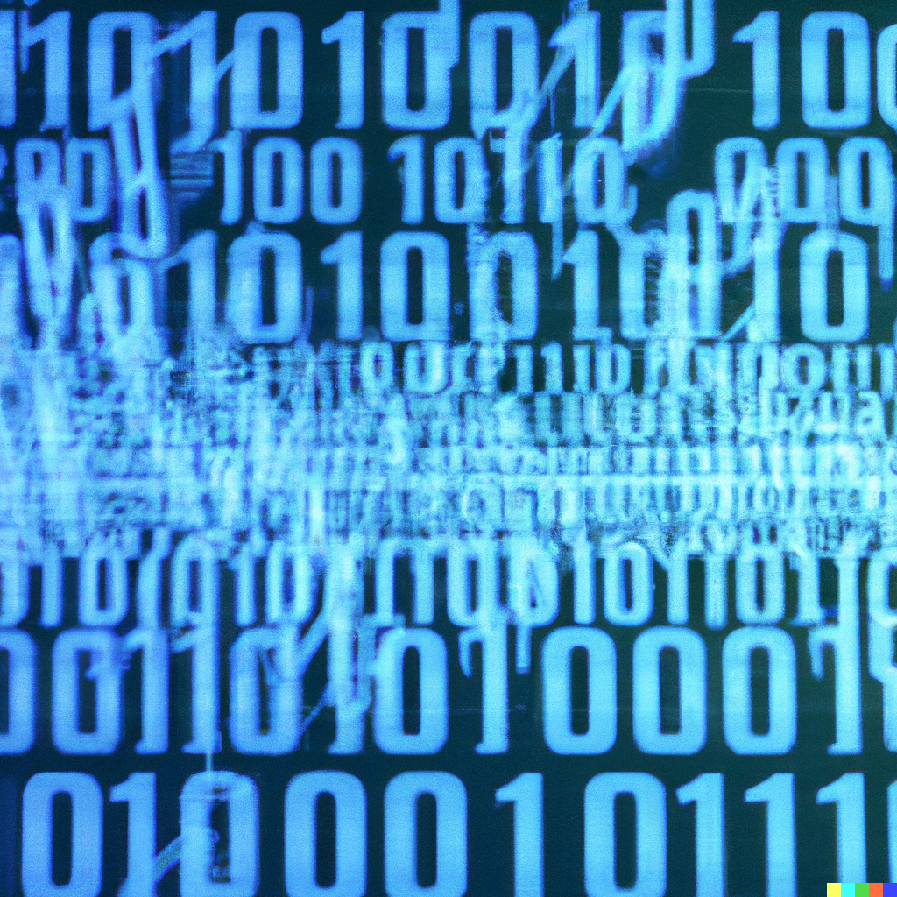

<!--
author:  Swantje Piotrowski, Lukas Eweleit, Erik Stoffer, Penelope Stibane, Caroline Beckmann, Arnold A. Willemer

email:    s.piotrowski@email.uni-kiel.de, stu217721@mail.uni-kiel.de, stu201059@mail.uni-kiel.de, stu210544@mail.uni-kiel.de, stu204392@mail.uni-kiel.de

version:  0.0.1

@icon: https://www.uni-kiel.de/ps/cgi-bin/logos/files/cau/norm-de/cau-norm-de-lilagrey-rgb-0720.png

language: de

narrator: Deutsch Female, Male

comment: Der digitale Baustein zu Digital Literacy  möchte Studierende  einen Überblick über künftige Schlüsselqualifikationen ermöglichen. Sie sollen verstehen, welche Kompetenzen künftige Berufs- und Arbeitsfelder erfordern und in der Lage sein, Digital Literacy in einem Lernprozess zu erfahren und zu beurteilen. Nach dieser Lerneinheit sollen Studierende  differenziert und reflektiert Tools und Software anwenden können.

 Den Studierenden sollen die Vorteile des kollaborativen Arbeitens als Teil der Digital Literacy näher gebracht werden. Hierbei steht insbesondere der Anbieter "cryptpad" im Fokus, dessen Funktionsweise anhand einzelner Foto- und Videosequenzen veranschaulicht wird. Am Ende dieses Abschnittes sollen die Studierenden die Vorzüge von digital-kollaborativen Arbeiten kennen und die grundsätzliche Bedienung des Tools cryptpad verstanden haben.

Ziel ist die Präsentation von Techniken und Instrumenten der digitalen
Literaturrecherche sowie Möglichkeiten der Literaturverwaltung.

Leitfaden zum Erstellen einer Formatvorlage in Word

base: https://cloudlab-olathub.rz.uni-kiel.de/user/suzuv062/106513175450593/liascript-preview/

logo: zerosOnesDalle.png
-->

# Dateitypen (Arbeitstitel)

<h3>Inhalt</h3>

[**Allgemeine Informationen**](#2)

[**Textbasierte Dateiformate**](#8)

[**Ton, Bild, Video**](#13)

[**Karten**](#17)

[**Recherche**](#19)

## Allgemeine Informationen

{{0}} 
Eine der wichtigsten Funktionen von Computern ist ihre Fähigkeit, sich Dinge zu merken - wir sprechen vom **Speichern**. Computer bewerkstelligen dies, in dem sie Daten als magnetische Ladungen auf Festplatten speichern. Weil unterschiedliche Spannungen oder Ladungen schnell verfälscht werden und Daten daruch unleserlich werden könnten[^1](Man denke nur an Spannungsabfälle oder magnetische Einflüsse von außen, die das Ablesen oder Übertragen beeinflussen könnten und den gesamten Datenfluss durcheinanderbringen. Es ist hier also viel einfacher, nur mit zwei Zuständen zu arbeiten. Dabei ist es natürlich effektiver, pro Einheit so viele Zustände wie möglich zu verwenden. Dies ist jedoch etwas, das sich nur Quantencomputer verlässlich zu Nutze machen können. LINK), begrenzt man sich in der Regel auf zwei Zustände: **Ein** und **Aus**, welche als **1** und **0** bekannt sind. Diese können entweder ausgelesen oder verändert werden. 

{{1}} Diese kleinsten Einheiten sind die berühmten **Bits**.

{{2}}
**************
Doch wie kann aus einfachen Ladungen ein Text, Bild oder Ähnliches Entstehen? 
Die Lösung liegt auf der Hand: es werden mehrere Bits mit einander kombiniert.
Dabei hat sich die Verwendung von **acht Bits** als erstes durchgesetzt und wurde auf den Namen **Byte** getauft.

{{3}} Um die Zählweise eines Systems mit nur zwei Ziffern - ein **Binäres System** - zu verdeutlichen ist hier ein kleines Beispiel (interagiere mit dem Element): 

************

### Text vs Binär
{{0}}
******
In ihrer Organisationsform unterscheiden sich Dateien jetzt in zwei Arten.
Die einen halten sich strikt an eine Aufteilung in 8er-Blöcke, also Bytes, in der Regel um Text zu codieren[^2](In Wirklichkeit gibt es viele Textformate, die auch Zeichen wie 'A' mit dem Binärcode '00000000' abenfalls als '0' darstellen, um Speicherplatz zu schonen.)
Hier ist ein beispiel, wie aus Binärem Code Buchstaben werden: 

Diese Dateiformate werden gleich im Unterkapitel über textbasierte Formate genauer behandelt.

******

{{1}}******
Problematisch an der Vorgehendweise ist jedoch, dass relativ viel Platz verwendet werden muss, um relativ einfache Zustände zu speichern, da enorm viele Schriftzeichen zur Verfügung stehen. Doch nicht alle Programme brauchen so viele Zustände. Die Lösung sind kürzere *uneinheitliche* Einheiten. Hier sprechen wir von **binären** Dateiformaten.

{{2}}Doch diese uneinheitlichen Dateien können nur noch von speziellen Programmen gelesen, bzw. verstanden werden. Damit der Computer - oder besser sein Betriebssystem - diese Dateien den zugehörigen Programmen zuordnen können, kommen **Dateierweiterungen** ins Spiel (auch bekannt als *Dateiendungen* oder -*kürzel*). Beispiele für Dateikürzel wären: .*docx*, .*mp3*, .*mov*, .*heic*, etc. Sie sind, wie hier angedeutet jeweils durch einen '.' vom **Dateinamen** getrennt. 

Es sei an dieser Stelle erwähnt, dass Dateierweiterungen nicht die einzigen Mittel sind, die Computern zur verfügung stehen, um Dateiformate zu erkennen. Dazu mehr im nächsten Unterkapitel.

******

### Innerer Aufbau von Dateien

Üblicherweise bestehen Dateien aus:

1. *Header* oder **Kopf**
2. *Body* oder **Körper**

...und optionaler Weise...

3. *Footer* oder **Fuß**

Im Header finden sich sogenannte Metadaten, die dem System Auskunft über die Beschaffenheit der Datei geben. Dazu können z.B. der Name der Datei, Erstellungsdatum, Dateierweiterung, Höhe/Breite (für Bilder), Magic Number etc. gehören. 

Besonder interessant für die Verarbeitung sind dabei entweder die Dateierweiterung, Magic Number oder Dateistruktur. Die Dateierweitung (z.B. .*docx*, .*mp3*, .*mov*, .*heic*, etc.) wird als Teil des Dateinamens gespeichert. Sie kann jedoch missbraucht werden. So könnte jemand z.B. einen Virus in einer .exe-Datei programmieren, die Dateierweiterung jedoch im Nachhinein auf .jpg ändern und auf diese Weise einen Benutzer dazu verleiten, den Virus auszuführen, wenn eigentlich niedliche Katzen angezeigt werden sollten. Um diesem Missbrauch vorzubeuten, gibt es für viele Dateiformate, die eine sogenannte **Magic Number** haben. Dabei handelt es sich um zwei bis vier Bytes lange Zahl, die für jedes Dateiformat einzigartig ist. Zum Beispiel ist die Magic Number für das GIF Format '47 49 46 38'.[^1] 

[^1]:  Einige andere Formate und ihrer Magic Numbers lauten: PNG (89 50 4E 47 0D 0A 1A 0A), JPEG (FF D8 FF), GIF (47 49 46 38), BMP (42 4D), TIFF (49 49 2A 00 / 4D 4D 00 2A), PDF (25 50 44 46), ZIP (50 4B 03 04), RAR (52 61 72 21), EXE (4D 5A), AVI (52 49 46 46), MP3 (49 44 33), WAV (52 49 46 46), MPEG (00 00 01), MP4 (00 00 00 18 66 74 79 70), MKV (1A 45 DF A3), FLV (46 4C 56), JAR (50 4B 03 04), HEIC (66 74 79 70 33 67 70 35), HEIF (66 74 79 70 68 65 69 66), PPTX (50 4B 03 04 14 00 06 00), XLSX (50 4B 03 04 14 00 06 00), DOCX (50 4B 03 04 14 00 06 00)

### Was tun bei unbekannten Formaten? 

(Infotext)

<!--> Ende Abschnitt <-->

## Textbasierte Dateiformate

(Infotext)

### TXT – Mutter aller Textverarbeitung

(Infotext)

### RTF, MD, DOCX, ODT, PAGES — Informationen für Menschen aufbereiten

(Infotext)

### CSV, XML, JSON, HTML — Informationen für Computer aufbereiten

(Infotext)

### PDFs — möglicher Exkurs

(Infotext)

<!--> Ende Abschnitt <-->

## Ton, Bild, Video

(Infotext)

### WAV, MP3 — Ton und Tonqualität

(Infotext)

### RAW, JPEG, PNG — Bild und Bildqualität

(Infotext)

### MP4, MOV — Bild und Ton vereint

(Infotext)

<!--> Ende Abschnitt <-->

## Karten

(Infotext)

### unklar...

(Infotext)

<!--> Ende Abschnitt <-->

## Recherche

(Infotext)

### Wo finde ich Dateiformate? — Einschlägige Webseiten

(Infotext)

### Worauf man achten sollte:

(Infotext)

#### (Plattform-)Kompatibilität

(Infotext)

#### Lebensdauer (Wie alt? Wie langlebig?)

(Infotext)

#### Speichergröße / Ressourcenmanagement

(Infotext)

#### Updates / Support

(Infotext)

<!--> Ende Abschnitt <-->

