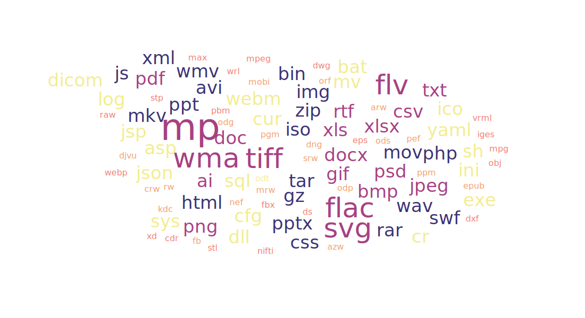

<!--
author:  Swantje Piotrowski, Lukas Eweleit, Erik Stoffer, Penelope Stibane, Caroline Beckmann, Arnold A. Willemer

email:    s.piotrowski@email.uni-kiel.de, stu217721@mail.uni-kiel.de, stu201059@mail.uni-kiel.de, stu210544@mail.uni-kiel.de, stu204392@mail.uni-kiel.de

version:  0.0.1

@icon: https://www.uni-kiel.de/ps/cgi-bin/logos/files/cau/norm-de/cau-norm-de-lilagrey-rgb-0720.png

language: de

narrator: Deutsch Female, Male

comment: Der digitale Baustein zu Digital Literacy  möchte Studierende  einen Überblick über künftige Schlüsselqualifikationen ermöglichen. Sie sollen verstehen, welche Kompetenzen künftige Berufs- und Arbeitsfelder erfordern und in der Lage sein, Digital Literacy in einem Lernprozess zu erfahren und zu beurteilen. Nach dieser Lerneinheit sollen Studierende  differenziert und reflektiert Tools und Software anwenden können.

 Den Studierenden sollen die Vorteile des kollaborativen Arbeitens als Teil der Digital Literacy näher gebracht werden. Hierbei steht insbesondere der Anbieter "cryptpad" im Fokus, dessen Funktionsweise anhand einzelner Foto- und Videosequenzen veranschaulicht wird. Am Ende dieses Abschnittes sollen die Studierenden die Vorzüge von digital-kollaborativen Arbeiten kennen und die grundsätzliche Bedienung des Tools cryptpad verstanden haben.

Ziel ist die Präsentation von Techniken und Instrumenten der digitalen
Literaturrecherche sowie Möglichkeiten der Literaturverwaltung.

Leitfaden zum Erstellen einer Formatvorlage in Word

base: https://cloudlab-olathub.rz.uni-kiel.de/user/suzuv062/106513175450593/liascript-preview/

logo: zerosOnesDalle.png
-->

# Dateiformate verstehen

                {{1-2}}
****************************************


(Begrüßungstext)

****************************************


                {{2}}
****************************************

<center>
<h1>**Inhalt**</h1>

<h4>

[Allgemeine Informationen](#Allgemeine-Informationen)

[Forschungsdatenmanagement](#Forschungsdatenmanagement)

[Textbasierte Dateiformate](#Textbasierte-Dateiformate)

[Ton, Bild, Video](#Ton,-Bild,-Video)

</h4>
</center>
****************************************


## Allgemeine Informationen

{{0}} 
Eine der wichtigsten Funktionen von Computern ist ihre Fähigkeit, sich Dinge zu merken - wir sprechen vom **Speichern**. Computer bewerkstelligen dies, in dem sie Daten als magnetische Ladungen auf Festplatten speichern. Weil unterschiedliche Spannungen oder Ladungen schnell verfälscht werden und Daten daruch unleserlich werden könnten[^1](Man denke nur an Spannungsabfälle oder magnetische Einflüsse von außen, die das Ablesen oder Übertragen beeinflussen könnten und den gesamten Datenfluss durcheinanderbringen. Es ist hier also viel einfacher, nur mit zwei Zuständen zu arbeiten. Dabei ist es natürlich effektiver, pro Einheit so viele Zustände wie möglich zu verwenden. Dies ist jedoch etwas, das sich nur Quantencomputer verlässlich zu Nutze machen können. LINK), begrenzt man sich in der Regel auf zwei Zustände: **Ein** und **Aus**, welche als **1** und **0** bekannt sind. Diese können entweder ausgelesen oder verändert werden. 

{{1}} Diese kleinsten Einheiten sind die berühmten **Bits**.

{{2}}
**************
Doch wie kann aus einfachen Ladungen ein Text, Bild oder Ähnliches Entstehen? 
Die Lösung liegt auf der Hand: es werden mehrere Bits mit einander kombiniert.
Dabei hat sich die Verwendung von **acht Bits** als erstes durchgesetzt und wurde auf den Namen **Byte** getauft.

{{3}} Um die Zählweise eines Systems mit nur zwei Ziffern - ein **Binäres System** - zu verdeutlichen ist hier ein kleines Beispiel (interagiere mit dem Element): 
<script input="number" value="22" min="0" max="1000000">
let i = @input // direct usage as a number
let j = (@input >>> 0).toString(2)

i + " = " + j
</script>

************


### Text vs Binär
{{0}}
******
In ihrer Organisationsform unterscheiden sich Dateien jetzt in zwei Arten.
Die einen halten sich strikt an eine Aufteilung in 8er-Blöcke, also Bytes, in der Regel um Text zu codieren[^2](In Wirklichkeit gibt es viele Textformate, die auch Zeichen wie 'A' mit dem Binärcode '00000000' abenfalls als '0' darstellen, um Speicherplatz zu schonen.)
Hier ist ein beispiel, wie aus Binärem Code Buchstaben werden: 
<script input="number" value="65" min="33" max="126">
let i = @input
let j = (@input >>> 0).toString(2)
let k = String.fromCharCode(i)

i + " = " + j + " = " + k
</script>
Diese Dateiformate werden gleich im Unterkapitel über textbasierte Formate genauer behandelt.

******

{{1}}******
Problematisch an der Vorgehendweise ist jedoch, dass relativ viel Platz verwendet werden muss, um relativ einfache Zustände zu speichern, da enorm viele Schriftzeichen zur Verfügung stehen. Doch nicht alle Programme brauchen so viele Zustände. Die Lösung sind kürzere *uneinheitliche* Einheiten. Hier sprechen wir von **binären** Dateiformaten.

{{2}}Doch diese uneinheitlichen Dateien können nur noch von speziellen Programmen gelesen, bzw. verstanden werden. Damit der Computer - oder besser sein Betriebssystem - diese Dateien den zugehörigen Programmen zuordnen können, kommen **Dateierweiterungen** ins Spiel (auch bekannt als *Dateiendungen* oder -*kürzel*). Beispiele für Dateikürzel wären: .*docx*, .*mp3*, .*mov*, .*heic*, etc. Sie sind, wie hier angedeutet jeweils durch einen '.' vom **Dateinamen** getrennt. 

Es sei an dieser Stelle erwähnt, dass Dateierweiterungen nicht die einzigen Mittel sind, die Computern zur verfügung stehen, um Dateiformate zu erkennen. Dazu mehr im nächsten Unterkapitel.

******


### Innerer Aufbau von Dateien

Üblicherweise bestehen Dateien aus:

1. *Header* oder **Kopf**
2. *Body* oder **Körper**

...und optionaler Weise...

3. *Footer* oder **Fuß**

Im Header finden sich sogenannte Metadaten, die dem System Auskunft über die Beschaffenheit der Datei geben. Dazu können z.B. der Name der Datei, Erstellungsdatum, Dateierweiterung, Höhe/Breite (für Bilder), Magic Number etc. gehören. 

Besonder interessant für die Verarbeitung sind dabei entweder die Dateierweiterung, Magic Number oder Dateistruktur. Die Dateierweitung (z.B. .*docx*, .*mp3*, .*mov*, .*heic*, etc.) wird als Teil des Dateinamens gespeichert. Sie kann jedoch missbraucht werden. So könnte jemand z.B. einen Virus in einer .exe-Datei programmieren, die Dateierweiterung jedoch im Nachhinein auf .jpg ändern und auf diese Weise einen Benutzer dazu verleiten, den Virus auszuführen, wenn eigentlich niedliche Katzen angezeigt werden sollten. 

Um diesem Missbrauch vorzubeugen, gibt es für die meisten Dateiformate, eine sogenannte **Magic Number**. Dabei handelt es sich um eine zwei bis vier Bytes lange Zahl, die für jedes Dateiformat einzigartig ist. Zum Beispiel ist die Magic Number für das GIF Format '47 49 46 38'.[^1] 

Fromate, die keine Magic Number haben werden üblicherweise anhand ihrer Struktur erkennt, sofern die Dateierweiterung fehlt. Dabei handelt es sich üblicherweise um Plain-Text-Formate wie .txt oder .csv.[^2]


[^1]:  Einige andere Formate und ihrer Magic Numbers lauten: PNG (89 50 4E 47 0D 0A 1A 0A), JPEG (FF D8 FF), GIF (47 49 46 38), BMP (42 4D), TIFF (49 49 2A 00 / 4D 4D 00 2A), PDF (25 50 44 46), ZIP (50 4B 03 04), RAR (52 61 72 21), EXE (4D 5A), AVI (52 49 46 46), MP3 (49 44 33), WAV (52 49 46 46), MPEG (00 00 01), MP4 (00 00 00 18 66 74 79 70), MKV (1A 45 DF A3), FLV (46 4C 56), JAR (50 4B 03 04), HEIC (66 74 79 70 33 67 70 35), HEIF (66 74 79 70 68 65 69 66), PPTX (50 4B 03 04 14 00 06 00), XLSX (50 4B 03 04 14 00 06 00), DOCX (50 4B 03 04 14 00 06 00)

[^2]: Eine weitere Formate wären: JSON-Dateien (JavaScript Object Notation, wie .json), XML-Dateien (Extensible Markup Language, wie .xml), HTML-Dateien (Hypertext Markup Language, wie .html), CSS-Dateien (Cascading Style Sheets, wie .css), JavaScript-Dateien (wie .js), SQL-Dateien (Structured Query Language, wie .sql), PHP-Dateien (Hypertext Preprocessor, wie .php), YAML-Dateien (YAML Ain't Markup Language, wie .yml).


### Was tun bei unbekannten Formaten? 

(Infotext)


<!-- Ende Abschnitt -->


## Forschungsdatenmanagement 

All die Informationen, die hier ausgebreitet wurden, haben den Sinn, Ihnen bei der Wahl eines idealen Formats für Ihr Forschungsprojekt zu helfen. Wir haben unterschiedliche Vor- und Nachteile angesprochen und worauf bei der Wahl zu achten ist. 

Doch wenn der Arbeits-/Forschungsprozess abgeschlossen ist, stellt sich die Frage, wie die Ergebnisse am besten konserviert und für zukünftige Weiterverarbeitung gelagert werden können. Was für den Arbeitsprozess sinnvoll war muss es nicht zwingend auch für die Lagerung sein. 


Hier[^1](https://forschungsdaten.info/fileadmin/_processed_/e/d/csm_Datenlebenszyklus_a6b6aeb3f7.png) sehen wir den Lebenszyklus von Forschungsdaten. Es wird klar, dass jedes Ergebnis wieder zur Grundlage weiterer Forschung werden kann und dass es unerlässlich ist, durchgängig auf hohem Niveau zu arbeiten und Forschungsdaten zuverlässig zu speichern. Nur so kann der Forschungsprozess als Ganzes zuverlässig weiterlaufen und dabei transparant bleiben.

Wie bei so Vielem gilt es hier wieder Vor- und Nachteile abzuwiegen und die gegebenen Möglichkeiten optimal auszunutzen. Deshalb werden wir jetzt vier Prinzipien vorstellen, die eine optimale Speicherung charakterisieren. 


### Menschenlesbarkeit

Bei der Planung für mögliche Wiederverwertbarkeit gilt immer die Frage nach dem *Worst-Case*-Szenario. Hier ist es der Fall, dass die Daten in irgendeiner Form beschädigt wurden und jetzt unklar ist, um was für Daten es sich handelt. In diesem Fall wird es äußerst wichtig, die Rohdaten auch menschenlesbar vorzufinden. Im Abschnitt [*CSV, XML, JSON, HTML — Informationen für Computer aufbereiten*](CSV,-XML,-JSON,-HTML-—-Informationen-für-Computer-aufbereiten) finden Sie Übungen mit denen Sie lernen können zwischen den genannten Formaten zu unterscheiden. So ähnlich könnte auch ein Wiederentdeckungsprozess für eine Datenset aussehen, bei dem nicht klar ist, worum es sich handelt, weil z.B. Dateiendugen fehlen usw. 

                {{1}}
>Plain-Text-basierte Dateiformate eignen sich besonders gut, um Daten auch über lange Zeit zu speichern und zeichnen sich durch ihre Menschenlesbarkeit aus. Sie existieren bereits seit langer Zeit und lassen sich immer durch einen einfachen Editor offnen. Mehr dazu [hier](TXT---Muter-aller-Textverarbeitung). 

                {{2}}
Unterschiedliche Datenformen benötigen jedoch Daten in binären Formaten wie zum Beispiel Bild- und Tondateien. Damit diese über lange Zeit lesbar bleiben ist es wichtig, Formate zu wählen, die so standardisiert sind, dass sie von vielen Programmen lesbar sind und nicht nur ein bestimmtes. 

<!-- Ende Abschnitt -->


### Maschinenlesbarkeit

Maschinenlesbarkeit bedeutet vor allem die Möglichkeit, Daten mit leicht verfügbaren Programmen - am besten [Open-Source](Link-Me!), also frei verfügbar - öffnen zu können. Es gilt:

>Je weiter verbreitet die Software, desto besser!

Auf diese Weise kann davon ausgegangen werden, dass auch nach längerer Zeit das Programm noch zur Verfügung steht, um die Dateien zu öffnen. "*Weit verbreitet*" kann auch bedeuten, dass mehrere Programme das Format nutzen, es sich also um eine Art *Industriestandard* handelt. 

<!-- Ende Abschnitt -->


### Langzeitstabilität

<span style='color:red'>"**Nichts ist von Dauer in der Tech-Welt!**"</span>, möchte man manchmal ausrufen. Denn, in der Tat, entwickeln sich in dieser doch noch relativ jungen Disziplin die Neuerung stets rasant. Wie kann in solch einer Umgebung überhaupt etwas entstehen, das von Dauer ist?

                {{1-2}}
****************************************
Dieses Problem ist natürlich schon früh aufgekommen. Und während eine Inovation der nächsten die Klinke in die Hand gedrückt hat, ist man schnell dazu übergegangen Standards für bestimmte Formate einzuführen, um eine gewisse Kompatibilität zu gewährleisten. 

Es sei an dieser Stelle darauf hingewiesen, dass es sich für Entwicklerfirmen - denken Sie an Apple, Microsoft, Google, etc. - nicht unbedingt lohnt, alles standardisieren zu lassen. Erstellen sie z.B. ein Programm zum Auslesen bestimmter Daten - sagen wir die Geschwindigkeit von Tretrollern -, kann es sich lohnen diese Technik nicht zu teilen, um eine Monopolstellung auf die Auslesung von Tretrollergeschwindigkeiten zu erhalten und so größeren Gewinn aus dem Produkt zu ziehen. 
Die Bereitschaft, einen öffentlichen Standard zu unterstützen wächst in der Regel genau dann, wenn die Konkurrenz beginnt Alternativen auf den Markt zu bringen. Jetzt lohnt es sich Hersteller des Industriestandards zu sein. 

****************************************


                {{2}}
****************************************
Weil dieser Prozess eine Weile dauern kann, gibt es unabhängige Organisationen, die Standardformate veröffentlichen. Berümte Bespiele sind: 

                {{3}}
- die [**Internationale Organisation für Normierung**](https://www.iso.org/home.html) auch **ISO** (von engl. *International Standardisation Organisation*), ein Verein mit Sitz in der Schweiz, der Standards von [Datum und Uhrzeit](https://www.iso.org/iso-8601-date-and-time-format.html) oder [Währungsdarstellungen](https://www.iso.org/iso-4217-currency-codes.html) über [Kindersitze](https://www.iso.org/isofix-child-seats-iso-13216.html) hin zum berühmten Kreuzworträtsel-Klassiker [ISO](https://www.iso.org/iso-6-camera-film-speed.html) (ASA in Amerika) für die Lichtempfindlichkeit von Kamerafilm. Für unser Thema besonders interessant ist die Arbeit des ***Joint Photographic Experts Group***, ein Unterkommitee der ISO, das die **JPEG** und **JPEG2000** Standards entwickelt hat. Mehr dazu [später](RAW,-JPEG,-PNG---Bild-und-Bildqualität)...

                {{4}}
- das [**Unicode Consortium**](https://home.unicode.org), welches für die Standardisierung von Textzeichen eintritt. Die wohl größte Leistung ist die Erweiterung der alten ASCII-Symbolsammlung, die nur englische Textzeichen abgebildet hat, auf die neuen Standards UTF-8 und UTF-16. In ihnen sind nicht nur alle Variaten des Römischen Schriftbilds, sondern die meisten bekannten Schriftzeichen der Welt enthalten. Eine neuere Leistung ist die Einführung von standadisierten Emojis. 🙌

****************************************


### Metadaten

(Infotext)

<!-- Ende Abschnitt -->


## Zusammenfassung

(Infotext)


<!-- Ende Abschnitt -->


## Zusatzmaterial:

                {{0-3}}
*************************************
Mit diesen Grundlagen sei der offizielle Teil dieses Teilbausteins abgeschlossen. Im Zusatzmaterial wollen wir nun ein wenig mehr ins Detail gehen. Dabei könnte es passieren, dass das wir stellenweise etwas...

                {{1}}
*************************************
<div style="float:right; width:40%;">
  
  </div>
...<span style="color:red">*komplex*</span> werden. Deshalb versteht er sich als eine Art *Lexikon*, in dem Sie stöbern können.

*************************************


                {{2}}
Wenngleich es von Vorteil sein kann, den folgenden Teil komplett durchzuarbeiten, so möchten wir Sie einladen, entsprechend Ihren akademischen Bedürfnisse selektiv aus dem Katalog zu auszuwählen. 
Nutzen Sie dazu das Menü auf der rechten Seite und wählen Sie entsprechend Ihren Interessen. 

*************************************


                {{3}}
*************************************
<center>
  <h1 style="color:red">Fangen wir an!</h1>
  
</center>


*************************************


## Dateiformate für Text

In diesem Abschnitt werden wir uns mit verschiedenen Arten von Dateiformaten beschäftigen, die Text widergeben, und ihre Funktionsweise und Einsatzmöglichkeiten genauer untersuchen.

Wir werden den Kurs in drei Teile gliedern: Plain Text (TXT), Formate, die hauptsächlich für Menschen gedacht sind und Formate, die hauptsächlich für Maschinen gedacht sind. Im ersten Teil werden wir uns mit dem einfachen, aber leistungsfähigen Plain Text-Format (TXT) beschäftigen.

Im zweiten Teil werden wir uns mit Formaten befassen, die hauptsächlich für Menschen gedacht sind, wie RTF, MD, DOCX, ODT, PAGES und andere. Diese Formate sind mit Formatierungsoptionen ausgestattet, die es Benutzern ermöglichen, ihre Dokumente mit Stil und Klarheit zu gestalten.

Im dritten Teil werden wir uns mit Formaten befassen, die hauptsächlich für Maschinen gedacht sind, wie CSV, XML, JSON und HTML. Diese Formate sind gut geeignet, um Daten zwischen Anwendungen auszutauschen und zu verarbeiten.

Am Ende dieses Kurses sollte man ein tiefes Verständnis für die verschiedenen textbasierten Dateiformate haben und wissen, wann es am besten ist, welches Format zu verwenden. Lass uns loslegen und tiefer in die Welt der textbasierten Dateiformate eintauchen, Formate, die hauptsächlich für Menschen gedacht sind und Formate, die hauptsächlich für Maschinen gedacht sind." erstellt und leicht modifiziert)


### TXT – Mutter aller Textverarbeitung

                {{0}}
Plain-Text (.txt) ist eines der einfachsten und ältesten Dateiformate für Textverarbeitungen. Es handelt sich hierbei um ein Format ohne Formatierungen oder spezielle Zeichen, welches lediglich reinen Text enthält. Dieser Text kann mit jedem Texteditor geöffnet, bearbeitet und gespeichert werden.

                {{1}}
Es hat seine Wurzeln in den frühen Tagen der Computertechnologie, als einfache Textdateien die einzigen Arten von Dokumenten waren, die auf Computern gespeichert und verarbeitet werden konnten. Es entstand aus dem Bedarf heraus, Informationen in einer einfachen, universell lesbaren und maschinenlesbaren Form zu speichern. Die Einfachheit des Plain-Text-Formats hat es zu einem wertvollen Werkzeug für die Textverarbeitung gemacht und es ist auch heute noch ein wichtiger Bestandteil der Computerwelt. Es ist einfach zu lesen und zu bearbeiten, egal ob mit einem einfachen Texteditor oder einem leistungsstarken Textverarbeitungsprogramm, und es ist kompatibel mit fast allen Computern und Betriebssystemen.

                {{2}}
Das .txt-Format ist für seine Portabilität bekannt. Da es keine Formatierungen oder spezielle Zeichen enthält, kann es auf jedem Gerät mit einem Texteditor geöffnet und bearbeitet werden. Es ist auch sehr gut lesbar, da es nicht mit unnötigen Formatierungen überladen ist.

                {{3}}
Ein weiterer Vorteil des .txt-Formats ist seine Einfachheit. Es ist einfach zu erstellen, da keine besonderen Kenntnisse erforderlich sind. Außerdem ist es einfach zu lesen, da es keine unübersichtlichen Formatierungen enthält.

                {{4}}
Da das .txt-Format so einfach gehalten ist, eignet es sich auch hervorragend für einfache Texte oder Notizen. Es ist jedoch wichtig zu beachten, dass es keine Möglichkeit gibt, Textformatierungen wie Fett- oder Kursivdruck hinzuzufügen.[^ChatGPT1](Diese Abstätze wurden von ChatGPT am 15.01.2023 mit dem Prompt "Schreibe einen informativen Text über das Plain-Text-Format .txt. Die Überschrift lautet "TXT – Mutter aller Textverarbeitung"." erstellt und leicht modifiziert.)

                {{5}}
TXT-Dateien können mit den meisten Textverarbeitungsprogrammen geöffnet werden, einschließlich Notepad auf Windows-Systemen und TextEdit auf MacOS-Systemen. Darüber hinaus gibt es auch eine Vielzahl von kostenlosen und Open-Source-Texteditoren, die TXT-Dateien unterstützen, wie z.B. [Notepad++](https://notepad-plus-plus.org), [Sublime Text](https://www.sublimetext.com) und [Atom](https://github.blog/2022-06-08-sunsetting-atom/). Diese Programme bieten oft mehr Funktionen als die einfachen Texteditoren, wie Syntax-Hervorhebung, Zeilennummerierung und Unterstützung für mehrere Dateiformate.[^ChatGPT2](Diese Abstätze wurden von ChatGPT am 15.01.2023 mit dem Prompt "Schreibe noch einen weiteren Absatz über Programme, mit denen man txt Dateien öffnet." erstellt und leicht modifiziert)

                {{6}}
Insgesamt ist das .txt-Format ein zuverlässiger und unkomplizierter Weg, Text zu speichern und zu teilen. Es ist einfach zu verstehen und eignet sich hervorragend für einfache Texte oder Notizen. Obwohl es eingeschränktere Funktionen als andere Formate hat, bleibt es dennoch eine wertvolle Ressource für alle, die einfache Texte verwalten müssen.[^ChatGPT1](Diese Abstätze wurden von ChatGPT am 15.01.2023 mit dem Prompt "Schreibe einen informativen Text über das Plain-Text-Format .txt. Die Überschrift lautet "TXT – Mutter aller Textverarbeitung"." erstellt und leicht modifiziert.)


### RTF, MD, DOCX, ODT, PAGES — Informationen für Menschen aufbereiten

Wenn es darum geht, Texte für Menschen lesbar aufzubereiten, gibt es eine Reihe von Dateiformaten, die speziell für diesen Zweck entwickelt wurden. Hier sind einige der wichtigsten:


                {{1-3}}
***************************************         
<h3>RTF (Rich Text Format): </h3>

{{1}}RTF ist ein Textformat, das es Benutzern ermöglicht, Text mit Formatierungen wie Schriftart, Größe, Farbe, Absatz- und Zeichenformatierungen usw. zu speichern. RTF-Dateien können mit den meisten Textverarbeitungsprogrammen gelesen und bearbeitet werden und sind eine gute Wahl, wenn Sie eine einfache Möglichkeit zur Aufbereitung von Texten für Menschen benötigen.

{{2}}Das RTF (Rich Text Format) wurde 1987 von Microsoft eingeführt und war eines der ersten Textformate, das die Formatierung von Texten über mehrere Anwendungen und Betriebssysteme hinweg beibehält. Es ermöglichte es Benutzern, Texte mit verschiedenen Schriftarten, Schriftgrößen, Schriftstilen und Farben zu formatieren und diese Formatierung bei Übertragungen auf andere Computer beizubehalten. Mit dem Aufkommen anderer Formate, wie z.B. DOCX, hat RTF jedoch an Popularität verloren, obwohl es immer noch von einigen Textverarbeitungsprogrammen unterstützt wird, wie z.B. Microsoft Word.

***************************************


                {{3-6}}
***************************************
<h3>DOCX ("Das Word-Dokument"): </h3>

{{3}}DOCX ist das Standardformat für Microsoft Word-Dokumente. Es bietet eine reiche Palette an Formatierungsmöglichkeiten, einschließlich Schriftart, Größe, Farbe, Absatz- und Zeichenformatierungen usw. DOCX-Dateien können mit Microsoft Word und einigen anderen Textverarbeitungsprogrammen gelesen und bearbeitet werden.

{{4}}Das DOCX Format wurde erstmals im Jahr 2007 mit Microsoft Word 2007 eingeführt und hat sich seitdem zum Industriestandard entwickelt. Es hat das ältere DOC Format, das seit 1993 verwendet wurde, abgelöst und bietet eine Vielzahl von Vorteilen, darunter eine bessere Kompatibilität und Zusammenarbeit mit anderen Anwendungen und Betriebssystemen. Darüber hinaus ermöglicht DOCX eine flexiblere Textformatierung, eine kleinere Dateigröße und die Möglichkeit, interaktive Elemente wie Tabellen, Grafiken und Formulare einzufügen. Aufgrund dieser Vorteile und seiner breiten Akzeptanz in der Geschäftswelt hat sich DOCX zum Industriestandard für Textverarbeitung entwickelt.

***************************************


                {{5-6}}
***************************************
<h4>Alternativen: </h4>

{{5-6}}Einige Alternativen zu DOCX-Formaten sind **ODT (Open Document Text)**, das vom OpenOffice-Projekt entwickelt wurde und als offenes Format für Textverarbeitungen verwendet wird, sowie **Pages**, das von Apple für die Verwendung auf Mac-Computern entwickelt wurde. Beide Formate haben eine vergleichbare Funktionalität mit DOCX und bieten viele der gleichen Funktionen, aber die Kompatibilität und die Verbreitung kann je nach Plattform und Gerät variieren. Außerdem gibt es auch cloud-basierte Optionen wie **Google Docs**, die eine Alternative für die Verwendung von Textdokumenten in einer online-basierten Umgebung bieten.

***************************************


                {{6}}
***************************************
<h3>MD (Markdown): </h3>

                {{6}}
Markdown ist ein einfaches Textformat, das es Benutzern ermöglicht, Texte mit einer einfachen Syntax zu formatieren. Diese Syntax kann später in HTML umgewandelt werden, um den Text auf einer Webseite darzustellen. MD-Dateien sind einfach zu lesen und zu bearbeiten und eignen sich hervorragend für die Aufbereitung von Texten für Menschen, die nicht viel Erfahrung mit Textformatierung haben.

                {{7}}
Markdown wurde  2006 von John Gruber und Aaron Swartz eingeführt. Die Idee dahinter war, dass es einfacher sein sollte, Texte zu formatieren, als mit HTML oder anderen Markup-Sprachen. Markdown wurde schnell zu einem beliebten Format für Blogging, Dokumentation und andere Anwendungen, bei denen Texte formatiert werden müssen.

                {{8}}
Die Syntax von Markdown ist sehr einfach und besteht aus einer Kombination aus Text und einfachen Zeichen, die für Formatierungen verwendet werden. Beispielsweise kann ein Überschrift durch eine Reihe von #-Zeichen gekennzeichnet werden, während fett gedruckter Text durch zwei Asterisken eingerahmt wird. Die Schönheit von Markdown liegt darin, dass es einfach zu erlernen und zu verwenden ist, aber dennoch eine Vielzahl an Formatierungen ermöglicht. Dieser ganze Kurs ist zum Beispiel in Mardown geschrieben.

***************************************


### CSV, XML, JSON, HTML — Informationen für Computer aufbereiten

                {{0-1}}
In der Welt der digitalen Datenverarbeitung ist es von größter Bedeutung, Informationen in einer Form zu speichern, die für Computer und andere digitale Geräte leicht lesbar ist. Dies ist der Hauptgrund, warum es eine Vielzahl von Dateiformaten gibt, die speziell für die Verarbeitung von Informationen durch Maschinen ausgelegt sind. In diesem Kapitel werden wir uns mit einigen dieser Formate beschäftigen, die sich durch ihre maschinenlesbare Struktur auszeichnen, darunter **CSV**, **XML**, **JSON** und **HTML**.

                {{1-4}}
***********************
<h3>CSV (Comma Separated Values): </h3>

                {{1}}
CSV ist ein sehr einfaches Format, das nur durch Kommas getrennte Werte enthält.[^1](ACHTUNG! Es sind auch auch Trennungen mit anderen Zeichen wie z.B. einem Semikolon möglich) Es ist sehr flexibel und kann mit fast jedem Texteditor oder Tabellenkalkulationsprogramm bearbeitet werden. Da es keine Informationen über Datentypen oder Formatierungen enthält, kann es jedoch Schwierigkeiten bereiten, wenn die Daten komplexer werden.

                {{2}}
CSV ist eines der ältesten und am weitesten verbreiteten Dateiformate für den Austausch von Daten. Es wurde in den 1960er Jahren entwickelt und hat sich bis heute als einfaches und effektives Format für den Datenaustausch etabliert. CSV ermöglicht es, Daten in einer tabellarischen Form zu speichern, bei der jede Zeile einen Datensatz und jede Spalte eine bestimmte Eigenschaft oder ein Attribut darstellt. Die Daten werden durch Kommas getrennt, wodurch sie von einfachen Texteditoren und Tabellenkalkulationsprogrammen wie Microsoft Excel oder Google Sheets gelesen und bearbeitet werden können.

                {{3}}
Die Syntax von CSV ist sehr einfach und intuitiv. Jede Zeile stellt einen Datensatz dar, während die Spaltenüberschriften und die Daten in jeder Spalte durch Kommas voneinander getrennt sind:

                {{3}}
````
Name,Alter,Stadt
Max,35,Berlin
Lisa,28,München
Tom,42,Hamburg
Jane,31,Köln
````

***********************


                {{4-5}}
<h3>XML (Extensible Markup Language) und JSON (JavaScript Object Notation): </h3>
XML und JSON sind etwas komplexere Formate, die eine Hierarchie von Daten ermöglichen. Sie bieten eine bessere Strukturierung der Daten und ermöglichen es, Daten zu kategorisieren und zu beschreiben. Dies macht sie für Anwendungen, die Daten verarbeiten müssen, viel nützlicher als CSV.


                {{5-8}}
***********************

<h4>XML</h4>

                {{5}}
XML (Extensible Markup Language) ist ein textbasiertes Format, das für Computer lesbar ist und das Austausch und Speicherung von Daten ermöglicht. Es nutzt eine hierarchische Struktur, um Informationen in einer Baumstruktur zu organisieren. Jedes Element im XML-Dokument hat einen Namen und kann Attribute und Inhalte haben.

                {{6-7}}
Hier ein Beispiel für den Inhalt eines typischen XML-Dokuments:

                {{6-8}}
````XML
<?xml version="1.0" encoding="UTF-8"?>
<person>
  <name>John Doe</name>
  <age>30</age>
  <address>
    <street>123 Main St</street>
    <city>New York</city>
    <state>NY</state>
  </address>
  <phoneNumbers>
    <phoneNumber type="home">555-555-1212</phoneNumber>
    <phoneNumber type="work">555-555-1213</phoneNumber>
  </phoneNumbers>
</person>
````

                {{7}}
XML verwendet eine syntaktische Struktur, die von HTML ähnlich ist. Es werden Hierarchien von Elementen und Attributen verwendet, um Daten zu beschreiben. Jedes Element repräsentiert eine bestimmte Dateneinheit und kann andere untergeordnete Elemente enthalten. Jedes Attribut enthält zusätzliche Informationen zu einem Element. Ein XML-Dokument muss mit einer Prolog-Zeile beginnen, die die verwendete XML-Version und Zeichenkodierung angibt. Zudem muss jedes geöffnete Element auch geschlossen werden, um eine valide Syntax zu erreichen.

***********************


                {{8-10}}
***********************
<h4>JSON</h4>

        
JSON, oder JavaScript Object Notation, ist ein Datenformat, das Anfang der 2000er Jahre entwickelt wurde. Ursprünglich wurde es als einfachere Alternative zu XML entwickelt, um Daten zwischen Server und Anwendung auszutauschen. JSON nutzt eine einfache Syntax aus geschweiften Klammern und Anführungszeichen, um Datenstrukturen darzustellen. Es hat sich schnell zu einem der weitverbreitetsten Datenformate im Internet entwickelt und wird heute von vielen Anwendungen und APIs genutzt, um Daten effizient und einfach zu verarbeiten und auszutauschen. Hier ein Beispiel: 

                {{9}}
````JSON
{
  "person": {
    "name": "John Doe",
    "age": 30,
    "address": {
      "street": "123 Main St",
      "city": "New York",
      "state": "NY"
    },
    "phoneNumbers": [
      {
        "type": "home",
        "number": "555-555-1212"
      },
      {
        "type": "work",
        "number": "555-555-1213"
      }
    ]
  }
}
````

***********************


                {{10-12}}
***********************

<h4>XML und JSON im Vergleich</h4>

Im Gegensatz zu JSON (JavaScript Object Notation) ist XML ein umfassenderes Format und bietet eine größere Flexibilität bei der Strukturierung von Daten. Mit XML kann man komplexere Datenstrukturen aufbauen und es bietet auch die Möglichkeit, eigene Markups zu definieren. Außerdem kann XML auch semantische Informationen bereitstellen, die für Maschinen nützlich sind.

                {{11}}
Allerdings ist XML auch aufwendiger zu lesen und zu schreiben als JSON. Es erfordert eine stärkere Überwachung, um Fehler zu vermeiden und es kann auch größere Datenmengen erzeugen, da es mehr Informationen speichert. JSON ist dagegen einfacher zu lesen und zu schreiben und eignet sich besser für den Austausch von Daten zwischen Anwendungen und ist deshalb hier of die bevorzugte Wahl.

***********************


                {{12-14}}
***********************

<h3>HTML (Hypertext Markup Language)</h3>


HTML ist ein Format, das hauptsächlich für Webseiten verwendet wird. Es ermöglicht es, Texte, Bilder und andere Inhalte in einer für Computer lesbaren Form darzustellen. HTML-Dokumente enthalten Informationen über die Layout- und Formatierungselemente einer Seite, was es ermöglicht, Inhalte auf eine benutzerfreundliche Art und Weise darzustellen.

                {{13}}
HTML wurde bereits 1990 von Tim Berners-Lee, dem Vater des World Wide Web, entwickelt. Die Syntax von HTML basiert auf den sogenannten "Tags", welche innerhalb von angleichen Klammern stehen. Diese Tags geben an, wie ein bestimmter Teil des Dokuments formatiert werden soll, beispielsweise als Überschrift, Absatz, Liste, Tabellen usw. HTML ermöglicht es auch, Links und Bilder einzubetten, wodurch eine Verknüpfung von Dokumenten im World Wide Web entsteht. Mit fortschreitender Weiterentwicklung, wurde HTML immer komplexer und bietet heute umfassende Möglichkeiten für die Gestaltung von Webseiten.

***********************


                {{14-16}}
***********************

Hier ist ein Beispiel für eine extrem einfache Website:

```HTML
<!DOCTYPE html>
<html>
  <head>
    <title>Mein erstes HTML-Dokument</title>
  </head>
  <body>
    <h1>Willkommen zu meiner Website!</h1>
    <p>Dies ist ein einfaches Beispiel eines HTML-Dokuments.</p>
    <ul>
      <li>Punkt 1</li>
      <li>Punkt 2</li>
      <li>Punkt 3</li>
    </ul>
  </body>
</html>
```

Dieser Text wird von sogenannten Browsern interpretiert, um die angenehmen Weboberflächen anzuzeigen, an die wir uns so gewöhnt haben. Mit der Zeit haben sich dabei auch die Möglichkeiten und auch ansprüche vervielfältigt, sodass selbst simpel anmutende Weseiten enorm lange und komplexe HTML-Dokumente generieren. 


***********************


#### Selbsttest

<h4>Es kann sinnvoll sein, auf Plain-Text basierende Dokumente identifizieren zu können. Also testen Sie sich selbst und erkennen die die folgenden Beispielformate: </h4>

                {{0-1}}
***************************************
Um welches Format handelt es sich? 

       
- [( )] CSV
- [(X)] XML
- [( )] JSON
- [( )] HTML
        

        
````XML
<?xml version="1.0" encoding="UTF-8"?>
<Sesamstrasse>
  <Charakter>
    <Name>Ernie</Name>
    <Alter>7</Alter>
    <Beruf>Clown</Beruf>
    <Besonderheit>Liebt seine Waschbärpuppe Bert</Besonderheit>
  </Charakter>
  <Charakter>
    <Name>Bert</Name>
    <Alter>7</Alter>
    <Beruf>Künstler</Beruf>
    <Besonderheit>Pflegt seine viele Sammelsurien</Besonderheit>
  </Charakter>
  <Charakter>
    <Name>Oscar</Name>
    <Alter>7</Alter>
    <Beruf>Grummeliger Müllmann</Beruf>
    <Besonderheit>Wohnt in einem Mülleimer</Besonderheit>
  </Charakter>
  <Charakter>
    <Name>Big Bird</Name>
    <Alter>7</Alter>
    <Beruf>Künstler</Beruf>
    <Besonderheit>Ein großer gelber Vogel</Besonderheit>
  </Charakter>
  <Charakter>
    <Name>Grover</Name>
    <Alter>3</Alter>
    <Beruf>Schauspieler</Beruf>
    <Besonderheit>Ein blaues Monster</Besonderheit>
  </Charakter>
</Sesamstrasse>
````

***************************************


        {{1-2}}
************************
Okay, das war zu einfach! Versuchen wir es mit diesem Kandidaten:

- [( )] CSV
- [( )] XML
- [(X)] JSON
- [( )] HTML


````JSON
[  
    {    
        "make": "Toyota",    
        "model": "Camry",    
        "year": 2020,    
        "color": "Silver",    
        "features": ["Bluetooth", "Sunroof", "Rearview Camera"]
  },
  {
    "make": "Honda",
    "model": "Civic",
    "year": 2019,
    "color": "Red",
    "features": ["Apple CarPlay", "Android Auto", "Automatic Climate Control"]
  },
  {
    "make": "Tesla",
    "model": "Model 3",
    "year": 2021,
    "color": "Midnight Silver Metallic",
    "features": ["Autopilot", "LONG RANGE ALL-WHEEL DRIVE", "FULL SELF-DRIVING"]
  }
]

````


************************


        {{2-3}}
************************
Wie sieht es hier aus?

- [(X)] CSV
- [( )] XML
- [( )] JSON
- [( )] HTML


````CSV
Name,Vorname,Jahreseinkommen,BMI,Bildungsgrad
Max,Mustermann,50000,22,Master
Lisa,Musterfrau,55000,20,Bachelor
Tom,Schmidt,60000,25,Master
Jane,Doe,52000,19,Bachelor
John,Miller,58000,24,Bachelor
Emma,Brown,51000,18,Bachelor
Olivia,Davis,53000,21,Master
Ava,Wilson,57000,23,Master
Isabella,Moore,54000,20,Bachelor
Sophia,Anderson,56000,22,Master
Mia,Taylor,59000,24,Master
Charlotte,Thomas,55000,19,Bachelor
Amelia,Jackson,57000,21,Master
Harper,White,58000,23,Master
Evelyn,Harris,56000,20,Bachelor
Abigail,Martin,54000,22,Master
Emily,Thompson,60000,24,Master
Elizabeth,Garcia,58000,19,Bachelor
Avery,Martinez,57000,21,Master
Ella,Robinson,59000,23,Master
Madison,Clark,55000,20,Bachelor
Scarlett,Rodriguez,57000,22,Master
Victoria,Lewis,60000,24,Master
Aria,Lee,58000,19,Bachelor
Adalynn,Walker,57000,21,Master
Riley,Hall,59000,23,Master
Chloe,Allen,56000,20,Bachelor
Brooklynn,King,57000,22,Master
Natalie,Wright,60000,24,Master
Hazel,Lopez,59000,19,Bachelor
Aubrey,Hill,57000,21,Master
Lily,Green,58000,23,Master
Eleanor,Adams,57000,20,Bachelor
Genesis,Nelson,59000,22,Master
Aurora,Carter,60000,24,Master
Evelynn,Mitchell,58000,19,Bachelor
Allison,Perez,57000,21,Master
Audrey,Roberts,59000,23,Master
Aaliyah,Turner,57000,20,Bachelor
Arianna,Phillips,59000,22,Master
Camila,Campbell,60000,24,Master
Kaylee,Parker,58000,19,Bachelor
Aubree,Evans,57000,21,Master
Anna,Edwards,59000,23,Master
Aurora,Cox,57000,20,Bachelor
Arianna,Alexander,59000,22,Master
Avery,Ramirez,60000,24,Master
Aria,James,58000,19,Bachelor
Brooklynn,Watson,57000,21,Master
Evelyn,Brooks,59000,23,Master
Adalynn,Kelly,57000,20,Bachelor
Audrey,Sanders,59000,22,Master
Lillian,Price,60000,24,Master
Natalie,Bennett,58000,19,Bachelor
Everly,Woods,57000,21,Master
Harper,Coleman,59000,23,Master
Ryleigh,Ellis,57000,20,Bachelor
````


************************


        {{3-4}}
************************
Wie sieht es hier aus?

- [( )] CSV
- [( )] XML
- [( )] JSON
- [(x)] HTML


````HTML
<!DOCTYPE html>
<head>
	<title>KreativerName - Deine Suchmaschine</title>
	<style>
		body {
			text-align: center;
			font-family: Arial, sans-serif;
		}
		h1 {
			margin-top: 100px;
			font-size: 36px;
		}
		form {
			margin-top: 50px;
		}
		input[type="text"] {
			padding: 10px 20px;
			font-size: 20px;
			width: 500px;
			border-radius: 5px;
			border: 1px solid #ccc;
			margin-right: 20px;
		}
		input[type="submit"] {
			padding: 10px 20px;
			font-size: 20px;
			background-color: blue;
			color: white;
			border-radius: 5px;
			border: none;
		}
	</style>
</head>
<body>
	<h1>Wer hier sucht, der findet</h1>
	<form action="">
		<input type="text" placeholder="Gib deinen Suchbegriff ein">
		<input type="submit" value="Suchen">
	</form>
</body>
</html>
````


************************


        {{4-5}}
************************
Diese Beispiele waren recht und künstlich und vor allem durch die Darstellung leicht zu erfassen. In der "freien Wildbahn" kann einem jedoch so manches weniger lesbares Dokument begegnen deshalb jetzt etwas schwerere Beispiele, die ihrer länge wegen gekürzt wurden.

- [( )] CSV
- [( )] XML
- [(x)] JSON
- [( )] HTML


````
{"Instruments":[{"InstrumentID":1,"TypeID":1,"BuyCurrencyID":2,"SellCurrencyID":1,"IsDelisted":false,"AllowManualTrading":true,"RestrictedManualOpen":false,"AllowSell":true,"AllowBuy":true,"Precision":5,"AboveDollarPrecision":5,"MaxPositionUnits":3805935,"NonLeveragedSellEndOfWeekFee":-0.00012384,"NonLeveragedBuyEndOfWeekFee":0.00031146,"LeveragedSellEndOfWeekFee":-0.00012384,"LeveragedBuyEndOfWeekFee":0.00031146,"NonLeveragedBuyOverNightFee":0.00010382,"NonLeveragedSellOverNightFee":-0.00004128,"LeveragedBuyOverNightFee":0.00010382,"LeveragedSellOverNightFee":-0.00004128,"AllowPendingOrders":true,"AllowEntryOrders":true,"AllowExitOrder":true,"IsNonRealAsTRS":false},{"InstrumentID":2,"TypeID":1,"BuyCurrencyID":3,"SellCurrencyID":1,"IsDelisted":false,"AllowManualTrading":true,"RestrictedManualOpen":false,"AllowSell":true,"AllowBuy":true,"Precision":5,"AboveDollarPrecision":5,"MaxPositionUnits":2000000,"NonLeveragedSellEndOfWeekFee":0.00002228,"NonLeveragedBuyEndOfWeekFee":0.00019958,"LeveragedSellEndOfWeekFee":0.00002228,"LeveragedBuyEndOfWeekFee":0.00019958,"NonLeveragedBuyOverNightFee":0.00006653,"NonLeveragedSellOverNightFee":0.00000743,"LeveragedBuyOverNightFee":0.00006653,"LeveragedSellOverNightFee":0.00000743,"AllowPendingOrders":true,"AllowEntryOrders":true,"AllowExitOrder":true,"IsNonRealAsTRS":false},{"InstrumentID":3,"TypeID":1,"BuyCurrencyID":8,"SellCurrencyID":1,"IsDelisted":false,"AllowManualTrading":true,"RestrictedManualOpen":false,"AllowSell":true,"AllowBuy":true,"Precision":5,"AboveDollarPrecision":5,"MaxPositionUnits":2000000,"NonLeveragedSellEndOfWeekFee":0.00005929,"NonLeveragedBuyEndOfWeekFee":0.00010429,"LeveragedSellEndOfWeekFee":0.00005929,"LeveragedBuyEndOfWeekFee":0.00010429,"NonLeveragedBuyOverNightFee":0.00003476,"NonLeveragedSellOverNightFee":0.00001976,"LeveragedBuyOverNightFee":0.00003476,"LeveragedSellOverNightFee":0.00001976,"AllowPendingOrders":true,"AllowEntryOrders":true,"AllowExitOrder":true,"IsNonRealAsTRS":false},{"InstrumentID":4,"TypeID":1,"BuyCurrencyID":1,"SellCurrencyID":7,"IsDelisted":false,"AllowManualTrading":true,"RestrictedManualOpen":false,"AllowSell":true,"AllowBuy":true,"Precision":5,"AboveDollarPrecision":5,"MaxPositionUnits":2000000,"NonLeveragedSellEndOfWeekFee":0.00010374,"NonLeveragedBuyEndOfWeekFee":0.00008438,"LeveragedSellEndOfWeekFee":0.00010374,"LeveragedBuyEndOfWeekFee":0.00008438,"NonLeveragedBuyOverNightFee":0.00002813,"NonLeveragedSellOverNightFee":0.00003458,"LeveragedBuyOverNightFee":0.00002813,"LeveragedSellOverNightFee":0.00003458,"AllowPendingOrders":true,"AllowEntryOrders":true,"AllowExitOrder":true,"IsNonRealAsTRS":false},{"InstrumentID":5,"TypeID":1,"BuyCurrencyID":1,"SellCurrencyID":4,"IsDelisted":false,"AllowManualTrading":true,"RestrictedManualOpen":false,"AllowSell":true,"AllowBuy":true,"Precision":3,"AboveDollarPrecision":3,"MaxPositionUnits":2000000,"NonLeveragedSellEndOfWeekFee":0.00053367,"NonLeveragedBuyEndOfWeekFee":-0.00025235,"LeveragedSellEndOfWeekFee":0.00053367,"LeveragedBuyEndOfWeekFee":-0.00025235,"NonLeveragedBuyOverNightFee":-0.00008412,"NonLeveragedSellOverNightFee":0.00017789,"LeveragedBuyOverNightFee":-0.00008412,"LeveragedSellOverNightFee":0.00017789,"AllowPendingOrders":true,"AllowEntryOrders":true,"AllowExitOrder":true,"IsNonRealAsTRS":false},{"InstrumentID":6,"TypeID":1,"BuyCurrencyID":1,"SellCurrencyID":6,"IsDelisted":false,"AllowManualTrading":true,"RestrictedManualOpen":false,"AllowSell":true,"AllowBuy":true,"Precision":5,"AboveDollarPrecision":5,"MaxPositionUnits":2000000,"NonLeveragedSellEndOfWeekFee":0.00043415,"NonLeveragedBuyEndOfWeekFee":-0.00019502,"LeveragedSellEndOfWeekFee":0.00043415,"LeveragedBuyEndOfWeekFee":-0.00019502,"NonLeveragedBuyOverNightFee":-0.00006501,"NonLeveragedSellOverNightFee":0.00014472,"LeveragedBuyOverNightFee":-0.00006501,"LeveragedSellOverNightFee":0.00014472,"AllowPendingOrders":true,"AllowEntryOrders":true,"AllowExitOrder":true,"IsNonRealAsTRS":false},{"InstrumentID":7,"TypeID":1,"BuyCurrencyID":5,"SellCurrencyID":1,"IsDelisted":false,"AllowManualTrading":true,"RestrictedManualOpen":false,"AllowSell":true,"AllowBuy":true,"Precision":5,"AboveDollarPrecision":5,"MaxPositionUnits":2000000,"NonLeveragedSellEndOfWeekFee":-0.00002851,"NonLeveragedBuyEndOfWeekFee":0.00016949,"LeveragedSellEndOfWeekFee":-0.00002851,"LeveragedBuyEndOfWeekFee":0.00016949,"NonLeveragedBuyOverNightFee":0.00005650,"NonLeveragedSellOverNightFee":-0.00000950,"LeveragedBuyOverNightFee":0.00005650,"LeveragedSellOverNightFee":-0.00000950,"AllowPendingOrders":true,"AllowEntryOrders":true,"AllowExitOrder":true,"IsNonRealAsTRS":false},{"InstrumentID":8,"TypeID":1,"BuyCurrencyID":2,"SellCurrencyID":3,"IsDelisted":false,"AllowManualTrading":true,"RestrictedManualOpen":false,"AllowSell":true,"AllowBuy":true,"Precision":5,"AboveDollarPrecision":5,"MaxPositionUnits":2000000,"NonLeveragedSellEndOfWeekFee":-0.00003364,"NonLeveragedBuyEndOfWeekFee":0.00024845,"LeveragedSellEndOfWeekFee":-0.00003364,"LeveragedBuyEndOfWeekFee":0.00024845,"NonLeveragedBuyOverNightFee":0.00008282,"NonLeveragedSellOverNightFee":-0.00001121,"LeveragedBuyOverNightFee":0.00008282,"LeveragedSellOverNightFee":-0.00001121,"AllowPendingOrders":true,"AllowEntryOrders":true,"AllowExitOrder":true,"IsNonRealAsTRS":false},{"InstrumentID":9,"TypeID":1,"BuyCurrencyID":2,"SellCurrencyID":6,"IsDelisted":false,"AllowManualTrading":true,"RestrictedManualOpen":false,"AllowSell":true,"AllowBuy":true,"Precision":5,"AboveDollarPrecision":5,"MaxPositionUnits":2000000,"NonLeveragedSellEndOfWeekFee":0.00024517,"NonLeveragedBuyEndOfWeekFee":0.00001932,"LeveragedSellEndOfWeekFee":0.00024517,"LeveragedBuyEndOfWeekFee":0.00001932,"NonLeveragedBuyOverNightFee":0.00000644,"NonLeveragedSellOverNightFee":0.00008172,"LeveragedBuyOverNightFee":0.00000644,"LeveragedSellOverNightFee":0.00008172,"AllowPendingOrders":true,"AllowEntryOrders":true,"AllowExitOrder":true,"IsNonRealAsTRS":false},{"InstrumentID":10,"TypeID":1,"BuyCurrencyID":2,"SellCurrencyID":4,"IsDelisted":false,"AllowManualTrading":true,"RestrictedManualOpen":false,"AllowSell":true,"AllowBuy":true,"Precision":3,"AboveDollarPrecision":3,"MaxPositionUnits":2000000,"NonLeveragedSellEndOfWeekFee":0.00035996,"NonLeveragedBuyEndOfWeekFee":-0.00003882,"LeveragedSellEndOfWeekFee":0.00035996,"LeveragedBuyEndOfWeekFee":-0.00003882,"NonLeveragedBuyOverNightFee":-0.00001294,"NonLeveragedSellOverNightFee":0.00011999,"LeveragedBuyOverNightFee":-0.00001294,"LeveragedSellOverNightFee":0.00011999,"AllowPendingOrders":true,"AllowEntryOrders":true,"AllowExitOrder":true,"IsNonRealAsTRS":false},...

````


************************


        {{5-6}}
************************
Diese Beispiele waren recht und künstlich und vor allem durch die Darstellung leicht zu erfassen. In der "freien Wildbahn" kann einem jedoch so manches weniger lesbares Dokument begegnen deshalb jetzt etwas schwerere Beispiele, die ihrer länge wegen gekürzt wurden.

- [(x)] CSV
- [( )] XML
- [( )] JSON
- [( )] HTML


````
ID;Object Type;Date:;Denomination;Manufacturing Style;Issuer;Minter;Mint;Region;Obverse Legend;Obverse Description;Obverse displayed Person;Reverse Legend;Reverse Description;Reverse displayed Person
RRC 488/1;Coin;43 BC;Denarius;Struck;Mark Antony;-;-;Gallia Cisalpina;M·ANTON·IMP or M·ANTO·IMP;"Head of M. Antonius, right, bearded; behind, lituus. Border of dots.";Mark Antony;CAESAR·DIC;"Laureate head of Caesar, right; behind, jug. Border of dots.";-
RRC 488/2;Coin;43 BC;Denarius;Struck;Mark Antony;-;-;Gallia Cisalpina;M·ANTON·IMP·R·P·C or M·ANTO·IMP·R·P·C;"Head of M. Antonius, right, bearded; behind, lituus. Border of dots.";Mark Antony;CAESAR·DIC;"Laureate head of Caesar, right; behind, jug. Border of dots.";-
RRC 489/1;Coin;43 BC - 42 BC;Denarius;Struck;Mark Antony;M. Aemilius Lepidus;-;Gallia Cisalpina;M·ANTON·COS IMP;Lituus, jug and raven. Border of dots.;-;M·LEPID·COS·IMP;Simpulum, aspergillum, axe and apex. Border of dots.;-
RRC 489/2;Coin;43 BC - 42 BC;Denarius;Struck;Mark Antony;M. Aemilius Lepidus;-;Gallia Cisalpina;M·ANTON·IMP;Lituus, jug and raven. Border of dots.;-;M·LEPID·IMP;Simpulum, aspergillum, axe and apex. Border of dots.;-
RRC 489/3;Coin;43 BC - 42 BC;Quinarius;Struck;Mark Antony;M. Aemilius Lepidus;-;Gallia Cisalpina;M·ANT·IMP;Lituus, jug and raven. Border of dots.;-;LEP·IMP;Simpulum, aspergillum, axe and apex. Border of dots.;-
RRC 489/4;Coin;43 BC - 42 BC;Quinarius;Struck;Mark Antony;-;-;Gallia Cisalpina;M·ANT·IMP;Lituus, jug and raven. Border of dots.;-;-;Victory, right, crowning trophy. Border of dots.;Victory
RRC 489/5;Coin;43 BC - 42 BC;Quinarius;Struck;Mark Antony;-;Lugdunum;Gallia Cisalpina;-;Bust of Victory, right. Border of dots.;Victory;LVGV DVNI A XL;Lion walking right. Border of dots.;-
RRC 489/6;Coin;43 BC - 42 BC;Quinarius;Struck;Mark Antony;-;-;Gallia Cisalpina;III·VIR·R·P·C;Bust of Victory, right. Border of dots.;Victory;ANTONI IMP XLI;Lion walking right. Border of dots.;-
RRC 492/1;Coin;43 BC;Aureus;Struck;Mark Antony;-;-;Gallia Cisalpina;M·ANTONIVS·III·VIR·R·P·C;"Head of M. Antonius, right, bearded; behind, lituus. Border of dots.";Mark Antony;C·CAESAR·III·VIR·R·P·C;"Head of Octavian, right, bearded; behind, lituus. Border of dots.";Octavian
RRC 492/2;Coin;43 BC;Aureus;Struck;Mark Antony;-;-;Gallia Cisalpina;M·ANTONIVS·III·VIR·R·P·C;"Head of M. Antonius, right, bearded; behind, lituus. Border of dots.";Mark Antony;M·LEPIDVS·III·VIR·R·P·C;"Head of Lepidus, right; behind, aspergillum and simpulum. Border of dots.";M. Aemilius Lepidus
RRC 496/1;Coin;42 BC;Denarius;Struck;Mark Antony;-;-;-;M·ANTONI IMP;Head of M. Antonius, right, bearded. Border of dots.;Mark Antony;III·VIR·R·P·C;"Distyle temple; within, medallion bearing radiate bust of Sol, facing, draped. Border of dots.";Sol
RRC 496/2;Coin;42 BC;Denarius;Struck;Mark Antony;-;-;-;-;"Head of M. Antonius, right, bearded; behind, lituus. Border of dots.";Mark Antony;M·ANTONIVS·III·VIR·R·P·C;Radiate head of Sol, right. Border of dots.;Sol
RRC 496/3;Coin;42 BC;Denarius;Struck;Mark Antony;-;-;-;IMP;"Head of M. Antonius, right, bearded; behind, lituus. Border of dots.";Mark Antony;M·ANTONIVS·III·VIR·R·P·C;Radiate head of Sol, right. Border of dots.;Sol
RRC 516/1;Coin;41 BC;Aureus;Struck;Mark Antony;-;-;-;"
ANT·AVG·IMP·III·V·R·P·C";Head of M. Antonius, right. Border of dots.;Mark Antony;PIETAS·COS;"Fortuna standing left, holding rudder in right hand and cornucopiae in left hand; at feet, stork. Border of dots.";Fortuna
RRC 516/2;Coin;41 BC;Denarius;Struck;Mark Antony;-;-;-;"
ANT·AVG·IMP·III·V·R·P·C";Head of M. Antonius, right. Border of dots.;Mark Antony;PIETAS·COS;"Fortuna standing left, holding rudder in right hand and cornucopiae in left hand; at feet, stork. Border of dots.";Fortuna
RRC 516/3;Coin;41 BC;Denarius;Struck;Mark Antony;-;-;-;M·ANTONIVS·IMP·III·VIR·R·P·C;Head of M. Antonius, right. Border of dots.;Mark Antony;PIETAS·COS;Fortuna standing left, holding rudder in right hand and cornucopiae in left hand. Border of dots.;Fortuna
RRC 516/4;Coin;41 BC;Aureus;Struck;Mark Antony;-;-;-;M·ANTONIVS·IMP·III·VIR·R·P·C;Head of M. Antonius, right. Border of dots.;Mark Antony;PIETAS COS;"Pietas standing left, holding lighted turibulum in right hand and cornucopiae in left hand; two storks perch on cornucopia. Border of dots.";Pietas
RRC 516/5;Coin;41 BC;Denarius;Struck;Mark Antony;-;-;-;M·ANTONIVS·IMP·III·VIR·R·P·C;Head of M. Antonius, right. Border of dots.;Mark Antony;PIETAS COS;"Pietas standing left, holding lighted turibulum in right hand and cornucopiae in left hand; two storks perch on cornucopia. Border of dots.";Pietas
RRC 517/1;Coin;41 BC;Aureus;Struck;Mark Antony;M. Barbatius Pollio;-;-;-;-;-;-;-;-
RRC 517/2;Coin;41 BC;Denarius;Struck;Mark Antony;M. Barbatius Pollio;-;-;M·ANT·IMP·AVG·III·VIR·R·P·C·M·BARBAT·Q·P;Head of M. Antonius, right. Border of dots.;Mark Antony;CAESAR·IMP·PONT·III·VIR·R·P·C;Head of Octavian, right, bearded. Border of dots.;Octavian
RRC 517/3;Coin;41 BC;Denarius;Struck;Mark Antony;M. Cocceius Nerva;-;-;M·ANT·IMP·AVG·III·VIR·R·P·C·M·BARBAT·Q·P;Head of M. Antonius, right. Border of dots.;Mark Antony;L·ANTONIVS·COS;Head of L. Antonius, right. Border of dots.;Lucius Antonius Pietas
RRC 517/4;Coin;41 BC;Aureus;Struck;Mark Antony;M. Cocceius Nerva;-;-;-;-;-;-;-;-
RRC 517/5;Coin;41 BC;Denarius;Struck;Mark Antony;M. Cocceius Nerva;-;-;-;-;-;-;-;-
RRC 517/6;Coin;41 BC;Denarius;Struck;Mark Antony;M. Cocceius Nerva;-;-;M·ANT·IMP·AVG·III·VIR·R·P·C·M·NERVA·PROQ·P;Head of M. Antonius, right. Border of dots.;Mark Antony;CAESAR·IMP·PONT·III·VIR·R·P·C;Head of Octavian, right. Border of dots.;Octavian
RRC 517/7;Coin;41 BC;Aureus;Struck;Mark Antony;L. Gellius Poplicola;-;-;M·ANT·IMP·AVG·III·VIR·R·P·C·L·GELL·Q·P;Head of M. Antonius, right. Border of dots.;Mark Antony;CAESAR·IMP·PONT·III·VIR·R·P·C;Head of Octavian, right. Border of dots.;Octavian
RRC 517/8;Coin;41 BC;Denarius;Struck;Mark Antony;L. Gellius Poplicola;-;-;M·ANT·IMP·AVG·III·VIR·R·P·C·L·GELL·Q·P;Head of M. Antonius, right. Border of dots.;Mark Antony;CAESAR·IMP·PONT·III·VIR·R·P·C;Head of Octavian, right. Border of dots.;Octavian
RRC 520/1;Coin;40 BC;Denarius;Struck;Mark Antony;-;-;-;-;Head of M. Antonius, right. Border of dots.;Mark Antony;M·ANT·IMP III·VIR·R·P·C;Caduceus between two cornucopiae on globe. Border of dots.;-
RRC 521/1;Coin;40 BC;Aureus;Struck;Mark Antony;-;-;-;ANT·IMP·III·VIR·R·P·C;Head of M. Antonius, right. Border of dots.;Mark Antony;CN·DOMIT·AHENOBARBVS·IMP;"Prow, right; above, star. Border of dots.";-
RRC 521/2;Coin;40 BC;Denarius;Struck;Mark Antony;-;-;-;ANT·IMP·III·VIR·R·P·C;Head of M. Antonius, right. Border of dots.;Mark Antony;CN·DOMIT·AHENOBARBVS·IMP;"Prow, right; above, star. Border of dots.";-
RRC 522/1;Coin;40 BC;Aureus;Struck;L. Munatius Plancus;Mark Antony;-;-;M·ANTON·IMP·AVG·III·VIR·R·P·C;Lituus and jug. Border of dots.;-;L·PLANCVS·PRO·COS;Thunderbolt, jug and caduceus. Border of dots.;-
RRC 522/2;Coin;40 BC;Denarius;Struck;L. Munatius Plancus;Mark Antony;-;-;M·ANTON·IMP·AVG·III·VIR·R·P·C;Lituus and jug. Border of dots.;-;L·PLANCVS·PRO·COS;Thunderbolt, jug and caduceus. Border of dots.;-
RRC 522/3;Coin;40 BC;Aureus;Struck;L. Munatius Plancus;Mark Antony;-;-;M·ANTON·IMP·AVG·III·VIR·R·P·C;Lituus and jug. Border of dots.;-;L·PLANCVS·IMP·ITER;Thunderbolt, jug and caduceus. Border of dots.;-
RRC 522/4;Coin;40 BC;Denarius;Struck;L. Munatius Plancus;Mark Antony;-;-;M·ANTON·IMP·AVG·III·VIR·R·P·C;Lituus and jug. Border of dots.;-;L·PLANCVS·IMP·ITER;Thunderbolt, jug and caduceus. Border of dots.;-
RRC 527/1;Coin;39 BC;Aureus;Struck;Mark Antony;-;-;-;M·ANTONIVS·IMP·III·VIR·R·P·C;Head of M. Antonius, right. Border of dots.;Mark Antony;-;Head of Octavia, right. Border of dots.;Octavia
RRC 528/1;Coin;39 BC;Aureus;Struck;Mark Antony;-;-;-;-;-;-;-;-;-
RRC 528/2;Coin;39 BC;Denarius;Struck;Mark Antony;-;-;-;-;-;-;-;-;-
RRC 528/3;Coin;39 BC;Denarius;Struck;Mark Antony;-;-;-;M·ANTON·IMP·III·VIR·R·P·C·AVG;Head of M. Antonius, right. Border of dots.;Mark Antony;CAESAR·IMP·PONT·III·VIR·R·P·C;Head of Octavian, right, sometimes bearded. Border of dots.;Octavian
RRC 529/1;Coin;39 BC;Aureus;Struck;Mark Antony;Octavian;-;-;CAESAR IMP;Head of Octavian, right, bearded. Border of dots.;Octavian;ANTONIVS IMP;Head of M. Antonius, right. Border of dots.;Mark Antony
RRC 529/2;Coin;39 BC;Denarius;Struck;Mark Antony;Octavian;-;-;-;-;-;-;-;-
RRC 529/3;Coin;39 BC;Denarius;Struck;Mark Antony;Octavian;-;-;ANTONIVS IMP;Head of M. Antonius, right. Border of dots.;Mark Antony;CAESAR·IMP;Winged caduceus. Border of dots.;-
RRC 529/4;Coin;39 BC;Quinarius;Struck;Mark Antony;Octavian;-;-;-;-;-;-;-;-
RRC 530/1;Coin;39 BC;As;Struck;Mark Antony;L. Sempronius Atratinus;-;-;I L·ATRATINVS·AVGVR;Laureate head of Janus. Border of dots.;Janus;ANTONIVS IMP;Prow, right. Border of dots.;-
RRC 531/1;Coin;39 BC;Denarius;Struck;Mark Antony;P. Ventidius Bassus;Eastern Roman Mint;-;-;-;-;-;-;-
RRC 533/1;Coin;38 BC;Aureus;Struck;Mark Antony;-;-;-;"M·ANTONIVS·M·F·M·N·AVGVR·IMP·TERT
";M. Antonius standing right, wearing cuirass, holding spear in right hand and sword in left hand and placing left foot on prow. Border of dots.;Mark Antony;III·VIR·R·P·C·COS·DESG·ITER·ET·TERT;"Lion standing left, holding sword in right paw; above, star. Border of dots.";-
RRC 533/2;Coin;38 BC;Denarius;Struck;Mark Antony;-;-;-;"M·ANTONIVS·M·F·M·N·AVGVR·IMP·TERT
";M. Antonius standing right, togate and wearing veil, holding lituus in right hand. Border of dots.;Mark Antony;III·VIR·R·P·C·COS·DESIG·ITER·ET·TERT;Radiate head of Sol, right. Border of dots.;Sol
RRC 533/3;Coin;38 BC;Aureus;Struck;Mark Antony;-;-;-;-;-;-;-;-;-
RRC 536/1;Coin;37 BC;Denarius;Struck;Mark Antony;-;-;-;M·ANT·AVGVR·III·VIR·R·P·C;Head of M. Antonius, right. Border of dots.;Mark Antony;IMP· TER;"Trophy with curved sword and figure-eight shield, with another sword hanging from waist; at base of trophy, two round shields and two spears. Border of dots.";-
RRC 536/2;Coin;37 BC;Denarius;Struck;Mark Antony;-;-;-;M·ANT·AVGVR·III·VIR·R·P·C;Head of M. Antonius, right. Border of dots.;Mark Antony;IMP· TER;"Trophy with curved sword and figure-eight shield, with another sword hanging from waist; at base of trophy, prow and round shield. Border of dots.";-
RRC 536/3;Coin;37 BC;Denarius;Struck;Mark Antony;-;-;-;ANT·AVGV·III·VIR·R·P·C;Head of M. Antonius, right. Border of dots.;Mark Antony;IMP TER;"Trophy with curved sword and figure-eight shield, with another sword hanging from waist; at base of trophy, prow and round shield. Border of dots.";-
RRC 536/4;Coin;37 BC;Denarius;Struck;Mark Antony;-;-;-;ANT·AVGVR·III·VIR·R·P·C;Head of M. Antonius, right. Border of dots.;Mark Antony;IMP· TER;"Trophy with two figure-eight shields; at base of trophy, two round shields and two spears. Border of dots.";-
RRC 539/1;Coin;36 BC;Denarius;Struck;Mark Antony;-;-;-;ANTONIVS·AVGVR·COS·DES·ITER·ET·TERT;Head of M. Antonius, right. Border of dots.;Mark Antony;IMP·TERTIO·III·VIR·R·P·C;"Armenian tiara; behind, bow and arrow in saltire. Border of dots.";-
RRC 541/1;Coin;34 BC;Aureus;Struck;Mark Antony;-;-;-;M·ANTONI·M·F·M·N·AVG·IMP·TERT;Head of M. Antonius, right. Border of dots.;Mark Antony;COS·ITER·ΔESIGN·TERT·III·VIR·R·P·C;Head of M. Antonius junior, right. Border of dots.;-
RRC 541/2;Coin;34 BC;Aureus;Struck;Mark Antony;-;-;-;ANTON·AVG·IMP·III·COS·DES·III·III·V·R·P·C;Head of M. Antonius, right. Border of dots.;Mark Antony;M·ANTONIVS·M·F·F;Head of M. Antonius junior, right. Border of dots.;-
````


************************


        {{6-7}}
************************
Diese Beispiele waren recht und künstlich und vor allem durch die Darstellung leicht zu erfassen. In der "freien Wildbahn" kann einem jedoch so manches weniger lesbares Dokument begegnen deshalb jetzt etwas schwerere Beispiele, die ihrer länge wegen gekürzt wurden.

- [( )] CSV
- [(x)] XML
- [( )] JSON
- [( )] HTML


````
<xml><buch><titel>Krieg und Frieden</titel><autor>Leo Tolstoi</autor><verlag>Insel Verlag</verlag><erscheinungsdatum>1869</erscheinungsdatum><seitenanzahl>1225</seitenanzahl><genre>Historischer Roman</genre></buch><buch><titel>Anna Karenina</titel><autor>Leo Tolstoi</autor><verlag>Insel Verlag</verlag><erscheinungsdatum>1877</erscheinungsdatum><seitenanzahl>864</seitenanzahl><genre>Realistischer Roman</genre></buch><buch><titel>Moby Dick</titel><autor>Herman Melville</autor><verlag>Verlag neuer Literatur</verlag><erscheinungsdatum>1851</erscheinungsdatum><seitenanzahl>678</seitenanzahl><genre>Abenteuerroman</genre></buch></xml>
````


************************


### PDFs — Text und Bild überall!

Eine der im Studium am häufigsten verwendeten Formate ist die PDF. Sie wird hier extra gelistet, weil sie anders als DOCX oder Markdown sich nicht mehr nachträglich bearbeiten lässt. PDF steht für *Portable Document Format* und ist ein weit verbreitetes Dateiformat zur Übertragung und Archivierung von Dokumenten. Es wurde 1993 von Adobe Systems entwickelt und ist ein offenes Format, das es ermöglicht, Dokumente unabhängig vom ursprünglichen Programm, mit dem sie erstellt wurden, auf jedem Computer oder Mobilgerät zu öffnen.

        {{1}}
Es gibt zwei Arten von PDFs: **text-basierte** und **bild-basierte PDFs**. Text-basierte PDFs enthalten Text und Grafiken, die als separate Elemente gespeichert sind. Dadurch können sie von Suchmaschinen indexiert und durchsucht werden. Der Text wird als plain text gespreichert und das erstellende Programm hinterlegt ein Beispiel-Alphabet in der Datei. Auf diese Weise kann das Dokument auch in der beabsichtigten Formatierung auf Endreräten ausgelesen werden, die diese Schriftart nicht unterstützen. 
Diese Dateien werden meistens durch Textverarbeitungsprogramme wie Word, OpenOffice oder Pages direkt erstellt, da diese sowohl über die Daten der Schriftarten als auch den reinen Text verfügen und diese in einer PDF vereinen können. 

        {{2}}
Bild-basierte PDFs hingegen sind einfache Abbildungen von Dokumenten, die aus Bitmaps und Vektorgrafiken bestehen. Diese Art von PDFs eignet sich am besten für die Übertragung von Grafiken und Layouts, bei denen der Inhalt nicht ausgelesen werden soll.
Diese Sorte PDF wird in der Regel von Bildverarbeitungssoftwares erzeugt. Modernere Scanner und KI-Bildverarbeitungsprogramme erkennen jetzt auch immer öfter Text auf Bildern und können diesen in die PDFs mit einfließen lassen. Dabei sei gedoch vorsicht geboten, weil diese Maschinen bei besonders schlechten Aufnahmen auch gerne raten. [^1](Siehe für eine besonders schockierendes Beispiel den XEROX-Bug und seine verheerenden Folgen: https://www.dkriesel.com/blog/2013/0802_xerox-workcentres_are_switching_written_numbers_when_scanning)

        {{3}}
PDFs haben einige Vorteile gegenüber anderen Dateiformaten, wie z.B. Unabhängigkeit von Plattform und Gerät, Schutz gegen Überschreiben und Änderungen, hohe Kompatibilität und die Möglichkeit, Dokumente konsistent darzustellen. Allerdings haben PDFs auch einige Nachteile, wie z.B. die Schwierigkeit bei der Bearbeitung und Änderung von Inhalten, die Notwendigkeit zusätzlicher Software zum Anzeigen oder Bearbeiten und die manchmal größere Dateigröße im Vergleich zu anderen Formaten.


<!-- Ende Abschnitt -->

## Ton, Bild, Video

(Infotext)

### WAV, MP3 — Ton und Tonqualität

(Infotext)


### RAW, JPEG, PNG — Bild und Bildqualität

                {{0-1}}
*******************************************
Bei Bilddateien teilt sich des Feld in zwei Arten. Die einen basieren auf Rastern, die anderen auf Vectoren. Rasterbasierte Bildformate nutzen ein zweidimensionales Raster auf dem sie Pixel, farbige Quadrate, verorten. Einschlägige Formate sind **JPEG**, **PNG**, **RAW**, **TIFF**. Sie zeichnen sich durch unterschiedliche Datendichte ab. 

Vectorbasierte Formate nutzen mathematische Formeln, um Formen, bzw. ihre Kanten zu speichern. Diese können dann mit Farben gefüllt werden. Was auf den ersten Blick als umständlich erscheint ermöglicht kleinere Dateigrößen und bessere Skalierbarkeit. Während man beim Vergrößern von Rasterbilddateien irgendwann auf der Pixelebene endet kann in Vektorgraphiken endlos hineingezoomt werden. Beispiele für solche Formate wären SVG, <!-- HIER WEITER! -->
*******************************************


                {{1-2}}
*******************************************
<h4>Anwendungsbereiche: </h4>
Fotografien werden generell als Rasterbilddateien gespeichert, weil dies der Funktion der Kamerasensoren entspricht.[^1](Diese winzigen Sensoren sind ebenfalls in einem Rastermuster angeordnet und messen beim Belichten die Farbe des Lichts, das auf sie trifft. Diese wird dann in einen Pixel umgesetzt.) Wie erwähnt kann es besonders beim Verwenden in starker Vergrößerung dazu kommen, dass das Bild nicht mehr ansprechend aussieht.

Vektorgrafiken werden nun besonders in den Gebieten verwendet, in denen sie in unterschiedlichen Größen bei gleichhbleibender Qualität zur Verfügung stehen müssen. Logos sind ein häufiger Anwendungsbereich. Ihre kleinere Größe bietet sich auch an, um sie in Webapplikationen zu verwenden, weil hier alles einzeln vom Server zum Klienten transferiert werden soll. 

*******************************************


### MP4, MOV — Bild und Ton vereint

(Infotext)


<!-- Ende Abschnitt -->

## Karten

(Infotext)

### unklar...

(Infotext)


<!-- Ende Abschnitt -->


