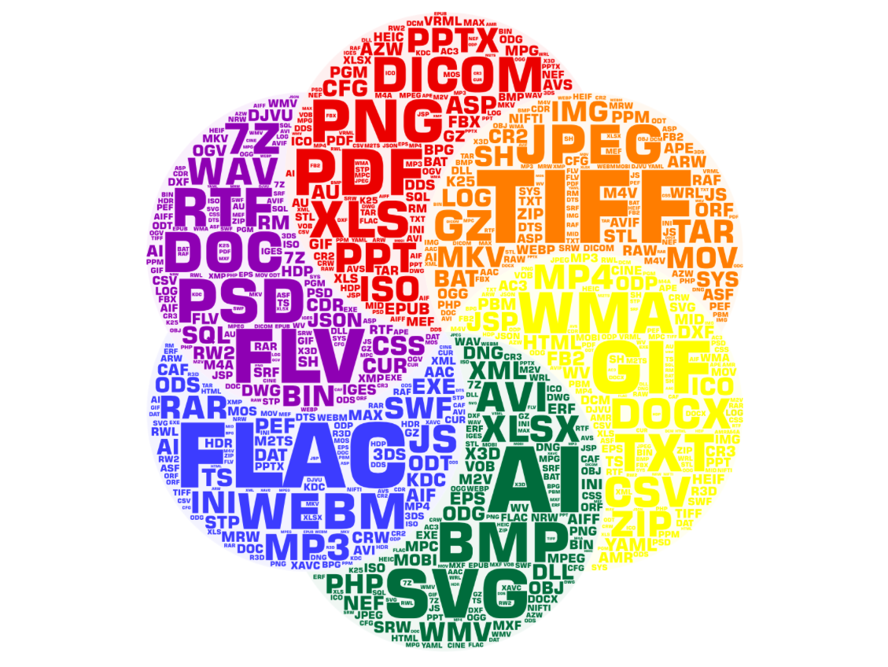
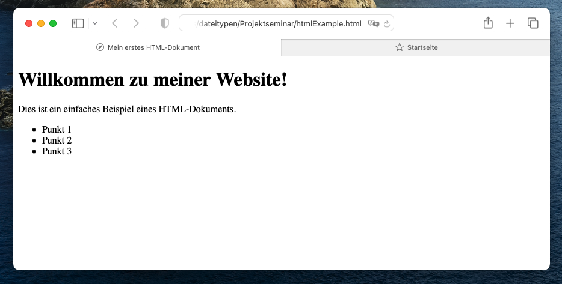
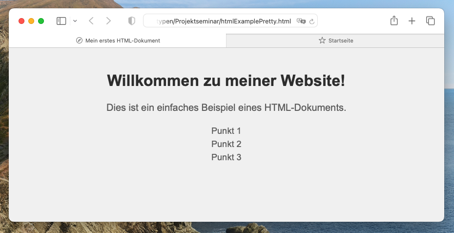
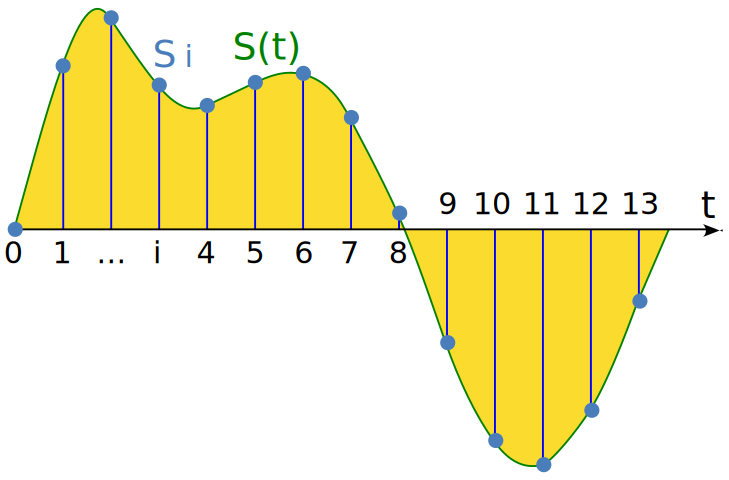
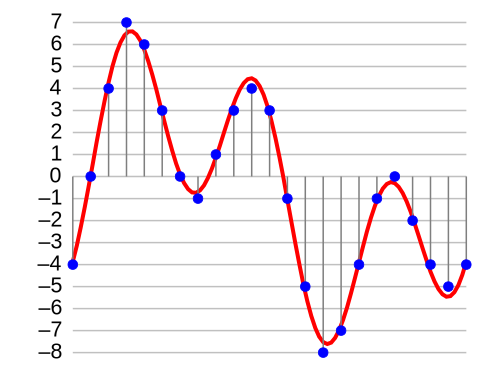
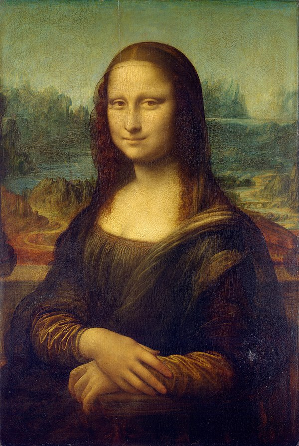
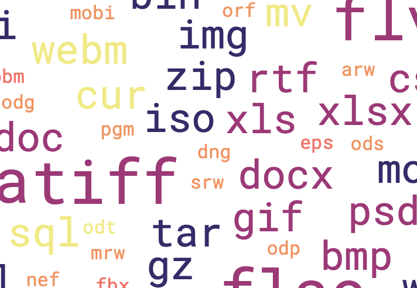
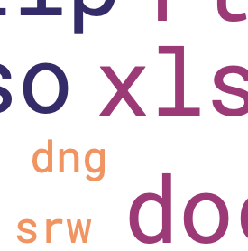
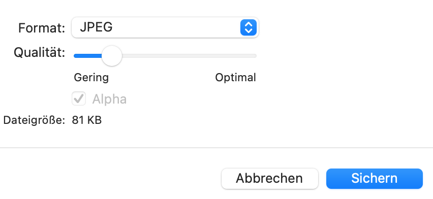
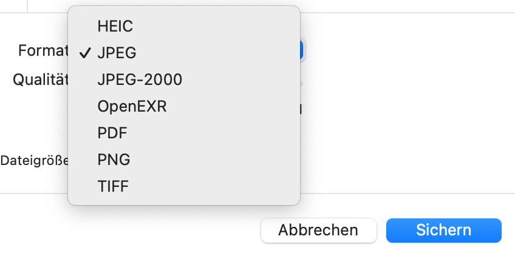

<!--
author:  Swantje Piotrowski, Lukas Eweleit, Erik Stoffer, Penelope Stibane, Caroline Beckmann, Arnold A. Willemer

email:    s.piotrowski@email.uni-kiel.de, stu217721@mail.uni-kiel.de, stu201059@mail.uni-kiel.de, stu210544@mail.uni-kiel.de, stu204392@mail.uni-kiel.de

version:  0.0.1

@icon: https://www.uni-kiel.de/ps/cgi-bin/logos/files/cau/norm-de/cau-norm-de-lilagrey-rgb-0720.png

language: de

narrator: Deutsch Female, Male

comment: Der digitale Baustein zu Digital Literacy  möchte Studierende  einen Überblick über künftige Schlüsselqualifikationen ermöglichen. Sie sollen verstehen, welche Kompetenzen künftige Berufs- und Arbeitsfelder erfordern und in der Lage sein, Digital Literacy in einem Lernprozess zu erfahren und zu beurteilen. Nach dieser Lerneinheit sollen Studierende  differenziert und reflektiert Tools und Software anwenden können.

 Den Studierenden sollen die Vorteile des kollaborativen Arbeitens als Teil der Digital Literacy näher gebracht werden. Hierbei steht insbesondere der Anbieter "cryptpad" im Fokus, dessen Funktionsweise anhand einzelner Foto- und Videosequenzen veranschaulicht wird. Am Ende dieses Abschnittes sollen die Studierenden die Vorzüge von digital-kollaborativen Arbeiten kennen und die grundsätzliche Bedienung des Tools cryptpad verstanden haben.

Ziel ist die Präsentation von Techniken und Instrumenten der digitalen
Literaturrecherche sowie Möglichkeiten der Literaturverwaltung.

Leitfaden zum Erstellen einer Formatvorlage in Word

base: https://cloudlab-olathub.rz.uni-kiel.de/user/suzuv062/106513175450593/liascript-preview/

logo: zerosOnesDalle.png
-->

# Dateiformate verstehen

                {{0-4}}
****************************************


*Designed auf* [*WordArt.com*](https://wordart.com/create)

                {{1}}
****************************************
Willkommen in der Welt der Dateiformate. Sie sind klein, uns egal und meistens tun sie was sie sollen. Doch was auf den ersten Blick trivial erscheint, ist in Wirklichkeit ein entscheidender Teil von Digital Literacies. Diese untersten Bausteine der Digitalen Welt verstehen, heißt auch ein Fundament für nachhaltige Arbeit in der digitalen Welt zu legen. 

Im Laufe dieses Bausteins werden wir uns mit den **Grundlagen des Dateiensystems**<!-- style='color: orange; font-weight: bold;' --> beschäftien und anschließend einen Blick auf **Forschungsdatenmangement und Archivierung**<!-- style='color: orange; font-weight: bold;' --> werfen. Anschließend gehen wir ans Eingemachte<!-- style='color: orange; font-weight: bold;' -->: Der hintere Teil dieses Bausteins befasst sich mit unterschiedlichen Bereichen und mit welchen Formaten in ihnen gearbeitet wird. Damit wir in der Zeit bleiben können, sollten Sie hier nach Ihrem Intersesse und vor allem akademischen Bedarf auswählen.

                {{2}}
<p style="padding: 10px; color: orange; background: black; border: 2px solid orange;">
  <h4>Zwei Hinweise: </h4> 
  <p>Über den Baustein hinweg sind einige Kapitel mit OpenAIs ChatGPT erstellt worden. Sie erkennen die Abschnitte an den entsprechenden Fußnoten[^ChatGPT](Hier gibt's nicht zu sehen.). Wenn Sie mehr über diese Technologie erfahren wollen, klicken Sie sich in den [Kurs](Link-ME!) über Künstliche Intelligenz hinein.</p>

  <p>Darüber hinaus sind einige Unterkapitel recht "reichhaltig" geworden, was dazu führt, dass sie nicht sofort erscheinen, wenn sie angeklickt werden. Wir bitten deshalb um ein wenig Geduld. Die entsprechenden Kapitel sind mit dem ♻️-Emoji gekennzeichnet</p>
</p>

                {{3}}
Es folgt das Inhaltsverzeichnis.

****************************************

****************************************


                {{4}}
****************************************

<h1 style='text-align: center;'>**Inhalt**</h1>

<h4 style='text-align: center;'>

[Allgemeine Informationen](#Allgemeine-Informationen)

[Forschungsdatenmanagement](#Forschungsdatenmanagement)

[Dateiformate für Text](#Dateiformate-für-Text)

[Ton, Bild, Video](#Ton,-Bild,-Video)

</h4>

****************************************


## Allgemeine Informationen

Eine der wichtigsten Funktionen von Computern ist ihre Fähigkeit, sich Dinge zu merken - wir sprechen vom **Speichern**<!-- style='color: orange; font-weight: bold' -->. Computer bewerkstelligen dies, in dem sie Daten als magnetische Ladungen auf Festplatten speichern. Weil unterschiedliche Spannungen oder Ladungen schnell verfälscht werden und Daten daruch unleserlich werden könnten[^1](Man denke nur an Spannungsabfälle oder magnetische Einflüsse von außen, die das Ablesen oder Übertragen beeinflussen könnten und den gesamten Datenfluss durcheinanderbringen. Es ist hier also viel einfacher, nur mit zwei Zuständen zu arbeiten. Dabei ist es natürlich effektiver, pro Einheit so viele Zustände wie möglich zu verwenden. Dies ist jedoch etwas, das sich nur Quantencomputer verlässlich zu Nutze machen können. LINK), begrenzt man sich in der Regel auf zwei Zustände: **Ein**<!-- style='color: orange; font-weight: bold' --> und **Aus**<!-- style='color: orange; font-weight: bold' -->, welche als **1**<!-- style='color: orange; font-weight: bold' --> und **0**<!-- style='color: orange; font-weight: bold' --> bekannt sind. Diese können entweder ausgelesen oder verändert werden. 

                {{1}} 
>Diese kleinsten Einheiten sind die berühmten **Bits**<!-- style='color: orange; font-weight: bold' -->.

                {{2}}
Doch wie kann aus einfachen Ladungen ein Text, Bild oder Ähnliches entstehen? 
Die Lösung liegt auf der Hand: es werden **mehrere Bits**<!-- style='color: orange; font-weight: bold' --> mit einander kombiniert.
Dabei hat sich die Verwendung von **acht Bits** als erstes durchgesetzt und wurde auf den Namen **Byte**<!-- style='color: orange; font-weight: bold' --> getauft.

                {{3}} 
Um die Zählweise eines Systems mit nur zwei Ziffern - ein **Binäres System**<!-- style='color: orange; font-weight: bold' --> - zu verdeutlichen ist hier ein kleines Beispiel (interagieren Sie mit dem Element): 
<script input="number" value="22" min="0" max="1000000">
let i = @input // direct usage as a number
let j = (@input >>> 0).toString(2)

i + " = " + j
</script>


### Text vs Binär

In ihrer Organisationsform unterscheiden sich Dateien jetzt in **zwei Arten**<!-- style='color: orange; font-weight: bold' -->.
Die einen halten sich strikt an eine Aufteilung in vorhersehbare Einheiten (meist 8er-Blöcke, also **Bytes**<!-- style='color: orange; font-weight: bold' -->), um Text zu codieren.
Hier ist ein Beispiel, wie aus Binärem Code Buchstaben werden: 
<script input="number" value="65" min="33" max="126">
let i = @input
let j = (@input >>> 0).toString(2)
let k = String.fromCharCode(i)

i + " = " + j + " = " + k
</script>
Es handelt sich um sogenannte **Plain-Text-Formate**<!-- style='color: orange; font-weight: bold' -->. Diese Dateiformate werden im [Unterkapitel über textbasierte Formate](Dateiformate-für-Text) im Dateiformateabschnitt genauer behandelt.

                {{1}}
*************************************
Problematisch an der Vorgehendweise ist jedoch, dass relativ viel Platz verwendet werden muss, um relativ einfache Zustände zu speichern, da enorm viele Schriftzeichen zur Verfügung stehen. Doch nicht alle Programme brauchen so viele Zustände. Die Lösung sind kürzere *uneinheitliche* Einheiten. Hier sprechen wir von **binären**<!-- style='color: orange; font-weight: bold' --> Dateiformaten.

                {{2}}
*************************************
Doch diese binären<!-- style='color: orange; font-weight: bold' --> Dateien können nur von jenen Programmen gelesen, bzw. verstanden werden, die in der Lage sind, diesen binären Code zu entziffern. Damit der Computer - oder besser sein Betriebssystem - diese Dateien den zugehörigen Programmen zuordnen können, kommen **Dateierweiterungen**<!-- style='color: orange; font-weight: bold' --> ins Spiel (auch bekannt als *Dateiendungen* oder -*kürzel*). Beispiele für Dateikürzel wären: .*docx*, .*mp3*, .*mov*, .*heic*, usw. Sie sind, wie hier angedeutet jeweils durch einen '.' vom **Dateinamen**<!-- style='color: orange; font-weight: bold' --> getrennt. 

Es sei an dieser Stelle erwähnt, dass Dateierweiterungen nicht die einzigen Mittel sind, die Computern zur verfügung stehen, um Dateiformate zu erkennen. Dazu mehr im nächsten Unterkapitel.

*************************************

*************************************


### Innerer Aufbau von Dateien

Üblicherweise bestehen Dateien aus:

1. Header<!-- style='color: orange; font-style: italic; font-weight: bold' --> oder **Kopf**
2. Body<!-- style='color: orange; font-style: italic; font-weight: bold' --> oder **Körper**


>Im Header<!-- style='color: orange; font-weight: bold' --> befinden sich die sogenannten Metadaten<!-- style='color: orange; font-weight: bold' -->, die dem System Auskunft über die Beschaffenheit der Datei geben. Dazu können z.B. der **Name der Datei**<!-- style='color: orange; font-weight: bold' -->, Erstellungsdatum<!-- style='color: orange; font-weight: bold' -->, Dateierweiterung<!-- style='color: orange; font-weight: bold' -->, **Höhe/Breite**<!-- style='color: orange; font-weight: bold' --> (für Bilder), **Magic Number**<!-- style='color: orange; font-weight: bold' --> usw. gehören. 

                {{1}}
****************************************
Besonder interessant für die Verarbeitung sind dabei entweder die Dateierweiterung<!-- style='color: orange; font-weight: bold' -->, **Magic Number**<!-- style='color: orange; font-weight: bold' --> oder Dateistruktur<!-- style='color: orange; font-weight: bold' -->. Die Dateierweitung<!-- style='color: orange; font-weight: bold' --> (z.B. .*docx*, .*mp3*, .*mov*, .*heic*, usw.) wird als Teil des Dateinamens gespeichert. Sie kann jedoch missbraucht werden. So könnte jemand z.B. einen Virus in einer .exe-Datei programmieren, die Dateierweiterung jedoch im Nachhinein auf .jpg ändern und auf diese Weise einen Benutzer dazu verleiten, einen Virus auszuführen, wenn eigentlich niedliche Katzen angezeigt werden sollten. 

****************************************


                {{2}}
****************************************
Um diesem Missbrauch vorzubeugen, gibt es für die meisten Dateiformate, eine sogenannte **Magic Number**<!-- style='color: orange; font-weight: bold' -->. Dabei handelt es sich um eine zwei bis vier Bytes lange Zahl, die für jedes Dateiformat einzigartig ist. Zum Beispiel ist die Magic Number für das GIF Format '47 49 46 38'.[^1] 

Formate, die keine Magic Number haben werden üblicherweise anhand ihrer Struktur erkannt, sofern die Dateierweiterung fehlt. Dabei handelt es sich üblicherweise um **Plain-Text-Formate**<!-- style='color: orange; font-weight: bold' --> wie TXT<!-- style='color: orange; font-weight: bold' -->, XML<!-- style='color: orange; font-weight: bold' --> oder CSV<!-- style='color: orange; font-weight: bold' -->.[^2]

****************************************


                {{3}}
****************************************
>Im Body<!-- style='color: orange; font-weight: bold' --> befinden sich dann die Kerninformationen, die die Datei ausmachen. Plain-Text-Dateien bestehen nur aus diesem Teil.

Bei anderen Textdateien sind dies die einzelnen Buchstaben und Formatierungen, bei Bildern die einzelnen Bildelemente oder Pixel, bei Tondateien liegen hier die Informationen für die digitalisierten Schallwellen.
Dabei sind diese Daten oft unbrauchbar, wenn sie nicht durch Informationen im Header "erklärt" werden, weil sie sonst einfach zu einem einheitlichen Block von Einsen und Nullen verschmelzen. 

****************************************


                {{4}}
**Was also tun, wenn diese Informationen fehlen?**<!-- style='color: orange; font-size: 2vw; font-weight: bold' -->


[^1]:  Einige andere Formate und ihrer Magic Numbers lauten: PNG (89 50 4E 47 0D 0A 1A 0A), JPEG (FF D8 FF), GIF (47 49 46 38), BMP (42 4D), TIFF (49 49 2A 00 / 4D 4D 00 2A), PDF (25 50 44 46), ZIP (50 4B 03 04), RAR (52 61 72 21), EXE (4D 5A), AVI (52 49 46 46), MP3 (49 44 33), WAV (52 49 46 46), MPEG (00 00 01), MP4 (00 00 00 18 66 74 79 70), MKV (1A 45 DF A3), FLV (46 4C 56), JAR (50 4B 03 04), HEIC (66 74 79 70 33 67 70 35), HEIF (66 74 79 70 68 65 69 66), PPTX (50 4B 03 04 14 00 06 00), XLSX (50 4B 03 04 14 00 06 00), DOCX (50 4B 03 04 14 00 06 00)

[^2]: Eine weitere Formate wären: JSON-Dateien (JavaScript Object Notation, wie .json), XML-Dateien (Extensible Markup Language, wie .xml), HTML-Dateien (Hypertext Markup Language, wie .html), CSS-Dateien (Cascading Style Sheets, wie .css), JavaScript-Dateien (wie .js), SQL-Dateien (Structured Query Language, wie .sql), PHP-Dateien (Hypertext Preprocessor, wie .php), YAML-Dateien (YAML Ain't Markup Language, wie .yml).


### Was tun bei unbekannten Formaten? 

Wenn die Metadaten durch Dateibeschädigung<!-- style='color: orange; font-weight: bold' --> oder andere Umstände verloren gegangen sein sollten, können sie nur noch anhand ihrer Struktur erkannt werfen. [DROID<!-- style='color: orange; font-weight: bold' -->](https://www.nationalarchives.gov.uk/information-management/manage-information/preserving-digital-records/droid/) ist ein kostenloses [OpenSource](Link-ME!) Projekt entwickelt vom britischen Nationalarchiv. Es kann Dateien im Cluster analysieren und die Dateiformate erkennen. 

                  {{1}}
Wenn Dateien vorgefunden werden, die nicht korumpiert, deren Format dem Nutzer jedoch trotzdem unbekannt<!-- style='color: orange; font-weight: bold' --> sind, so hilft stets eine Online-Recherche. Gerade die englische Wikipedia<!-- style='color: orange; font-weight: bold' --> kann hier sehr aufschlussreich sein. Auch Webseiten wie [**Fileformats.com**<!-- style='color: orange; font-weight: bold' -->](https://docs.fileformat.com), [**Fileformat.info**<!-- style='color: orange; font-weight: bold' -->](https://www.fileformat.info/format/all.htm) oder [**FileInfo.com**<!-- style='color: orange; font-weight: bold' -->](https://fileinfo.com/filetypes/common) bieten die Informationen. Obendrein erlaubt der Aufbau dieser Wissensbasen,  einen leichteren Zugriff auf ähnliche Formate, was das Stöbern ermöglicht. 


<!-- Ende Abschnitt -->


## Forschungsdatenmanagement 

<i>Dieser Lehrbaustein soll nicht nur ein **Verständnis für Dateiformate**<!-- style='color: orange; font-weight: bold' --> erzeugen, sondern Ihnen auch bei der **Wahl eines idealen Formats**<!-- style='color: orange; font-weight: bold' --> für Ihr Forschungsprojekt helfen. Bevor wir jedoch die unterschiedlichen Vor- und Nachteile bestimmter Formate ansprechen können und worauf Sie bei ihrer Wahl achten sollten, müssen wir jedoch noch einen weiteren Aspekt mit in den Blick nehmen: das Forschungsdatenmanagement<!-- style='color: orange; font-weight: bold' --></i>

<p> </p>

Es ist ein häufiger Fehler, bei der Wahl der Arbeitsmaterialien nur an den Arbeitsprozess<!-- style='color: orange; font-weight: bold' --> und evtl. noch die Präsentation<!-- style='color: orange; font-weight: bold' --> der Ergebnisse zu denken. Doch genau so muss auch an die Nachnutzung<!-- style='color: orange; font-weight: bold' --> gedacht werden.

              {{1}}
***********************************


<sup>[*Bildquelle: forschungsdaten.info*](https://forschungsdaten.info/fileadmin/_processed_/e/d/csm_Datenlebenszyklus_a6b6aeb3f7.png)</sup>

<p></p>

<p></p>

<p></p>


Hier sehen wir den **Lebenszyklus von Forschungsdaten**<!-- style='color: orange; font-weight: bold' -->. Entgegen der subjektiven Wahrnehmung, handelt es sich nicht um einen linearen Ablauf, sondern viel mehr um einen Kreislauf<!-- style='color: orange; font-weight: bold' -->.[^1](Diese Fehleinschätzung kann besonders Studenten ereilen, die in der Regel nur für ihren Prüfer arbeiten, sich jedoch nicht wiklich am globalen Forschungsprojekt beteiligen.)

>**Jedes Ergebnis kann wieder zur Grundlage weiterer Forschung werden.**<!-- style='color: orange; font-weight: bold' --> Nur wer in der Lage ist, Forschungsdaten auch für eine Nachnutzung gut zur Verfügung zu stellen, kann davon ausgehen, einen Beitrag zur Forschung zu leisten.

***********************************


              {{2}}
***********************************
Gleichzeitig gilt:

>Je höher die Qualität<!-- style='color: orange; font-weight: bold' --> der Daten und ihre Verfügbarkeit<!-- style='color: orange; font-weight: bold' -->, desto relevanter<!-- style='color: orange; font-weight: bold' --> ist Ihre Arbeit.

Es ist also unerlässlich, durchgängig auf hohem Niveau zu arbeiten und Forschungsdaten zuverlässig zu speichern und zu veröffentlichen. Nur so kann der Forschungsprozess als Ganzes zuverlässig weiterlaufen und dabei transparant bleiben.

***********************************


              {{3}}
***********************************
Deshalb werden wir jetzt vier Prinzipien vorstellen, die eine optimale Speicherung charakterisieren: Menschenlesbarkeit<!-- style='color: orange; font-weight: bold' -->, Maschinenlesbarkeit<!-- style='color: orange; font-weight: bold' -->, Langzeitstabilität<!-- style='color: orange; font-weight: bold' --> und Metadaten<!-- style='color: orange; font-weight: bold' -->. 

***********************************


<!-- Ende Abschnitt -->


### Menschenlesbarkeit

Bei der Planung für mögliche Wiederverwertbarkeit gilt immer die Frage nach dem *Worst-Case*-Szenario. Hier ist es der Fall, dass die Daten in irgendeiner Form beschädigt wurden und jetzt unklar ist, um was für Daten es sich handelt. In diesem Fall wird es äußerst hilfreich, die Rohdaten auch menschenlesbar<!-- style='color: orange; font-weight: bold' --> vorzufinden. Im Abschnitt [*CSV, XML, JSON, HTML — Informationen für Computer aufbereiten*](CSV,-XML,-JSON,-HTML-—-Informationen-für-Computer-aufbereiten) finden Sie [Übungen](Übungen) mit denen Sie lernen können zwischen den genannten Formaten zu unterscheiden. So ähnlich könnte auch ein Wiederentdeckungsprozess für eine Datenset aussehen, bei dem nicht klar ist, worum es sich handelt, weil z.B. Dateiendugen fehlen usw. 

                {{1}}
>**Plain-Text-basierte Dateiformate**<!-- style='color: orange; font-weight: bold' --> eignen sich besonders gut, um Daten auch über lange Zeit zu speichern und zeichnen sich durch ihre Menschenlesbarkeit<!-- style='color: orange; font-weight: bold' --> aus. Sie existieren bereits seit langer Zeit und lassen sich immer durch einen einfachen Editor offnen. Mehr dazu [hier](TXT---Muter-aller-Textverarbeitung). 

                {{2}}
Unterschiedliche Datenformen benötigen jedoch Daten in binären Formaten wie zum Beispiel Bild- und Tondateien. Wie können diese erhalten werden?

<!-- Ende Abschnitt -->


### Maschinenlesbarkeit

Maschinenlesbarkeit<!-- style='color: orange; font-weight: bold' --> bedeutet vor allem die Möglichkeit, Daten mit leicht verfügbaren Programmen - am besten [Open-Source](Link-Me!), also frei verfügbar - öffnen zu können. Dabei gilt:

>**Je weiter verbreitet die Software, desto besser!**<!-- style='color: orange; font-weight: bold' -->

Auf diese Weise kann davon ausgegangen werden, dass auch nach längerer Zeit das Programm noch zur Verfügung steht, um die Dateien zu öffnen. **Nur weil etwas OpenSource und kostenlos ist, muss es noch nicht gut oder weit verbreitet sein.**<!-- style='color: orange; font-weight: bold' --> (!) *"Weit verbreitet"* kann auch bedeuten, dass mehrere Programme das Format nutzen, bzw. es das meistverwendete Format für diesen Zweck ist, es sich also um einen Industriestandard<!-- style='color: orange; font-weight: bold' --> handelt. 

Es muss auch zwischen **offenen und proprietären Formaten**<!-- style='color: orange; font-weight: bold' --> untersschiden werden. **Proprietäre Formate**<!-- style='color: orange; font-weight: bold' --> lassen sich oft nur durch eine Software der Hersteller-/Herausgeberfirma nutzen, welche in der Regel bezahlt werden muss oder Änderungen nach Firmeninteressen unterliegen kann. Damit Machinenlesbarkeit über längere Zeit gewährleistet werden kann, sollten hier immer **offene Formate**<!-- style='color: orange; font-weight: bold' --> verwendet werden.

<!-- Ende Abschnitt -->


### Langzeitstabilität

<span style='color:orange'>***"Nichts ist von Dauer in der Tech-Welt!"***</span>*, möchte man manchmal ausrufen. Denn, in der Tat, entwickeln sich in dieser doch noch relativ jungen Disziplin die Neuerung stets rasant. Wie kann in solch einer Umgebung überhaupt etwas entstehen, das von Dauer ist?*

                {{1-7}}
****************************************
Dieses Problem ist natürlich schon früh aufgekommen. Und während eine Innovation der nächsten die Klinke in die Hand gedrückt hat, ist man schnell dazu übergegangen Standards<!-- style='color: orange; font-weight: bold' --> für bestimmte Formate einzuführen, um eine gewisse Kompatibilität zu gewährleisten.[^Anmerkung](Es sei an dieser Stelle darauf hingewiesen, dass es sich für Entwicklerfirmen - denken Sie an Apple, Microsoft, Google, usw. - nicht unbedingt lohnt, alles standardisieren zu lassen. Erstellen sie z.B. ein Programm zum Auslesen bestimmter Daten - sagen wir die Geschwindigkeit von Tretrollern -, kann es sich lohnen diese Technik nicht zu teilen, um eine Monopolstellung auf die Auslesung von Tretrollergeschwindigkeiten zu erhalten und so größeren Gewinn aus dem Produkt ziehen zu können. 
Die Bereitschaft, einen öffentlichen Standard zu unterstützen wächst in der Regel genau dann, wenn die Konkurrenz beginnt Alternativen auf den Markt zu bringen. Jetzt lohnt es sich Hersteller des Industriestandards zu sein.)


                {{2}}
Weil dieser Prozess eine Weile dauern kann, gibt es **unabhängige Organisationen**<!-- style='color: orange; font-weight: bold' -->, die Standardformate veröffentlichen und in der Regel offen zur Verfügung stellen. Berühmte Bespiele sind: 

                {{3}}
- die [**Internationale Organisation für Normierung**<!-- style='color: orange; font-weight: bold' -->](https://www.iso.org/home.html) auch **ISO**<!-- style='color: orange; font-weight: bold' --> (von engl. *International Standardisation Organisation*), ein Verein mit Sitz in der Schweiz, der Standards von [Datum und Uhrzeit](https://www.iso.org/iso-8601-date-and-time-format.html) oder [Währungsdarstellungen](https://www.iso.org/iso-4217-currency-codes.html) über [Kindersitze](https://www.iso.org/isofix-child-seats-iso-13216.html) hin zum berühmten Kreuzworträtsel-Klassiker [ISO](https://www.iso.org/iso-6-camera-film-speed.html) (ASA in Amerika) für die Lichtempfindlichkeit von Kamerafilm normiert. Für unser Thema besonders interessant ist die Arbeit des ***Joint Photographic Experts Group***, ein Unterkommitee der ISO, das die [**JPEG** und **JPEG2000** Standards](https://www.iso.org/iso-9660-images-for-computer-files.html) entwickelt hat. Mehr dazu [später](RAW,-JPEG,-PNG---Bild-und-Bildqualität)...

                {{4}}
- das [**Unicode Consortium**<!-- style='color: orange; font-weight: bold' -->](https://home.unicode.org), welches für die Standardisierung von Textzeichen zuständig ist. Die wohl größte Leistung ist die Erweiterung der alten **ASCII-Symbolsammlung**<!-- style='color: orange; font-weight: bold' -->, die nur englische Textzeichen<!-- style='color: orange; font-weight: bold' --> abgebildet hat, auf die neuen Standards **UTF-8**<!-- style='color: orange; font-weight: bold' --> und **UTF-16**<!-- style='color: orange; font-weight: bold' -->. In ihnen sind nicht nur alle Variaten des Römischen Schriftbilds, sondern die meisten bekannten Schriftzeichen der Welt enthalten. Eine neuere Leistung ist die Einführung von standadisierten Emojis. 🙌

                {{5}}
- das [W3C<!-- style='color: orange; font-weight: bold' -->](https://www.w3.org/Consortium/) (**World Wide Web Consortium**<!-- style='color: orange; font-weight: bold' -->) ist eine internationale Gemeinschaft bestehend aus Mitgliedsorganisationen, privaten Mitarbeitern und der Öffentlichkeit, die zusammenarbeiten, um Webstandards zu entwickeln.[^1](https://www.w3.org/Consortium/) Zu diesen Standards gehören wichtige Technologien wie HTML<!-- style='color: orange; font-weight: bold' -->, CSS<!-- style='color: orange; font-weight: bold' -->, SVG<!-- style='color: orange; font-weight: bold' -->, XML<!-- style='color: orange; font-weight: bold' --> und mehr.[^2](https://www.w3.org/standards/) 

                {{6}}
****************************************
Wenn kein standardisiertes Format zur Verfügung steht, lohnt es sich ein weit verbreitetes zu nutzen. 

>Ein großer Nutzerkreis zieht in der Regel Interessierte an, die sich aus eigenem Antrieb um den **Erhalt des Formats**<!-- style='color: orange; font-weight: bold' --> bemühen, was der Langzeitstabillität erheblich dient. 

****************************************


****************************************


                {{7}}
<h4>Zuletzt sei noch von Zeiträumen<!-- style='color: orange; font-weight: bold' --> die Rede.</h4>

                {{8}}
**Im Studium**<!-- style='color: orange; font-weight: bold' --> ist der Zeitraum, für den Unterlagen erstellt werden, meist recht kurz. Ein Exzerpt muss nur bis zur nächsten Stunde oder Hausarbeit existieren, eine PowerPoint nur bis zur Präsentation und gemeinsames Arbeitsmaterial bis zur Deadline. 

                {{9}}
Doch das ändert sich schnell beim Berufseintritt<!-- style='color: orange; font-weight: bold' -->. Eine Lehrkraft wünscht sich seine markierten Scans von wichtigen Texten wieder, um sie in der nächsten Stunde als Material zu verwenden. Im Büro erinnert man sich an diese eine Studie, die man zwar gelesen aber einfach nicht mehr öffnen kann. Oder ein Experiment aus der Unizeit könnte den Druchbruch bringen - blöder Weise ist das Protokoll nicht mehr lesbar...

                {{10}}
****************************************
>Generell sollte davon ausgegangen werden, dass **alle Ergebnisse**<!-- style='color: orange; font-weight: bold' --> irgendwann eine Nachnutzung finden könnten. 

[Hier ist ein schönes Beispiel aus der Medizin.](https://www.nature.com/articles/s41591-020-1083-1) Als im September 2020 noch unklar war, wie langfristig die Immunisierung nach einer durchstandenen COVID-19 Erkrankung sein würde, konnte eine Gruppe von Forschern auf ihre Daten über HIV-Erkrankte, die über 35 Jahre hinweg regelmäßige Bluttests abgegeben hatten, zurückgreifen, um sie nach dem Wiederauftreten von COVID-19 ähnlichen Coronavirusantikörpern zu untersuchen. Auf diese Weise konnten sie zumindest Rückschlüsse auf COVOD-19 treffen.

****************************************


                {{11}}
>Es sind also immer **unvorhergesehene Verwendungsmöglichkeiten**<!-- style='color: orange; font-weight: bold' --> mit in Betracht zu ziehen und **möglichst lange Lagerung**<!-- style='color: orange; font-weight: bold' --> zu gewährleisten. Für einen Zeitraum von **unter 10 Jahren**<!-- style='color: orange; font-weight: bold' --> empfehlen sich auch häufig verwendeten Formate. Will man jedoch **über 10 Jahre**<!-- style='color: orange; font-weight: bold' --> hinaus so empfehlen sich immer standardisierte Formate. 

<!-- Ende Abschnitt -->


### Metadaten

*Wir hatten Metadaten<!-- style='color: orange; font-weight: bold' --> eingangs beim Aufbau von Dateien erklärt. Sie sind im Header oder Kopf einer Datei enthaltene Daten, die weitere Informationen über die Datei geben. Das können Erstellungs- und Änderungsdatum sein, Kompressionen und Dateilängen, sowie die Art der Datei, Magic Number und vieles mehr. *

>**Metadaten**<!-- style='color: orange; font-weight: bold' --> sind auf lange Zeit wichtig, weil sie als Ersatz dienen, wenn andere Informationsgeber versagen. *Nicht-Plain-Text*-Dateien können ohne sie in der Regel gar nicht gelesen werden.

                {{1}}
Wenn zum Beispiel Dateiendungen fehlen, kann eine **Magic Number** helfen. Beim Durchstöbern, bzw. Auswählen von Daten kann es extrem wichtig sein, die **Erstellungsdaten** nachzuvollziehen. Bei Projekten mit vielen Mitarbeitern kann es nötig werden bestimmte **Ersteller** zu filtern. Die Liste lässt sich beliebig verlängern.

                {{2}}
Selbstverständlich können diese Daten auch verloren gehen. In einem solchen Fall ist es wichtig, Informationen über den Datensatz separat niederzuschreiben. Hierfür lohnt es sich, eine sogenannte **README-Datei**<!-- style='color: orange; font-weight: bold' --> zu erstellt. Meist als **MARKDOWN**- oder **TXT**-Datei gespeichert, können Autoren die Logik ihres Datensatzes, sowie wichtige Randdaten hier verewigen. 

                {{3}}
>**README-Dateien**<!-- style='color: orange; font-weight: bold' --> sind kleine Textdateien<!-- style='color: orange; font-weight: bold' -->, in denen besondere **Informationen und Bedienhinweise**<!-- style='color: orange; font-weight: bold' --> an Datensätzen angehängt werden. Sie sind separate Dateien und werden in der Regel in einem Oberordner des Relevanten Verzeichnis gespeichert.

<!-- Ende Abschnitt -->


### Zusammenfassung

Zusammenfassend lassen sich die vorangegangen Erwägungen für die Eignung zur Langzeitspeicherung in dieser Tabelle ausdrücken:

| Eignung  | Machinenlesbarkeit| Menschenlesbarkeit | Langzeitstabilität | Metadaten |
| sehr gut | mit weit ver­breiteter offener Software | ja und ohne Spezial­software | genormter Standard | vollständig enthalten |
| gut | mit gut ver­breiteter und doku­mentierter Software | nach Standard­verfahren komprimiert, aber eigentlich ja | schon lang oder groß­flächig etabliert | technische Angaben sind enthalten |
| mittelmäßig | proprietäres Standard­format | mit offener Soft­ware (zuver­läs­sig?) in höhere Klasse konvertierbar | relativ neues Format | einige wichtige (z. B. Einheiten) sind enthalten |
| schlecht | selbst­entwickelte Lese-Software | nein | gerade erst erfunden | keine Angaben |

<sup>Übernommen von [Forschungsdaten.info](https://forschungsdaten.info/themen/veroeffentlichen-und-archivieren/formate-erhalten/)</sup>

                {{1}}
Natürlich ist bei der Langzeitspeicherung auch der Speicherplatz<!-- style='color: orange; font-weight: bold' --> von Wichtigkeit. Wenn also ein nachhaltigeres Format dazu führt, dass wichtige Daten weggeworfen werden müssten, sollte ein Kompromiss<!-- style='color: orange; font-weight: bold' --> gefunden werden, der so vielen Gütekriterien wie möglich genügt und trotzdem noch genug Platz lässt. 

<!-- Ende Abschnitt -->


## Dateiformate

                {{0-3}}
*************************************
Damit schließen wir mit den Grundlagen und widmen und den Details<!-- style='color: orange; font-weight: bold' -->. Im nächsten Teil wollen wir in **spezielle Anwendungsbereiche**<!-- style='color: orange; font-weight: bold' --> und **deren geläufigsten Formate**<!-- style='color: orange; font-weight: bold' --> vertiefen. Dabei könnte es passieren, dass  wir stellenweise etwas...

                {{1}}
*************************************
<div style="float:right; width:60%;">
  
  </div>
<span style="color:orange; font-style: italic; font_weight: bold">*...komplex*</span> werden.

*************************************


                {{2}}
Wenngleich es von Vorteil sein kann, den folgenden Teil komplett durchzuarbeiten, so möchten wir Sie einladen, entsprechend Ihren akademischen Bedürfnisse selektiv aus dem Katalog zu wählen. Geisteswissenschaftler<!-- style='color: orange;' --> dürften sich verstärkt für Textverarbeitung<!-- style='color: orange;' --> und<!-- style='color: orange;' --> -präsentation<!-- style='color: orange;' --> interessieren. Wer mit komplexeren<!-- style='color: orange;' --> Daten<!-- style='color: orange;' --> arbeiten will, sollte sich mit dem Abschnitt über Datenverarbeitung<!-- style='color: orange;' --> auseinandersetzen. Psychologen<!-- style='color: orange;' --> oder Pädagogen<!-- style='color: orange;' --> werden sich auf den Abschnitt über Videos<!-- style='color: orange;' --> für die nächste Interviewstudie freuen. Und Zoologen<!-- style='color: orange;' --> auf der Jagd nach seltenen Vogelrufe, können sicher sein, das richtige Audioformat<!-- style='color: orange;' --> zu wählen. 
**Nutzen Sie dazu das Menü auf der linken Seite**<!-- style='color: orange; font-weight: bold' --> oder das Verzeichnis unten und wählen Sie entsprechend Ihrer Interessen.

*************************************


                {{3}}
*************************************

<div style='text-align: center;'>

  <p style="color: red; font-size: 9vw; font-weight: bold; font-family: serif;">Fangen wir an!</p>

    

  <h3>

    [Dateiformate für Text](Dateiformate-für-Text)

  </h3>

  <h4>

    [TXT - Mutter aller Textverarbeitung](TXT---Mutter-aller-Textverarbeitung)

    [RTF, MD, DOCX, ODT, PAGES — Informationen für Menschen aufbereiten](RTF,-MD,-DOCX,-ODT,-PAGES-—-Informationen-für-Menschen-aufbereiten)

    [CSV, XML, JSON, HTML — Informationen für Computer aufbereiten](CSV,-XML,-JSON,-HTML-—-Informationen-für-Computer-aufbereiten)

    [PDFs — Text und Bild überall!](PDFs-—-Text-und-Bild-überall!)

  </h4>

  <h3> </h3>

  <h3>

    [Ton, Bild, Video](Ton,-Bild,-Video)

  </h3>

  <h4>

    [WAV, MP3 — Ton und Tonqualität](WAV,-MP3-—-Ton-und-Tonqualität-♻️)

    [JPEG, PNG, TIFF, SVG, PS — Bild und Bildqualität](JPEG,-PNG,-TIFF,-SVG,-PS-—-Bild-und-Bildqualität-♻️)

    [MP4, MOV, AVI, WMV — Bild und Ton vereint](MP4,-MOV,-AVI,-WMV-—-Bild-und-Ton-vereint)

  </h4>

</div>


*************************************

<!-- Ende Abschnitt -->


## Dateiformate für Text

<i><b>In diesem Abschnitt werden wir uns mit verschiedenen Arten von Dateiformaten beschäftigen, die Text<!-- style='color: orange; font-weight: bold' --> widergeben<!-- style='color: orange; font-weight: bold' -->, und ihre Funktionsweise und Einsatzmöglichkeiten genauer untersuchen.</b></i>[^ChatGPT1](Diese Abstätze wurden von ChatGPT am 15.01.2023 mit dem Prompt "Schreibe ein Intro zu einem Lernbaustein über textbasierte Dateiformate. Der Kurs gliedert sich in die Teile Plain Text TXT, Formate, die hauptsächlich für Menschen gedacht sind und Formate, die hauptsächlich für Maschinen gedacht sind." erstellt und leicht modifiziert)

Wir werden den Kurs in vier Teile gliedern: **Plain Text (TXT)**<!-- style='color: orange; font-weight: bold' -->, Formate, die **hauptsächlich für Menschen**<!-- style='color: orange; font-weight: bold' --> gedacht sind, PDF<!-- style='color: orange; font-weight: bold' --> werden wir uns mit Formaten befassen, die hauptsächlich für Maschinen gedacht sind. Diese Formate sind gut geeignet, um Daten zwischen Anwendungen auszutauschen und zu verarbeiten und Formate, die **hauptsächlich für Maschinen**<!-- style='color: orange; font-weight: bold' --> gedacht sind. 

Im **ersten Teil**<!-- style='color: orange; font-weight: bold' --> werden wir uns mit dem einfachen, aber leistungsfähigen Plain Text-Format (TXT<!-- style='color: orange; font-weight: bold' -->) beschäftigen.

Im **zweiten Teil**<!-- style='color: orange; font-weight: bold' --> werden wir uns mit Formaten befassen, die hauptsächlich für Menschen gedacht sind, wie RTF<!-- style='color: orange; font-weight: bold' -->, MD<!-- style='color: orange; font-weight: bold' -->, DOCX<!-- style='color: orange; font-weight: bold' -->, ODT<!-- style='color: orange; font-weight: bold' --> und PAGES<!-- style='color: orange; font-weight: bold' -->. Diese Formate sind mit Formatierungsoptionen<!-- style='color: orange; font-weight: bold' --> ausgestattet, die es Benutzern ermöglichen, ihre Dokumente mit **Stil und Klarheit**<!-- style='color: orange; font-weight: bold' --> zu gestalten.

Im **dritten Teil**<!-- style='color: orange; font-weight: bold' --> werfen wir noch einen Blick auf PDF<!-- style='color: orange; font-weight: bold' -->-Formate. Diese eignen sich besonders, um Text und Bild in einer für Menschen angenehmen Form dazustellen und über Zeit und Geräte hinweg stabil anzuzeigen.

Abschließen<!-- style='color: orange; font-weight: bold' --> werden wir uns mit Formaten befassen, die hauptsächlich für Maschinen gedacht sind, wie CSV<!-- style='color: orange; font-weight: bold' -->, XML<!-- style='color: orange; font-weight: bold' -->, JSON<!-- style='color: orange; font-weight: bold' --> und HTML<!-- style='color: orange; font-weight: bold' -->. Diese Formate sind gut geeignet, um Daten zwischen Anwendungen auszutauschen und zu verarbeiten.

<!-- Ende Abschnitt -->


### TXT – Mutter aller Textverarbeitung

                {{0}}
**Plain-Text (.txt)**<!-- style='color: orange; font-weight: bold' --> ist eines der einfachsten und ältesten Dateiformate für Textverarbeitungen. Es handelt sich hierbei um ein Format ohne Formatierungen oder spezielle Zeichen, welches lediglich reinen Text enthält. Dieser Text kann mit jedem Texteditor geöffnet, bearbeitet und gespeichert werden.[^ChatGPT1](Diese Abstätze wurden von ChatGPT am 15.01.2023 mit dem Prompt "Schreibe einen informativen Text über das Plain-Text-Format .txt. Die Überschrift lautet "TXT – Mutter aller Textverarbeitung"." erstellt und leicht modifiziert.)

                {{1}}
Es hat seine Wurzeln<!-- style='color: orange; font-weight: bold' --> in den frühen Tagen der Computertechnologie, als einfache Textdateien die einzigen Arten von Dokumenten waren, die auf Computern gespeichert und verarbeitet werden konnten. Es entstand aus dem Bedarf heraus, Informationen in einer einfachen, universell lesbaren und maschinenlesbaren Form zu speichern. 

                {{2}}
Das TXT-Format ist für seine Portabilität<!-- style='color: orange; font-weight: bold' --> bekannt. Da es keine Formatierungen oder spezielle Zeichen enthält, kann es auf jedem Gerät mit einem Texteditor geöffnet und bearbeitet werden. Es ist auch sehr gut lesbar, da es nicht mit unnötigen Formatierungen überladen ist.

                {{3}}
Ein weiterer Vorteil des TXT-Formats ist seine Einfachheit<!-- style='color: orange; font-weight: bold' -->. Es ist einfach zu erstellen, da keine besonderen Kenntnisse erforderlich sind. Außerdem ist es einfach zu lesen, da es keine<!-- style='color: orange; font-weight: bold' --> unübersichtlichen Formatierungen<!-- style='color: orange; font-weight: bold' --> enthält.

                {{4}}
Da das TXT-Format so einfach gehalten ist, eignet es sich auch hervorragend für **einfache Texte oder Notizen**<!-- style='color: orange; font-weight: bold' -->. Es ist jedoch wichtig zu beachten, dass es keine Möglichkeit gibt, Textformatierungen wie **Fett- oder Kursivdruck**<!-- style='color: orange; font-weight: bold' --> hinzuzufügen.

                {{5}}
TXT-Dateien können mit den meisten Textverarbeitungsprogrammen geöffnet werden, einschließlich Notepad<!-- style='color: orange; font-weight: bold' --> auf Windows-Systemen und TextEdit<!-- style='color: orange; font-weight: bold' --> auf MacOS-Systemen. Darüber hinaus gibt es auch eine Vielzahl von kostenlosen und Open-Source-Texteditoren, die TXT-Dateien unterstützen, wie z.B. [**Notepad++**<!-- style='color: orange; font-weight: bold' -->](https://notepad-plus-plus.org), [**Sublime Text**<!-- style='color: orange; font-weight: bold' -->](https://www.sublimetext.com) und [Atom<!-- style='color: orange; font-weight: bold' -->](https://github.blog/2022-06-08-sunsetting-atom/). Diese Programme bieten oft mehr Funktionen als die einfachen Texteditoren, wie Syntax-Hervorhebung, Zeilennummerierung und Unterstützung für mehrere Dateiformate.[^ChatGPT2](Diese Abstätze wurden von ChatGPT am 15.01.2023 mit dem Prompt "Schreibe noch einen weiteren Absatz über Programme, mit denen man txt Dateien öffnet." erstellt und leicht modifiziert)

                {{6}}
Insgesamt ist das TXT-Format ein zuverlässiger und unkomplizierter Weg, Text zu speichern und zu teilen. Es ist einfach zu verstehen und eignet sich hervorragend für einfache Texte oder Notizen. Obwohl es eingeschränktere Funktionen als andere Formate hat, bleibt es dennoch eine wertvolle Ressource für alle, die einfache Texte verwalten müssen.

                {{7}}
Was die Langzeitspeicherung betrifft, so ist klar: TXT geht nirgendwohin! Hat es seit den 60 Jahren bestand so wird es auch noch weiter 60 Jahre überstehen.

<!-- Ende Abschnitt -->


### RTF, MD, DOCX, ODT, PAGES — Informationen für Menschen aufbereiten

***Wenn es darum geht, Texte für Menschen lesbar aufzubereiten, gibt es eine Reihe von Dateiformaten, die speziell für diesen Zweck entwickelt wurden. Hier sind einige der wichtigsten:***[^ChatGPT](In diesem Kapitel sind ungefähr die Hälfte der Texte mit ChatGPT Mitte Januar erstellt worden. Leider ist der exakte Prompt nicht mehr erhalten.)


                {{1-3}}
***************************************
<h3>RTF (Rich Text Format): </h3>

                {{1}}
RTF<!-- style='color: orange; font-weight: bold' --> ist ein Textformat, das es Benutzern ermöglicht, Text mit Formatierungen wie Schriftart, Größe, Farbe, Absatz- und Zeichenformatierungen usw. zu speichern. RTF-Dateien können mit den meisten Textverarbeitungsprogrammen gelesen und bearbeitet werden und sind eine gute Wahl, wenn Sie eine einfache Möglichkeit zur Aufbereitung von Texten für Menschen benötigen.

                {{2}}
Das RTF wurde 1987 von Microsoft eingeführt und war eines der ersten Textformate, das die **Formatierung von Texten über mehrere Anwendungen und Betriebssysteme hinweg**<!-- style='color: orange; font-weight: bold' --> beibehält. Es ermöglichte es Benutzern, Texte mit verschiedenen Schriftarten<!-- style='color: orange; font-weight: bold' -->, Schriftgrößen<!-- style='color: orange; font-weight: bold' -->, Schriftstilen<!-- style='color: orange; font-weight: bold' --> und Farben<!-- style='color: orange; font-weight: bold' --> zu formatieren und diese Formatierung bei Übertragungen auf andere Computer beizubehalten. Mit dem Aufkommen anderer Formate, wie z.B. DOCX, hat RTF jedoch an **Popularität verloren**<!-- style='color: orange; font-weight: bold' -->, obwohl es immer noch von einigen Textverarbeitungsprogrammen unterstützt wird, wie z.B. Microsoft Word.

***************************************


                {{3-6}}
***************************************
<h3>DOCX ("Das Word-Dokument"): </h3>

DOCX<!-- style='color: orange; font-weight: bold' --> ist das Standardformat für Microsoft Word-Dokumente. Es bietet eine reiche Palette an Formatierungsmöglichkeiten, einschließlich Schriftart, Größe, Farbe, Absatz- und Zeichenformatierungen usw. DOCX-Dateien können mit **Microsoft Word**<!-- style='color: orange; font-weight: bold' --> und einigen anderen Textverarbeitungsprogrammen gelesen und bearbeitet werden.

                {{4}}
Das DOCX Format wurde erstmals im Jahr 2007<!-- style='color: orange; font-weight: bold' --> mit Microsoft Word 2007 eingeführt und hat sich seitdem zum Industriestandard entwickelt. Es hat das ältere DOC Format, das seit 1993 verwendet wurde, abgelöst und bietet eine Vielzahl von Vorteilen, darunter eine bessere **Kompatibilität und Zusammenarbeit mit anderen Anwendungen**<!-- style='color: orange; font-weight: bold' --> und Betriebssystemen<!-- style='color: orange; font-weight: bold' -->. Darüber hinaus ermöglicht DOCX eine flexiblere Textformatierung, eine kleinere Dateigröße und die Möglichkeit, interaktive Elemente wie Tabellen, Grafiken und Formulare einzufügen. Aufgrund dieser Vorteile und seiner breiten Akzeptanz in der Geschäftswelt hat sich DOCX zum Industriestandard für Textverarbeitung entwickelt.

***************************************


                {{5-6}}
***************************************
<h4>Alternativen: </h4>

{{5-6}}Einige Alternativen zu DOCX-Formaten sind **ODT (Open Document Text)**<!-- style='color: orange; font-weight: bold' -->, das vom OpenOffice-Projekt entwickelt wurde und als offenes Format für Textverarbeitungen verwendet wird, sowie **Pages**<!-- style='color: orange; font-weight: bold' -->, das von Apple für die Verwendung auf Mac-Computern entwickelt wurde. Beide Formate haben eine vergleichbare Funktionalität mit DOCX und bieten viele der gleichen Funktionen, aber die Kompatibilität und die Verbreitung kann je nach Plattform und Gerät variieren. Außerdem gibt es auch cloud-basierte Optionen wie **Google Docs**<!-- style='color: orange; font-weight: bold' -->, die eine Alternative für die Verwendung von Textdokumenten in einer online-basierten Umgebung bieten.

***************************************


                {{6}}
***************************************
<h3>MD (Markdown): </h3>

Markdown<!-- style='color: orange; font-weight: bold' --> ist ein Plain-Text-Format, das es Benutzern ermöglicht, Texte mit einer einfachen Syntax zu formatieren. Diese Syntax kann später in HTML umgewandelt werden, um den Text auf einer Webseite darzustellen. MD-Dateien sind einfach zu lesen und zu bearbeiten und eignen sich hervorragend für die Aufbereitung von Texten für Menschen, die nicht viel Erfahrung mit Textformatierung haben.

                {{7}}
Markdown wurde 2006 von John Gruber und Aaron Swartz eingeführt. Die Idee dahinter war, dass es einfacher sein sollte, Texte zu formatieren, als mit HTML oder anderen Markup-Sprachen. Markdown wurde schnell zu einem beliebten Format für Blogging, Dokumentation und andere Anwendungen, bei denen Texte formatiert werden müssen.

                {{8}}
Die Syntax<!-- style='color: orange; font-weight: bold' --> von Markdown ist sehr einfach und besteht aus einer Kombination aus Text und einfachen Zeichen, die für Formatierungen verwendet werden. Beispielsweise kann ein Überschrift<!-- style='color: orange; font-weight: bold' --> durch eine Reihe von **#-Zeichen** gekennzeichnet werden, während **fett gedruckter Text**<!-- style='color: orange; font-weight: bold' --> durch zwei **Asterisken** eingerahmt wird. Die Schönheit von Markdown liegt darin, dass es einfach zu erlernen und zu verwenden ist, aber dennoch eine [Vielzahl an Formatierungen](https://www.markdownguide.org/basic-syntax/) ermöglicht. Dieser ganze Kurs ist zum Beispiel in Markdown geschrieben.

***************************************


<!-- Ende Abschnitt -->


### PDFs — Text und Bild überall!

<i>Eins der im Studium am häufigsten verwendeten Formate ist die PDF<!-- style='color: orange; font-weight: bold' -->. Sie wird hier extra gelistet, weil sie anders als DOCX oder Markdown sich nicht mehr nachträglich bearbeiten lässt. PDF steht für **Portable Document Format**<!-- style='color: orange; font-weight: bold' --> und ist ein weit verbreitetes Dateiformat zur Übertragung und Archivierung von Dokumenten. Es wurde 1993 von Adobe Systems entwickelt und ist ein **offenes Format**<!-- style='color: orange; font-weight: bold' -->, das es ermöglicht, Dokumente unabhängig vom ursprünglichen Programm, mit dem sie erstellt wurden, **auf jedem Computer**<!-- style='color: orange; font-weight: bold' --> oder Mobilgerät zu öffnen.</i>

<p> </p>

        {{1}}
Es gibt zwei Arten von PDFs: **text-basierte**<!-- style='color: orange; font-weight: bold' --> und **bild-basierte PDFs**<!-- style='color: orange; font-weight: bold' -->. **Text-basierte PDFs**<!-- style='color: orange; font-weight: bold' --> enthalten Text und Grafiken, die als separate Elemente gespeichert sind. Dadurch können sie von Suchmaschinen indexiert<!-- style='color: orange; font-weight: bold' --> und **durchsucht werden**<!-- style='color: orange; font-weight: bold' -->. Der Text wird als *plain text* gespeichert und das erstellende Programm hinterlegt ein Beispiel-Alphabet für die verwendeten Schriftarten in der Datei. Auf diese Weise kann das Dokument auch in der beabsichtigten Formatierung auf Endreräten ausgelesen werden, die diese Schriftart nicht unterstützen. 
Diese Dateien werden meistens durch Textverarbeitungsprogramme wie Word, OpenOffice oder Pages direkt erstellt<!-- style='color: orange; font-weight: bold' -->, da diese sowohl über die Daten der Schriftarten als auch den reinen Text verfügen und diese in einer PDF vereinen können. 

        {{2}}
**********************
**Bild-basierte PDFs**<!-- style='color: orange; font-weight: bold' --> hingegen sind einfache Abbildungen, die aus Bitmaps und Vektorgrafiken bestehen. Diese Art von PDFs eignet sich am besten für die Übertragung von Grafiken und Layouts, bei denen der Inhalt nicht ausgelesen werden soll.
Diese Sorte PDF wird in der Regel von Bildverarbeitungssoftwares oder älteren Scannern erzeugt. 

Modernere Scanner und KI-Bildverarbeitungsprogramme erkennen jetzt  immer öfter und vor allem kostengünstiger Text auf Bildern und können diesen in  PDFs mit einfließen lassen, sie also zu Text-PDFs machen. Dabei sei jedoch Vorsicht geboten, weil diese Maschinen bei besonders schlechten Aufnahmen darauf angewiesen sind, zu raten. [^Beispiel](Siehe für ein besonders schockierendes Beispiel, den XEROX-Bug, und seine verheerenden Folgen: https://www.dkriesel.com/blog/2013/0802_xerox-workcentres_are_switching_written_numbers_when_scanning)

**********************


        {{3}}
PDFs haben einige Vorteile<!-- style='color: orange; font-weight: bold' --> gegenüber anderen Dateiformaten, wie z.B. **Unabhängigkeit** von Plattform und Gerät, **Schutz** gegen Überschreiben und Änderungen, hohe **Kompatibilität** und die Möglichkeit, Dokumente **konsistent** darzustellen. Allerdings haben PDFs auch einige Nachteile<!-- style='color: orange; font-weight: bold' -->, wie z.B. die Schwierigkeit bei der **Bearbeitung und Änderung** von Inhalten, die Notwendigkeit **zusätzlicher Software** zum Anzeigen oder Bearbeiten und die manchmal **größere Dateigröße** im Vergleich zu anderen Formaten.


        {{4}}
**********************
Was die Langzeitspeicherung betrifft, so lohnen sich PDFs für alle abgeschlossenen Produkte. Für die Archivierung wurde durch die ISO speziell das **PDF/A-Format**<!-- style='color: orange; font-weight: bold' --> herausgegeben. Anders als Standard-PDFs erlauben PDF/As keine Formatierungen oder Hintergrundscripts, die in Zukunft nicht mehr existieren könnten. Es wird auch sichergestellt, dass alle verwendeten Schriftarten und Zeichen hinterlegt wurden.

PDF/A kann direkt aus WORD oder Adobe Acrobat Reader exportiert werden. Eine Anleitung finden Sie [hier](https://www.research.gov/common/attachment/Desktop/How_do_I_create_a_PDF-A_file.pdf). Sie können den PDF/A-Status ihrer PDF in Acrobat Reader überprüfen. Alternativ gibt es den [PDF Checker](https://www.pdfa.org/product/pdf-checker/) für Windows- und Linux-Systeme. 

******


<!-- Ende Abschnitt -->


### CSV, XML, JSON, HTML — Informationen für Computer aufbereiten

In der Welt der digitalen Datenverarbeitung ist es von größter Bedeutung, Informationen in einer Form zu speichern, die für Computer und andere digitale Geräte leicht lesbar ist. Dies ist der Hauptgrund, warum es eine Vielzahl von Dateiformaten gibt, die speziell für die Verarbeitung von Informationen durch Maschinen ausgelegt sind. In diesem Kapitel werden wir uns mit einigen dieser Formate beschäftigen, die sich durch ihre maschinenlesbare Struktur auszeichnen, darunter **CSV**<!-- style='color: orange; font-weight: bold' -->, **XML**<!-- style='color: orange; font-weight: bold' -->, **JSON**<!-- style='color: orange; font-weight: bold' --> und **HTML**<!-- style='color: orange; font-weight: bold' -->.

<p> </p>


#### CSV (Comma Separated Values)

CSV<!-- style='color: orange; font-weight: bold' --> ist ein sehr einfaches Format, das nur durch **Kommas getrennte Werte**<!-- style='color: orange; font-weight: bold' --> enthält. Trennungen durch andere Zeichen wie Semikolon<!-- style='color: orange; font-weight: bold' --> und Tabulator<!-- style='color: orange; font-weight: bold' --> sind auch möglich. Es ist sehr flexibel und kann mit fast jedem Texteditor oder Tabellenkalkulationsprogramm bearbeitet werden. Da es keine Informationen über Datentypen oder Formatierungen enthält, kann es jedoch Schwierigkeiten bereiten, wenn die Daten komplexer werden.

                {{1}}
CSV ist **eines der ältesten und am weitesten verbreiteten Dateiformate**<!-- style='color: orange; font-weight: bold' --> für den Austausch von Daten. Es wurde in den 1960er Jahren entwickelt und hat sich bis heute als einfaches und effektives Format für den Datenaustausch etabliert. CSV ermöglicht es, Daten in einer **tabellarischen Form**<!-- style='color: orange; font-weight: bold' --> zu speichern, bei der jede Zeile einen Datensatz und jede Spalte eine bestimmte Eigenschaft oder ein Attribut darstellt. Die Daten werden durch Kommas getrennt, wodurch sie von einfachen Texteditoren und Tabellenkalkulationsprogrammen wie Microsoft Excel oder Google Sheets gelesen und bearbeitet werden können.

                {{2}}
Die Syntax von CSV ist sehr einfach und intuitiv. Jede Zeile stellt einen Datensatz dar, während die Spaltenüberschriften und die Daten in jeder Spalte durch Kommas voneinander getrennt sind:

                {{2}}
````
Name,Alter,Stadt
Max,35,Berlin
Lisa,28,München
Tom,42,Hamburg
Jane,31,Köln
````


#### XML und JSON

<i>XML<!-- style='color: orange; font-weight: bold' --> (**Extensible Markup Language**<!-- style='color: orange; font-weight: bold' -->) und JSON<!-- style='color: orange; font-weight: bold' --> (**JavaScript Object Notation**<!-- style='color: orange; font-weight: bold' -->) sind etwas komplexere Formate, die eine Hierarchie von Daten ermöglichen. Sie bieten eine bessere Strukturierung der Daten und ermöglichen es, Daten zu kategorisieren und zu beschreiben. Dies macht sie für Anwendungen, die Daten verarbeiten müssen, viel nützlicher als CSV.</i>

<p> </p>

                {{1-4}}
***********************

<h4>XML</h4>

                {{1}}
XML<!-- style='color: orange; font-weight: bold' --> (**Extensible Markup Language**) ist ein textbasiertes<!-- style='color: orange; font-weight: bold' --> Format, das für Computer lesbar ist und das Austausch und Speicherung von Daten ermöglicht. Es nutzt eine hierarchische Struktur, um Informationen in einer Baumstruktur zu organisieren. Jedes Element im XML-Dokument hat einen Namen und kann Attribute und Inhalte haben.

                {{2}}
Hier ein Beispiel für den Inhalt eines typischen XML-Dokuments:

                {{2}}
````XML
<?xml version="1.0" encoding="UTF-8"?>
<person>
  <name>John Doe</name>
  <age>30</age>
  <address>
    <street>123 Main St</street>
    <city>New York</city>
    <state>NY</state>
  </address>
  <phoneNumbers>
    <phoneNumber type="home">555-555-1212</phoneNumber>
    <phoneNumber type="work">555-555-1213</phoneNumber>
  </phoneNumbers>
</person>
````

                {{3}}
XML verwendet eine syntaktische Struktur, die der von HTML ähnlich ist. Es werden **Hierarchien von Elementen und Attributen**<!-- style='color: orange; font-weight: bold' --> verwendet, um Daten zu beschreiben. Jedes Element repräsentiert eine bestimmte Dateneinheit und kann andere untergeordnete Elemente enthalten. Jedes Attribut enthält zusätzliche Informationen zu einem Element. Ein XML-Dokument muss mit einer **Prolog-Zeile**<!-- style='color: orange; font-weight: bold' --> beginnen, die die verwendete XML-Version und Zeichenkodierung angibt. Zudem muss jedes geöffnete Element auch geschlossen werden, um eine valide Syntax zu erreichen.

***********************


                {{4-7}}
***********************

<p> </p>

<h4>JSON</h4>

        
JSON<!-- style='color: orange; font-weight: bold' -->, oder **JavaScript Object Notation**<!-- style='color: orange; font-weight: bold' -->, ist ein Datenformat, das Anfang der 2000er Jahre entwickelt wurde. Ursprünglich wurde es als einfachere Alternative zu XML entwickelt, um Daten zwischen Server und Anwendung auszutauschen. JSON nutzt eine einfache Syntax aus geschweiften Klammern und Anführungszeichen, um Datenstrukturen darzustellen. Es hat sich schnell zu einem der weitverbreitetsten Datenformate im Internet entwickelt und wird heute von vielen Anwendungen und APIs genutzt, um Daten effizient und einfach zu verarbeiten und auszutauschen. Hier das Beispiel aus dem XML-Teil als JSON: 

                {{5}}
````JSON
{
  "person": {
    "name": "John Doe",
    "age": 30,
    "address": {
      "street": "123 Main St",
      "city": "New York",
      "state": "NY"
    },
    "phoneNumbers": [
      {
        "type": "home",
        "number": "555-555-1212"
      },
      {
        "type": "work",
        "number": "555-555-1213"
      }
    ]
  }
}
````

                {{6}}
JSON verwendet eine **hierarchische Struktur**<!-- style='color: orange; font-weight: bold' -->, die aus **Schlüssel-Wert-Paaren**<!-- style='color: orange; font-weight: bold' -->  besteht und durch geschweifte Klammern "**{}**<!-- style='color: orange; font-weight: bold' --> " begrenzt wird. Jedes Schlüssel-Wert-Paar besteht aus einem Schlüssel<!-- style='color: orange; font-weight: bold' --> und einem Wert<!-- style='color: orange; font-weight: bold' -->, der entweder ein String<!-- style='color: orange; font-weight: bold' -->[^1](einer Buchstabenfolge), eine Zahl<!-- style='color: orange; font-weight: bold' -->, ein Boolean<!-- style='color: orange; font-style: italic; font-weight: bold' -->[^2](WAHR oder FALSCH), null<!-- style='color: orange; font-style: italic; font-weight: bold' -->[^3](Oder besser: NICHTS) oder ein Array<!-- style='color: orange; font-style: italic; font-weight: bold' --> [^4](Alles vorherige in eckigen Klammern durch Kommata getrennt, also eine Art Sammlung) oder ein Objekt<!-- style='color: orange; font-weight: bold' -->[^5](Wieder ein weiteres komplexes Schlüsselpaar) sein kann. Die einzelnen Schlüssel-Wert-Paare werden durch Kommata<!-- style='color: orange; font-weight: bold' --> getrennt.[^ChatGPT](Dieser Absatz wurden von ChatGPT am 28.02.2023 mit dem Prompt "Schreibe einen einführeden Absatz über die Syntax von JSON." erstellt und leicht modifiziert.)


***********************


                {{7}}
***********************

<h4>XML und JSON im Vergleich</h4>

Im Gegensatz zu JSON ist XML<!-- style='color: orange; font-weight: bold' --> ein umfassenderes Format und bietet eine **größere Flexibilität**<!-- style='color: orange; font-style: italic; font-weight: bold' --> bei der Strukturierung von Daten. Mit XML kann man komplexere Datenstrukturen aufbauen und es bietet auch die Möglichkeit, **eigene Markups zu definieren**<!-- style='color: orange; font-style: italic; font-weight: bold' -->. Außerdem kann XML auch semantische Informationen bereitstellen, die für Maschinen nützlich sind.

                {{8}}
Allerdings ist XML auch aufwendiger zu lesen und zu schreiben als JSON. Es erfordert eine stärkere Überwachung, um Fehler zu vermeiden und es kann auch größere Datenmengen erzeugen, da es mehr Informationen speichert. JSON<!-- style='color: orange; font-weight: bold' --> ist dagegen **einfacher zu lesen und zu schreiben**<!-- style='color: orange; font-style: italic; font-weight: bold' --> und eignet sich besser für den Austausch von Daten zwischen Anwendungen und ist deshalb hier oft die bevorzugte Wahl.

***********************


#### HTML (Hypertext Markup Language)


HTML<!-- style='color: orange; font-weight: bold' --> ist ein Format, das hauptsächlich für Webseiten verwendet wird. Es ermöglicht es, Texte, Bilder und andere Inhalte in einer für Computer lesbaren Form darzustellen. HTML-Dokumente enthalten Informationen über die Layout- und Formatierungselemente einer Seite, was es ermöglicht, Inhalte auf eine benutzerfreundliche Art und Weise darzustellen. 

                {{1}}
HTML wurde bereits 1990 von Tim Berners-Lee, dem Vater des World Wide Web, entwickelt. Die Syntax<!-- style='color: orange; font-weight: bold' --> von HTML basiert auf den sogenannten "Tags", welche innerhalb von angleichen Klammern stehen. Diese Tags geben an, wie ein bestimmter Teil des Dokuments formatiert<!-- style='color: orange; font-weight: bold' --> werden soll, beispielsweise als Überschrift, Absatz, Liste, Tabellen usw. HTML ermöglicht es auch, Links und Bilder einzubetten, wodurch eine Verknüpfung von Dokumenten im World Wide Web entsteht. Mit fortschreitender Weiterentwicklung, wurde HTML immer komplexer und bietet heute umfassende Möglichkeiten für die Gestaltung von Webseiten.


                {{2}}
***********************

Hier ist ein Beispiel für eine extrem einfache Website:

```HTML
<!DOCTYPE html>
<html>
  <head>
    <title>Mein erstes HTML-Dokument</title>
  </head>
  <body>
    <h1>Willkommen zu meiner Website!</h1>
    <p>Dies ist ein einfaches Beispiel eines HTML-Dokuments.</p>
    <ul>
      <li>Punkt 1</li>
      <li>Punkt 2</li>
      <li>Punkt 3</li>
    </ul>
  </body>
</html>
```

Dieser Text wird von sogenannten Browsern<!-- style='color: orange; font-weight: bold' --> (*Firefox, Safari, GoogleChrome, Edge, Brave,* usw.) interpretiert, um die angenehmen Weboberflächen anzuzeigen, an die wir uns so gewöhnt haben. Mit der Zeit haben sich dabei auch die Möglichkeiten und Ansprüche vervielfältigt, sodass selbst simpel anmutende Weseiten enorm lange und komplexe HTML-Dokumente generieren. Dieser Code generiert folgende Website:



***********************


                {{3}}
***********************

Dabei können solche HTML-Dokumente rasant anwachsen. Folgendes ist eine etwas "schönere" Variante unseres Beispiels:

````html
<!DOCTYPE html>
<html>
  <head>
    <title>Mein erstes HTML-Dokument</title>
    <style>
      body {
        font-family: Arial, sans-serif;
        background-color: #f2f2f2;
        margin: 0;
        padding: 0;
      }
      h1 {
        text-align: center;
        margin-top: 50px;
        color: #333;
      }
      p {
        text-align: center;
        font-size: 20px;
        line-height: 1.5;
        color: #666;
      }
      ul {
        list-style: none;
        padding: 0;
        margin: 0 auto;
        text-align: center;
      }
      li {
        font-size: 18px;
        line-height: 1.5;
        color: #666;
      }
    </style>
  </head>
  <body>
    <h1>Willkommen zu meiner Website!</h1>
    <p>Dies ist ein einfaches Beispiel eines HTML-Dokuments.</p>
    <ul>
      <li>Punkt 1</li>
      <li>Punkt 2</li>
      <li>Punkt 3</li>
    </ul>
  </body>
</html>
````

Es generiert folgende Website:




***********************

                {{4}}
***********************
Wenn Sie den in HTML geschriebenen sogenannten Quelltext<!-- style='color: orange; font-weight: bold' --> einer Webseite sichbar machen wollen, so können Sie in den meisten Browsern auf ein beliebiges Element einer Website einen Rechtsklick ausführen und aus dem Ausklappmenü "Elementinformationen anzeigen" wählen. Sie werden sehen, dass unser Beispiel hier an Komplexität doch ein wenig zu wünschen über lässt...


***********************


#### Übungen

<p style='font-style: italic; font-size: 1.7vw'>Es kann sinnvoll sein, Plain-Text-Dokumente identifizieren zu können, falls Dateiendungen verloren gegangen sein sollten. Also testen Sie sich selbst und erkennen Sie die folgenden Beispielformate: </p>

                {{0-1}}
***************************************
Um welches Format handelt es sich? 

- [( )] CSV
- [(x)] XML
- [( )] JSON
- [( )] HTML


````xml
<?xml version="1.0" encoding="UTF-8"?>
<Sesamstrasse>
  <Charakter>
    <Name>Ernie</Name>
    <Alter>7</Alter>
    <Beruf>Clown</Beruf>
    <Besonderheit>Liebt seine Waschbärpuppe Bert</Besonderheit>
  </Charakter>
  <Charakter>
    <Name>Bert</Name>
    <Alter>7</Alter>
    <Beruf>Künstler</Beruf>
    <Besonderheit>Pflegt seine vielen Sammelsurien</Besonderheit>
  </Charakter>
  <Charakter>
    <Name>Oscar</Name>
    <Alter>7</Alter>
    <Beruf>Grummeliger Müllmann</Beruf>
    <Besonderheit>Wohnt in einem Mülleimer</Besonderheit>
  </Charakter>
  <Charakter>
    <Name>Big Bird</Name>
    <Alter>7</Alter>
    <Beruf>Künstler</Beruf>
    <Besonderheit>Ein großer gelber Vogel</Besonderheit>
  </Charakter>
  <Charakter>
    <Name>Grover</Name>
    <Alter>3</Alter>
    <Beruf>Schauspieler</Beruf>
    <Besonderheit>Ein blaues Monster</Besonderheit>
  </Charakter>
</Sesamstrasse>
````

***************************************


        {{1-2}}
************************
Okay, das war zu einfach! Versuchen wir es mit diesem Kandidaten:

- [( )] CSV
- [( )] XML
- [(x)] JSON
- [( )] HTML


````JSON
[  
    {    
        "make": "Toyota",    
        "model": "Camry",    
        "year": 2020,    
        "color": "Silver",    
        "features": ["Bluetooth", "Sunroof", "Rearview Camera"]
  },
  {
    "make": "Honda",
    "model": "Civic",
    "year": 2019,
    "color": "Red",
    "features": ["Apple CarPlay", "Android Auto", "Automatic Climate Control"]
  },
  {
    "make": "Tesla",
    "model": "Model 3",
    "year": 2021,
    "color": "Midnight Silver Metallic",
    "features": ["Autopilot", "LONG RANGE ALL-WHEEL DRIVE", "FULL SELF-DRIVING"]
  }
]

````


************************


        {{2-3}}
************************
Wie sieht es hier aus?

- [(X)] CSV
- [( )] XML
- [( )] JSON
- [( )] HTML


````CSV
Name,Vorname,Jahreseinkommen,BMI,Bildungsgrad
Max,Mustermann,50000,22,Master
Lisa,Musterfrau,55000,20,Bachelor
Tom,Schmidt,60000,25,Master
Jane,Doe,52000,19,Bachelor
John,Miller,58000,24,Bachelor
Emma,Brown,51000,18,Bachelor
Olivia,Davis,53000,21,Master
Ava,Wilson,57000,23,Master
Isabella,Moore,54000,20,Bachelor
Sophia,Anderson,56000,22,Master
Mia,Taylor,59000,24,Master
Charlotte,Thomas,55000,19,Bachelor
Amelia,Jackson,57000,21,Master
Harper,White,58000,23,Master
Evelyn,Harris,56000,20,Bachelor
Abigail,Martin,54000,22,Master
Emily,Thompson,60000,24,Master
Elizabeth,Garcia,58000,19,Bachelor
Avery,Martinez,57000,21,Master
Ella,Robinson,59000,23,Master
Madison,Clark,55000,20,Bachelor
Scarlett,Rodriguez,57000,22,Master
Victoria,Lewis,60000,24,Master
Aria,Lee,58000,19,Bachelor
Adalynn,Walker,57000,21,Master
Riley,Hall,59000,23,Master
Chloe,Allen,56000,20,Bachelor
Brooklynn,King,57000,22,Master
Natalie,Wright,60000,24,Master
Hazel,Lopez,59000,19,Bachelor
Aubrey,Hill,57000,21,Master
Lily,Green,58000,23,Master
Eleanor,Adams,57000,20,Bachelor
Genesis,Nelson,59000,22,Master
Aurora,Carter,60000,24,Master
Evelynn,Mitchell,58000,19,Bachelor
Allison,Perez,57000,21,Master
Audrey,Roberts,59000,23,Master
Aaliyah,Turner,57000,20,Bachelor
Arianna,Phillips,59000,22,Master
Camila,Campbell,60000,24,Master
Kaylee,Parker,58000,19,Bachelor
Aubree,Evans,57000,21,Master
Anna,Edwards,59000,23,Master
Aurora,Cox,57000,20,Bachelor
Arianna,Alexander,59000,22,Master
Avery,Ramirez,60000,24,Master
Aria,James,58000,19,Bachelor
Brooklynn,Watson,57000,21,Master
Evelyn,Brooks,59000,23,Master
Adalynn,Kelly,57000,20,Bachelor
Audrey,Sanders,59000,22,Master
Lillian,Price,60000,24,Master
Natalie,Bennett,58000,19,Bachelor
Everly,Woods,57000,21,Master
Harper,Coleman,59000,23,Master
Ryleigh,Ellis,57000,20,Bachelor
````


************************


        {{3-4}}
************************
Wie sieht es hier aus?

- [( )] CSV
- [( )] XML
- [( )] JSON
- [(x)] HTML


````HTML
<!DOCTYPE html>
<head>
	<title>KreativerSuche - Wir finden, was Sie nicht suchen</title>
	<style>
		body {
			text-align: center;
			font-family: Arial, sans-serif;
		}
		h1 {
			margin-top: 100px;
			font-size: 36px;
		}
		form {
			margin-top: 50px;
		}
		input[type="text"] {
			padding: 10px 20px;
			font-size: 20px;
			width: 500px;
			border-radius: 5px;
			border: 1px solid #ccc;
			margin-right: 20px;
		}
		input[type="submit"] {
			padding: 10px 20px;
			font-size: 20px;
			background-color: blue;
			color: white;
			border-radius: 5px;
			border: none;
		}
	</style>
</head>
<body>
	<h1>Wer hier sucht, der findet ... irgendwas.</h1>
	<form action="">
		<input type="text" placeholder="Gib deinen Suchbegriff ein">
		<input type="submit" value="Suchen">
	</form>
</body>
</html>
````


************************


        {{4-5}}
************************
Diese Beispiele waren künstlich und vor allem durch die Darstellung leicht zu erfassen. In der "freien Wildbahn" kann einem jedoch so manches weniger lesbares Dokument begegnen deshalb jetzt etwas schwerere Beispiele, die ihrer länge wegen gekürzt wurden.

- [( )] CSV
- [( )] XML
- [(x)] JSON
- [( )] HTML


````
{
  {"players": [{"id": 1, "name": "Patrick Mahomes", "position": "Quarterback", "jersey_number": 15, "height": "6-3", "weight": 230, "age": 26, "college": "Texas Tech", "stats": {"passing_yards": 5000, "passing_touchdowns": 45, "interceptions": 6, "completion_percentage": 66.3, "passer_rating": 108.2}}, {"id": 2, "name": "Tyreek Hill", "position": "Wide Receiver", "jersey_number": 10, "height": "5-10", "weight": 185, "age": 27, "college": "West Alabama", "stats": {"receiving_yards": 1276, "receiving_touchdowns": 15, "rushing_yards": 123, "rushing_touchdowns": 2, "return_yards": 243, "return_touchdowns": 1}}, {"id": 3, "name": "Travis Kelce", "position": "Tight End", "jersey_number": 87, "height": "6-5", "weight": 260, "age": 32, "college": "Cincinnati", "stats": {"receiving_yards": 1416, "receiving_touchdowns": 11}}, {"id": 4, "name": "Chris Jones", "position": "Defensive End", "jersey_number": 95, "height": "6-6", "weight": 310, "age": 27, "college": "Mississippi State", "stats": {"sacks": 7.5, "tackles": 36, "forced_fumbles": 1}}, {"id": 5, "name": "Tyrann Mathieu", "position": "Safety", "jersey_number": 32, "height": "5-9", "weight": 190, "age": 29, "college": "LSU", "stats": {"interceptions": 6, "sacks": 3, "tackles": 62, "forced_fumbles": 1}}, {"id": 6, "name": "Frank Clark", "position": "Defensive End", "jersey_number": 55, "height": "6-3", "weight": 260, "age": 28, "college": "Michigan", "stats": {"sacks": 6, "tackles": 23, "forced_fumbles": 2}}]}
````
<sub>Anmerkung: <i>Daten sind nicht mehr aktuell...</i></sub>

************************


        {{5-6}}
************************
Diese Beispiele waren recht und künstlich und vor allem durch die Darstellung leicht zu erfassen. In der "freien Wildbahn" kann einem jedoch so manches weniger lesbares Dokument begegnen deshalb jetzt etwas schwerere Beispiele, die ihrer länge wegen gekürzt wurden.

- [(x)] CSV
- [( )] XML
- [( )] JSON
- [( )] HTML


````
ID;Object Type;Date:;Denomination;Manufacturing Style;Issuer;Minter;Mint;Region;Obverse Legend;Obverse Description;Obverse displayed Person;Reverse Legend;Reverse Description;Reverse displayed Person
RRC 488/1;Coin;43 BC;Denarius;Struck;Mark Antony;-;-;Gallia Cisalpina;M·ANTON·IMP or M·ANTO·IMP;"Head of M. Antonius, right, bearded; behind, lituus. Border of dots.";Mark Antony;CAESAR·DIC;"Laureate head of Caesar, right; behind, jug. Border of dots.";-
RRC 488/2;Coin;43 BC;Denarius;Struck;Mark Antony;-;-;Gallia Cisalpina;M·ANTON·IMP·R·P·C or M·ANTO·IMP·R·P·C;"Head of M. Antonius, right, bearded; behind, lituus. Border of dots.";Mark Antony;CAESAR·DIC;"Laureate head of Caesar, right; behind, jug. Border of dots.";-
RRC 489/1;Coin;43 BC - 42 BC;Denarius;Struck;Mark Antony;M. Aemilius Lepidus;-;Gallia Cisalpina;M·ANTON·COS IMP;Lituus, jug and raven. Border of dots.;-;M·LEPID·COS·IMP;Simpulum, aspergillum, axe and apex. Border of dots.;-
RRC 489/2;Coin;43 BC - 42 BC;Denarius;Struck;Mark Antony;M. Aemilius Lepidus;-;Gallia Cisalpina;M·ANTON·IMP;Lituus, jug and raven. Border of dots.;-;M·LEPID·IMP;Simpulum, aspergillum, axe and apex. Border of dots.;-
RRC 489/3;Coin;43 BC - 42 BC;Quinarius;Struck;Mark Antony;M. Aemilius Lepidus;-;Gallia Cisalpina;M·ANT·IMP;Lituus, jug and raven. Border of dots.;-;LEP·IMP;Simpulum, aspergillum, axe and apex. Border of dots.;-
RRC 489/4;Coin;43 BC - 42 BC;Quinarius;Struck;Mark Antony;-;-;Gallia Cisalpina;M·ANT·IMP;Lituus, jug and raven. Border of dots.;-;-;Victory, right, crowning trophy. Border of dots.;Victory
RRC 489/5;Coin;43 BC - 42 BC;Quinarius;Struck;Mark Antony;-;Lugdunum;Gallia Cisalpina;-;Bust of Victory, right. Border of dots.;Victory;LVGV DVNI A XL;Lion walking right. Border of dots.;-
RRC 489/6;Coin;43 BC - 42 BC;Quinarius;Struck;Mark Antony;-;-;Gallia Cisalpina;III·VIR·R·P·C;Bust of Victory, right. Border of dots.;Victory;ANTONI IMP XLI;Lion walking right. Border of dots.;-
RRC 492/1;Coin;43 BC;Aureus;Struck;Mark Antony;-;-;Gallia Cisalpina;M·ANTONIVS·III·VIR·R·P·C;"Head of M. Antonius, right, bearded; behind, lituus. Border of dots.";Mark Antony;C·CAESAR·III·VIR·R·P·C;"Head of Octavian, right, bearded; behind, lituus. Border of dots.";Octavian
RRC 492/2;Coin;43 BC;Aureus;Struck;Mark Antony;-;-;Gallia Cisalpina;M·ANTONIVS·III·VIR·R·P·C;"Head of M. Antonius, right, bearded; behind, lituus. Border of dots.";Mark Antony;M·LEPIDVS·III·VIR·R·P·C;"Head of Lepidus, right; behind, aspergillum and simpulum. Border of dots.";M. Aemilius Lepidus
RRC 496/1;Coin;42 BC;Denarius;Struck;Mark Antony;-;-;-;M·ANTONI IMP;Head of M. Antonius, right, bearded. Border of dots.;Mark Antony;III·VIR·R·P·C;"Distyle temple; within, medallion bearing radiate bust of Sol, facing, draped. Border of dots.";Sol
RRC 496/2;Coin;42 BC;Denarius;Struck;Mark Antony;-;-;-;-;"Head of M. Antonius, right, bearded; behind, lituus. Border of dots.";Mark Antony;M·ANTONIVS·III·VIR·R·P·C;Radiate head of Sol, right. Border of dots.;Sol
RRC 496/3;Coin;42 BC;Denarius;Struck;Mark Antony;-;-;-;IMP;"Head of M. Antonius, right, bearded; behind, lituus. Border of dots.";Mark Antony;M·ANTONIVS·III·VIR·R·P·C;Radiate head of Sol, right. Border of dots.;Sol
RRC 516/1;Coin;41 BC;Aureus;Struck;Mark Antony;-;-;-;"
ANT·AVG·IMP·III·V·R·P·C";Head of M. Antonius, right. Border of dots.;Mark Antony;PIETAS·COS;"Fortuna standing left, holding rudder in right hand and cornucopiae in left hand; at feet, stork. Border of dots.";Fortuna
RRC 516/2;Coin;41 BC;Denarius;Struck;Mark Antony;-;-;-;"
ANT·AVG·IMP·III·V·R·P·C";Head of M. Antonius, right. Border of dots.;Mark Antony;PIETAS·COS;"Fortuna standing left, holding rudder in right hand and cornucopiae in left hand; at feet, stork. Border of dots.";Fortuna
RRC 516/3;Coin;41 BC;Denarius;Struck;Mark Antony;-;-;-;M·ANTONIVS·IMP·III·VIR·R·P·C;Head of M. Antonius, right. Border of dots.;Mark Antony;PIETAS·COS;Fortuna standing left, holding rudder in right hand and cornucopiae in left hand. Border of dots.;Fortuna
RRC 516/4;Coin;41 BC;Aureus;Struck;Mark Antony;-;-;-;M·ANTONIVS·IMP·III·VIR·R·P·C;Head of M. Antonius, right. Border of dots.;Mark Antony;PIETAS COS;"Pietas standing left, holding lighted turibulum in right hand and cornucopiae in left hand; two storks perch on cornucopia. Border of dots.";Pietas
RRC 516/5;Coin;41 BC;Denarius;Struck;Mark Antony;-;-;-;M·ANTONIVS·IMP·III·VIR·R·P·C;Head of M. Antonius, right. Border of dots.;Mark Antony;PIETAS COS;"Pietas standing left, holding lighted turibulum in right hand and cornucopiae in left hand; two storks perch on cornucopia. Border of dots.";Pietas
RRC 517/1;Coin;41 BC;Aureus;Struck;Mark Antony;M. Barbatius Pollio;-;-;-;-;-;-;-;-
RRC 517/2;Coin;41 BC;Denarius;Struck;Mark Antony;M. Barbatius Pollio;-;-;M·ANT·IMP·AVG·III·VIR·R·P·C·M·BARBAT·Q·P;Head of M. Antonius, right. Border of dots.;Mark Antony;CAESAR·IMP·PONT·III·VIR·R·P·C;Head of Octavian, right, bearded. Border of dots.;Octavian
RRC 517/3;Coin;41 BC;Denarius;Struck;Mark Antony;M. Cocceius Nerva;-;-;M·ANT·IMP·AVG·III·VIR·R·P·C·M·BARBAT·Q·P;Head of M. Antonius, right. Border of dots.;Mark Antony;L·ANTONIVS·COS;Head of L. Antonius, right. Border of dots.;Lucius Antonius Pietas
RRC 517/4;Coin;41 BC;Aureus;Struck;Mark Antony;M. Cocceius Nerva;-;-;-;-;-;-;-;-
RRC 517/5;Coin;41 BC;Denarius;Struck;Mark Antony;M. Cocceius Nerva;-;-;-;-;-;-;-;-
RRC 517/6;Coin;41 BC;Denarius;Struck;Mark Antony;M. Cocceius Nerva;-;-;M·ANT·IMP·AVG·III·VIR·R·P·C·M·NERVA·PROQ·P;Head of M. Antonius, right. Border of dots.;Mark Antony;CAESAR·IMP·PONT·III·VIR·R·P·C;Head of Octavian, right. Border of dots.;Octavian
RRC 517/7;Coin;41 BC;Aureus;Struck;Mark Antony;L. Gellius Poplicola;-;-;M·ANT·IMP·AVG·III·VIR·R·P·C·L·GELL·Q·P;Head of M. Antonius, right. Border of dots.;Mark Antony;CAESAR·IMP·PONT·III·VIR·R·P·C;Head of Octavian, right. Border of dots.;Octavian
RRC 517/8;Coin;41 BC;Denarius;Struck;Mark Antony;L. Gellius Poplicola;-;-;M·ANT·IMP·AVG·III·VIR·R·P·C·L·GELL·Q·P;Head of M. Antonius, right. Border of dots.;Mark Antony;CAESAR·IMP·PONT·III·VIR·R·P·C;Head of Octavian, right. Border of dots.;Octavian
RRC 520/1;Coin;40 BC;Denarius;Struck;Mark Antony;-;-;-;-;Head of M. Antonius, right. Border of dots.;Mark Antony;M·ANT·IMP III·VIR·R·P·C;Caduceus between two cornucopiae on globe. Border of dots.;-
RRC 521/1;Coin;40 BC;Aureus;Struck;Mark Antony;-;-;-;ANT·IMP·III·VIR·R·P·C;Head of M. Antonius, right. Border of dots.;Mark Antony;CN·DOMIT·AHENOBARBVS·IMP;"Prow, right; above, star. Border of dots.";-
RRC 521/2;Coin;40 BC;Denarius;Struck;Mark Antony;-;-;-;ANT·IMP·III·VIR·R·P·C;Head of M. Antonius, right. Border of dots.;Mark Antony;CN·DOMIT·AHENOBARBVS·IMP;"Prow, right; above, star. Border of dots.";-
RRC 522/1;Coin;40 BC;Aureus;Struck;L. Munatius Plancus;Mark Antony;-;-;M·ANTON·IMP·AVG·III·VIR·R·P·C;Lituus and jug. Border of dots.;-;L·PLANCVS·PRO·COS;Thunderbolt, jug and caduceus. Border of dots.;-
RRC 522/2;Coin;40 BC;Denarius;Struck;L. Munatius Plancus;Mark Antony;-;-;M·ANTON·IMP·AVG·III·VIR·R·P·C;Lituus and jug. Border of dots.;-;L·PLANCVS·PRO·COS;Thunderbolt, jug and caduceus. Border of dots.;-
RRC 522/3;Coin;40 BC;Aureus;Struck;L. Munatius Plancus;Mark Antony;-;-;M·ANTON·IMP·AVG·III·VIR·R·P·C;Lituus and jug. Border of dots.;-;L·PLANCVS·IMP·ITER;Thunderbolt, jug and caduceus. Border of dots.;-
RRC 522/4;Coin;40 BC;Denarius;Struck;L. Munatius Plancus;Mark Antony;-;-;M·ANTON·IMP·AVG·III·VIR·R·P·C;Lituus and jug. Border of dots.;-;L·PLANCVS·IMP·ITER;Thunderbolt, jug and caduceus. Border of dots.;-
RRC 527/1;Coin;39 BC;Aureus;Struck;Mark Antony;-;-;-;M·ANTONIVS·IMP·III·VIR·R·P·C;Head of M. Antonius, right. Border of dots.;Mark Antony;-;Head of Octavia, right. Border of dots.;Octavia
RRC 528/1;Coin;39 BC;Aureus;Struck;Mark Antony;-;-;-;-;-;-;-;-;-
RRC 528/2;Coin;39 BC;Denarius;Struck;Mark Antony;-;-;-;-;-;-;-;-;-
RRC 528/3;Coin;39 BC;Denarius;Struck;Mark Antony;-;-;-;M·ANTON·IMP·III·VIR·R·P·C·AVG;Head of M. Antonius, right. Border of dots.;Mark Antony;CAESAR·IMP·PONT·III·VIR·R·P·C;Head of Octavian, right, sometimes bearded. Border of dots.;Octavian
RRC 529/1;Coin;39 BC;Aureus;Struck;Mark Antony;Octavian;-;-;CAESAR IMP;Head of Octavian, right, bearded. Border of dots.;Octavian;ANTONIVS IMP;Head of M. Antonius, right. Border of dots.;Mark Antony
RRC 529/2;Coin;39 BC;Denarius;Struck;Mark Antony;Octavian;-;-;-;-;-;-;-;-
RRC 529/3;Coin;39 BC;Denarius;Struck;Mark Antony;Octavian;-;-;ANTONIVS IMP;Head of M. Antonius, right. Border of dots.;Mark Antony;CAESAR·IMP;Winged caduceus. Border of dots.;-
RRC 529/4;Coin;39 BC;Quinarius;Struck;Mark Antony;Octavian;-;-;-;-;-;-;-;-
RRC 530/1;Coin;39 BC;As;Struck;Mark Antony;L. Sempronius Atratinus;-;-;I L·ATRATINVS·AVGVR;Laureate head of Janus. Border of dots.;Janus;ANTONIVS IMP;Prow, right. Border of dots.;-
RRC 531/1;Coin;39 BC;Denarius;Struck;Mark Antony;P. Ventidius Bassus;Eastern Roman Mint;-;-;-;-;-;-;-
RRC 533/1;Coin;38 BC;Aureus;Struck;Mark Antony;-;-;-;"M·ANTONIVS·M·F·M·N·AVGVR·IMP·TERT
";M. Antonius standing right, wearing cuirass, holding spear in right hand and sword in left hand and placing left foot on prow. Border of dots.;Mark Antony;III·VIR·R·P·C·COS·DESG·ITER·ET·TERT;"Lion standing left, holding sword in right paw; above, star. Border of dots.";-
RRC 533/2;Coin;38 BC;Denarius;Struck;Mark Antony;-;-;-;"M·ANTONIVS·M·F·M·N·AVGVR·IMP·TERT
";M. Antonius standing right, togate and wearing veil, holding lituus in right hand. Border of dots.;Mark Antony;III·VIR·R·P·C·COS·DESIG·ITER·ET·TERT;Radiate head of Sol, right. Border of dots.;Sol
RRC 533/3;Coin;38 BC;Aureus;Struck;Mark Antony;-;-;-;-;-;-;-;-;-
RRC 536/1;Coin;37 BC;Denarius;Struck;Mark Antony;-;-;-;M·ANT·AVGVR·III·VIR·R·P·C;Head of M. Antonius, right. Border of dots.;Mark Antony;IMP· TER;"Trophy with curved sword and figure-eight shield, with another sword hanging from waist; at base of trophy, two round shields and two spears. Border of dots.";-
RRC 536/2;Coin;37 BC;Denarius;Struck;Mark Antony;-;-;-;M·ANT·AVGVR·III·VIR·R·P·C;Head of M. Antonius, right. Border of dots.;Mark Antony;IMP· TER;"Trophy with curved sword and figure-eight shield, with another sword hanging from waist; at base of trophy, prow and round shield. Border of dots.";-
RRC 536/3;Coin;37 BC;Denarius;Struck;Mark Antony;-;-;-;ANT·AVGV·III·VIR·R·P·C;Head of M. Antonius, right. Border of dots.;Mark Antony;IMP TER;"Trophy with curved sword and figure-eight shield, with another sword hanging from waist; at base of trophy, prow and round shield. Border of dots.";-
RRC 536/4;Coin;37 BC;Denarius;Struck;Mark Antony;-;-;-;ANT·AVGVR·III·VIR·R·P·C;Head of M. Antonius, right. Border of dots.;Mark Antony;IMP· TER;"Trophy with two figure-eight shields; at base of trophy, two round shields and two spears. Border of dots.";-
RRC 539/1;Coin;36 BC;Denarius;Struck;Mark Antony;-;-;-;ANTONIVS·AVGVR·COS·DES·ITER·ET·TERT;Head of M. Antonius, right. Border of dots.;Mark Antony;IMP·TERTIO·III·VIR·R·P·C;"Armenian tiara; behind, bow and arrow in saltire. Border of dots.";-
RRC 541/1;Coin;34 BC;Aureus;Struck;Mark Antony;-;-;-;M·ANTONI·M·F·M·N·AVG·IMP·TERT;Head of M. Antonius, right. Border of dots.;Mark Antony;COS·ITER·ΔESIGN·TERT·III·VIR·R·P·C;Head of M. Antonius junior, right. Border of dots.;-
RRC 541/2;Coin;34 BC;Aureus;Struck;Mark Antony;-;-;-;ANTON·AVG·IMP·III·COS·DES·III·III·V·R·P·C;Head of M. Antonius, right. Border of dots.;Mark Antony;M·ANTONIVS·M·F·F;Head of M. Antonius junior, right. Border of dots.;-
````


************************


        {{6-7}}
************************
Diese Beispiele waren recht und künstlich und vor allem durch die Darstellung leicht zu erfassen. In der "freien Wildbahn" kann einem jedoch so manches weniger lesbares Dokument begegnen deshalb jetzt etwas schwerere Beispiele, die ihrer länge wegen gekürzt wurden.

- [( )] CSV
- [(x)] XML
- [( )] JSON
- [( )] HTML


````
<xml><buch><titel>Krieg und Frieden</titel><autor>Leo Tolstoi</autor><verlag>Insel Verlag</verlag><erscheinungsdatum>1869</erscheinungsdatum><seitenanzahl>1225</seitenanzahl><genre>Historischer Roman</genre></buch><buch><titel>Anna Karenina</titel><autor>Leo Tolstoi</autor><verlag>Insel Verlag</verlag><erscheinungsdatum>1877</erscheinungsdatum><seitenanzahl>864</seitenanzahl><genre>Realistischer Roman</genre></buch><buch><titel>Moby Dick</titel><autor>Herman Melville</autor><verlag>Verlag neuer Literatur</verlag><erscheinungsdatum>1851</erscheinungsdatum><seitenanzahl>678</seitenanzahl><genre>Abenteuerroman</genre></buch></xml>
````


************************


## Ton, Bild, Video

<span style='font-size: 1.7vw; font-weight: bold;'>Multimedia<!-- style='color: orange; font-weight: bold' -->-Formate spielen in der heutigen digitalen Welt eine zentrale Rolle, da sie es uns ermöglichen, eine Vielzahl von Informationen in verschiedenen Formen zu teilen und zu konsumieren. Insbesondere Ton<!-- style='color: orange; font-weight: bold' -->, Bild<!-- style='color: orange; font-weight: bold' --> und Video<!-- style='color: orange; font-weight: bold' --> sind drei wichtige Arten von Multimedia-Formaten, die täglich von Milliarden von Menschen weltweit genutzt werden. Tonformate, wie MP3<!-- style='color: orange; font-weight: bold' --> oder WAV<!-- style='color: orange; font-weight: bold' -->, ermöglichen es uns, Musik, Sprache und Soundeffekte zu hören, während Bildformate wie JPEG<!-- style='color: orange; font-weight: bold' --> oder PNG<!-- style='color: orange; font-weight: bold' --> es uns ermöglichen, statische Bilder anzuzeigen. Videodateien, wie z.B. MP4<!-- style='color: orange; font-weight: bold' --> oder AVI<!-- style='color: orange; font-weight: bold' -->, bieten uns die Möglichkeit, bewegte Bilder und Ton zu kombinieren und somit vollständige audiovisuelle Erfahrungen zu schaffen. 
In diesem Lernbaustein werden wir uns eingehender mit diesen drei Arten von Multimedia-Formaten beschäftigen, ihre Eigenschaften<!-- style='color: orange; font-weight: bold' -->, **Vor- und Nachteile**<!-- style='color: orange; font-weight: bold' --> sowie ihre Anwendungen<!-- style='color: orange; font-weight: bold' --> in verschiedenen Bereichen untersuchen, sowie ihre Brauchbarkeit für die Langzeitspeicherung<!-- style='color: orange; font-weight: bold' --> erörtern.</span>[^ChatGPT](Dieses Kapitel wurden von ChatGPT am 28.02.2023 mit dem Prompt "Schreibe eine Einleitung zu einem Lernbaustein über Multimediaformate, besonders jene über Ton, Bild und Video." erstellt und leicht modifiziert.)

<!-- Ende Abschnitt -->


### WAV, MP3 — Ton und Tonqualität ♻️

              {{0}}
**********************************

Geräusche, die wir mit unseren Ohren wahrnehmen, sind Schallwellen<!-- style='color: orange; font-weight: bold' -->. Das heißt, es handelt sich um einen direktionalen Überdruck in der Luft, der sich ausgleichen muss und deshalb in eine Richtug weiter ausbreitet. An dem Ort, an dem vorher ein Überdruck geherrscht hat, findet sich jetzt ein Unterdruck. Dieser Prozess setzt sich wellenförmig<!-- style='color: orange; font-weight: bold' --> fort, weshalb wir von Schall**wellen** sprechen. Je schneller die Luft schwingt, desto höher ist der Ton, den wir höhren.

Wenn es darum geht Ton, also Schallwellen, digital zu replizieren und festzuhalten, müssen diese Schwingungen erst durch ein Mikrofon in Spannungen umgewandelt werden. Die Luftdruckunterschiede werden jetzt durch Spannungsunterschiede repliziert. 

              {{1}}
**********************************
Diese Spannungsunterschiede können jedoch nicht direkt gespeichert werden, wie wir eingangs besprochen hatten. Stattdessen müssen sie in **Bits** und **Bytes** unterteilt werden. Um das zu bewerkstelligen, werden die Spannungswellen in **zeitliche Segmente**<!-- style='color: orange; font-weight: bold' --> unterteilt und in diesen die einzelnen Spannungswerte als *ein Wert* gemessen - oder  "abgetastet<!-- style='color: orange; font-weight: bold' -->" -, der als einzelne Zahl abgespeichert werden kann. Damit sind wir wieder auf einer Ebene, die durch Bytes gespeichert werden kann. 


<figure style="float:center; width:100%;">
  <a href='https://commons.wikimedia.org/w/index.php?curid=98587159'>
    
  </a>
  <div style='font-style: italic'> Hier ist der Prozess des Samplings<!-- style='color: orange; font-weight: bold' --> einmal graphisch dargestellt: Das kontinuierliche Signal S(t) wird durch eine grüne Linie dargestellt, während die einzelne Samples, der einzelne Messwert, S<sub>i</sub> durch eine blaue vertikale Linien angezeigt werden. Der Abstand, also die Zeit, zwischen den blauen Linien ist die Sample-Rate.</div>
  <tooltip><small>Bildquelle: <i>By Д.Ильин: vectorization, CC0 (Link auf dem Bild)</i></small></tooltip>
</figure>


Wie oft dabei pro Sekunde gemessen wird, bestimmt die Qualität der Audio-Datei, wenn man sie später wieder abhört. Die Häufigkeit dieser Messungen nennt man "Abtastrate<!-- style='color: orange; font-weight: bold' -->" oder häufiger aus dem Englischen: "**sampling rate**<!-- style='color: orange; font-weight: bold' -->". 

>**Je höher Abtastrate, desto höher die Qualität des Audio-Signals und der verbrauchte Speicherplatz (!).**<!-- style='color: orange; font-weight: bold' --> 

**********************************

              {{2}}
Weil die Sampling-Rate in Samples pro Sekunde gemessen wird, ähnelt sie der physischen Einheit für Amplitudenlänge Hertz<!-- style='color: orange; font-weight: bold' -->, kurz Hz<!-- style='color: orange; font-weight: bold' -->. Es ist deshalb üblich geworden, Abtastraten so anzugeben. Übliche Samplingraten im Audiobereich sind: **44,1 kHz**<!-- style='color: orange; font-weight: bold' --> (44.100 Hz), **48 kHz**<!-- style='color: orange; font-weight: bold' --> (48.000 Hz), **88,2 kHz**<!-- style='color: orange; font-weight: bold' --> (88.200 Hz) und **96 kHz**<!-- style='color: orange; font-weight: bold' --> (96.000 Hz). Dabei gilt 44,1 kHz als eine Art Minimumstandard, bzw. billigere Variante von 48 kHz. Jenseits von 48 kHz wird es jedoch schwer, für das menschliche Gehör noch großartige Unterschiede zu hören. Professionelle Musik-Produzenten nehmen gerne in den höheren Samplingraten auf, damit die Effekte in der Nachbearbeitung besser "greifen". Anschließend wird das fertige Produkt dann jedoch auf 44,1 oder 48 kHz heruntertransformiert, um Speicherplatzverbrauch und Downloadzeiten zu verkleinern. 


                {{3}}
**********************************
<figure style="float:right; width:50%; background:#2f8080; margin: 1vw">
  <a href='https://commons.wikimedia.org/w/index.php?curid=29599378 '>
    
  </a>
  <div style='color:white'> Hier sehen wir eine anologes Signal, also  Spannungswellen, in rot, die durch die einzelnen Datenpunkte (blau) auf einer Skale von -8 bis 7 repräsentiert werden.</div>
  <tooltip style='color: white;'><small>Bildquelle: <i>By Aquegg - Own work, CC BY-SA 3.0 (Link auf dem Bild)</i></small></tooltip>
</figure>
Eine weitere Messeinheit ist entscheidend für die Qualität der Audio-Datei: die sogenannte Bittiefe<!-- style='color: orange; font-weight: bold' -->. Wie eingangs besprochen müssen alle zu speichernden Umstände als Bits auf Festplatten repräsentiert werden. Deshalb kommt hier noch einmal das Gimmick aus dem ersten Kapitel - dieses mal auf vier Bits begrenzt:
<script input="number" value="14" min="0" max="15">
let i = @input // direct usage as a number
let j = (@input >>> 0).toString(2)

j + " = " + i
</script>
Diese vier Bits erlauben es die Zahlen 0-15 abzubilden, also 16 Messzustände zu speichern. Das entspricht der y-Achse auf der Graphik links. Bei genauem Hinsehen wird deutlich, dass die einzelnen Punkte das genaue Originalsignal nicht immer exakt wiedergeben können, weil die Messskala nicht genau genug ist.  

**********************************


                {{4}}
**********************************

Die Lösung liegt auf der Hand: MEHR BITS! Um das Verhältnis von Byte-Länge und den damit möglichen Zahlen, bzw. Zuständen oder Messskaleeinheiten zu verdeutlichen gibt es die folgende Tabelle:

| Bittiefe | 6 Bits | 8Bit | 16Bits | 24Bits | 32Bits | 64Bits |
|Darstellbare Einheiten | 0-63 | 0-255 | 0-65.535 | 0-16.777.215 | 0-4.294.967.295 | 0-18.446.744.073.709.551.999 |
| Probier selbst! | <script input="number" value="42" min="0" max="63">
let i = @input // direct usage as a number
let j = (@input >>> 0).toString(2)

j + " = " + i
</script> | <script input="number" value="112" min="0" max="255">
let i = @input // direct usage as a number
let j = (@input >>> 0).toString(2)

j + " = " + i
</script> | <script input="number" value="4444" min="0" max="65535">
let i = @input // direct usage as a number
let j = (@input >>> 0).toString(2)

j + " = " + i
</script> | <script input="number" value="7425775" min="0" max="16777215">
let i = @input // direct usage as a number
let j = (@input >>> 0).toString(2)


j + " = " + i
</script> | <script input="number" value="314159275" min="0" max="4294967295">
let i = @input // direct usage as a number
let j = (@input >>> 0).toString(2)

j + " = " + i
</script> | <script input="number" value="35897932384626" min="0" max="18446744073709551999">
let i = @input // direct usage as a number
let j = (@input >>> 0).toString(2)

j + " = " + i
</script> |


Wie Sie sehen, eskaliert diese Rechnung recht schnell. Doch audiotechnisch sind 8 Bit immer noch recht wenig. Sie genügen jedoch, um die menschliche Sprache halbwegs verständlich wiederzugeben, weshalb 8 Bit die übliche Bittiefe in Telefonanlagen sind. Das ist auch der Grund, warum wir am Telefon so anders klingen.[^1](An dieser Stelle sei noch angemerkt, dass die acht Bits nicht verwendet werden, um das ganze menschliche Hörspektrum von \~80-20.000 Hz widerzugeben, sondern nur für 200-4.000 Hz die wichtigsten Frequenzen der menschlichen Stimme. Andernfalls wäre die Klangqualität am Telefon noch einmal bedeutend schlechter) Für Musikproduktion hingegen sind die Bittiefen 16<!-- style='color: orange; font-weight: bold' -->, 24<!-- style='color: orange; font-weight: bold' --> und **32 Bit**<!-- style='color: orange; font-weight: bold' --> Standard. 

**********************************


                {{5}}
**********************************
Mit dieser Technik arbeiten so gut wie alle Musikdateiformate. Dabei muss jedoch ein Unterschied zwischen verlustfreien<!-- style='color: orange; font-weight: bold' --> und -behafteten<!-- style='color: orange; font-weight: bold' --> sowie kompressierten<!-- style='color: orange; font-weight: bold' --> und unkompressierten<!-- style='color: orange; font-weight: bold' --> Formaten<!-- style='color: orange; font-weight: bold' --> gemacht werden. Im folgenden werden wir zwischen verlustfreien und verlustbehafteten Formaten unterscheiden.

**********************************


**********************************


<!-- Ende Abschnitt -->


#### Beispiel: Verlustfreie Formate

<i>Verlustfreie Audio-Dateiformate werden verwendet, um Audiodaten in **hoher Qualität** zu speichern, ohne dabei Informationen zu verlieren. Es gibt verschiedene Formate, die diese Funktion erfüllen können, wie zum Beispiel WAV<!-- style='color: orange; font-weight: bold' --> (Wafeform Audio File), AIFF<!-- style='color: orange; font-weight: bold' --> (Audio Interchange File Format) und FLAC<!-- style='color: orange; font-weight: bold' --> (Free Lossless Audio Codec).</i> [^ChatGPT](Dieses Kapitel wurden von ChatGPT am 25.02.2023 mit dem Prompt "Erstelle einen kurzen lehrreichen Artikel über verlustfreie Audio-Dateiformate. Nutze dabei WAV, AIFF und FLAC als Beispiele. Geh auf ihre Unterschiede, Stärken und Schwächen, sowie ihre Beliebtheit ein. Anschließend schreibe einen kurzen Absatz über die Brauchbarkeit der einzelnen Formate für Langzeitspeicherung." erstellt und leicht modifiziert.)

                {{1}}
**************************************
WAV<!-- style='color: orange; font-weight: bold' --> und AIFF<!-- style='color: orange; font-weight: bold' --> sind beide unkomprimierte Audio-Dateiformate, die die Audiodaten in voller Qualität speichern. WAV-Dateien werden oft von Windows-Computern verwendet, während AIFF-Dateien häufiger auf Mac-Computern zum Einsatz kommen. Beide Formate bieten eine hohe Klangqualität, aber auch eine größere Dateigröße im Vergleich zu komprimierten Formaten wie [MP3](Beispiel:-Verlustbehaftete-Formate).

FLAC<!-- style='color: orange; font-weight: bold' --> ist ein komprimiertes<!-- style='color: orange; font-weight: bold' --> Audio-Dateiformat, das jedoch verlustfrei ist, was bedeutet, dass die Klangqualität trotz Komprimierung erhalten bleibt. FLAC-Dateien sind kleiner als WAV- und AIFF-Dateien, bieten aber dennoch eine sehr hohe Klangqualität und werden von vielen Musikliebhabern und Audiophilen bevorzugt.

**************************************

                {{2}}
Obwohl alle diese Formate verlustfrei sind, haben sie unterschiedliche **Stärken und Schwächen**<!-- style='color: orange; font-weight: bold' -->. WAV und AIFF sind zwar unkomprimiert und bieten eine hohe Klangqualität, sind aber auch sehr groß und nehmen somit viel Speicherplatz ein. FLAC ist komprimiert und bietet trotzdem eine sehr hohe Klangqualität, ist aber möglicherweise nicht so weit verbreitet wie WAV und AIFF. Dafür handelt es sich bei FLAC um ein [Open-Source Projekt](Link-ME!) und ist deshalb im Gegensatz zu WAV und AIFF ein **nicht-proprietäres Format**<!-- style='color: orange; font-weight: bold' --> (!). 

                {{3}}
In Bezug auf die Langzeitspeicherung<!-- style='color: orange; font-weight: bold' --> können alle diese Formate verwendet werden, um Audiodaten sicher und in hoher Qualität zu speichern. WAV- und AIFF-Dateien sind seit vielen Jahren im Einsatz und haben sich als zuverlässige Formate bewährt. Wobei WAV eine größere Annahme genießt, AIFF hingegen Metadaten erlaubt. FLAC ist ein relativ neues Format, hat aber bereits eine starke Anhängerschaft und wird von vielen als bevorzugtes Format für die Langzeitspeicherung von Musik und Audio angesehen - auch im Hinblick auf die geringere Speichergröße.


<!-- Ende Abschnitt -->


#### Beispiel: Verlustbehaftete Formate

<i>Verlustbehaftete Audio-Dateiformate wie MP3<!-- style='color: orange; font-weight: bold' -->, AAC<!-- style='color: orange; font-weight: bold' --> und WMA<!-- style='color: orange; font-weight: bold' --> sind die am häufigsten verwendeten Dateiformate, um Musik und Audioinhalte digital zu speichern. Diese Formate komprimieren die Audioinhalte, um Speicherplatz zu sparen, indem sie Teile der Audiodaten entfernen, die für das menschliche Ohr schwer wahrnehmbar oder jenseits des hörbaren Spektrums sind. Was an Signal übrig bleibt wird so gut es geht komprimiert. Dies führt jedoch zu einem Verlust an Audioqualität im Vergleich zum unkomprimierten Original.</i>[^ChatGPT-1](Dieses Kapitel wurden von ChatGPT am 27.02.2023 mit dem Prompt "Erstelle einen kurzen lehrreichen Artikel über verlustbehaftete Audio-Dateiformate. Nutze dabei MP3, AAC und WMA als Beispiele. Geh auf ihre Unterschiede, Stärken und Schwächen, sowie ihre Beliebtheit ein. Anschließend schreibe einen kurzen Absatz über die Brauchbarkeit der einzelnen Formate für Langzeitspeicherung." erstellt und leicht modifiziert.)

                {{1}}
MP3<!-- style='color: orange; font-weight: bold' --> (MPEG-1 Audio Layer 3) war das erste verlustbehaftete Audioformat, das eine breite Akzeptanz erhielt. Es ist kompatibel mit den meisten Wiedergabegeräten und bietet eine hohe Komprimierungsrate bei annehmbarer Audioqualität. Im Gegensatz zu den anderen Formaten, handelt es sich um einen **nicht-proprietären Standard**<!-- style='color: orange; font-weight: bold' -->, der durch die ISO<!-- style='color: orange; font-weight: bold' --> normiert und erhalten wird. Eine MP3-Datei ist jedoch möglicherweise nicht so detailliert wie das Original und kann hörbare Artefakte aufweisen, insbesondere bei niedrigen Bitraten.

                {{2}}
AAC<!-- style='color: orange; font-weight: bold' --> (Advanced Audio Coding) bietet eine höhere Audioqualität als MP3 bei einer ähnlichen Dateigröße. Es wird oft als Standardformat für Apple-Geräte wie iPhone und iPad verwendet. AAC ist jedoch nicht so weit verbreitet wie MP3 und wird möglicherweise nicht von allen Wiedergabegeräten unterstützt.

                {{3}}
WMA<!-- style='color: orange; font-weight: bold' --> (Windows Media Audio) wurde von Microsoft entwickelt und wird hauptsächlich auf Windows-basierten Systemen verwendet. Es bietet eine hohe Komprimierungsraten bei guter Audioqualität. WMA-Dateien können jedoch nicht auf allen Geräten wiedergegeben werden und sind daher möglicherweise nicht so vielseitig wie MP3 oder AAC.

                {{4}}
Wenn es um die Langzeitspeicherung<!-- style='color: orange; font-weight: bold' --> von Audioinhalten geht, sind verlustbehaftete Audioformate nicht die beste Wahl. Da sie auf Komprimierung basieren, können sie bei jedem Konvertierungsvorgang oder jeder Bearbeitung zusätzliche Informationen verlieren und sich im Laufe der Zeit verschlechtern. Für die Langzeitspeicherung von Audioinhalten empfiehlt es sich, das Original unkomprimiert zu speichern oder auf verlustfreie Audioformate wie **WAV, AIFF oder FLAC**<!-- style='color: orange; font-weight: bold' -->  zurückzugreifen. Für kürzere Zeiträume **unter 10 Jahren**<!-- style='color: orange; font-weight: bold' --> kann es sich alledings besonders bei großen Projekten mit viel Audiodaten lohnen, MP3<!-- style='color: orange; font-weight: bold' --> als ein nicht-proprietäres Format zu verwenden. 


<!-- Ende Abschnitt -->


### JPEG, PNG, TIFF, SVG, PS — Bild und Bildqualität ♻️

*Bei Bilddateien teilt sich des Feld in zwei Arten. Die einen basieren auf <span style='color:orange'><b>Rastern</b></span>, die anderen auf <span style='color:orange'><b>Vectoren</b></span>. *


                {{0-4}}
*******************************************
<span style='color:orange'><b>Rasterbasierte Bildformate</b></span> nutzen ein zweidimensionales Raster auf dem sie Pixel, farbige Quadrate, verorten. Einschlägige Formate sind **JPEG**, **PNG**, **TIFF**. Sie zeichnen sich durch unterschiedliche Datendichte ab. 

Hier sind ein paar Versionen der selben JPEG-Datei mit abnehmender Pixelanzahl von links nach rechts. 


")  


Sie können sehen, wie die Qualität abnimmt. Je weniger Pixel in einem Bild verarbeitet werden, desto weniger detailreich erscheinen sie, bzw. desto geringer ist die Qualität. 

>Es bedarf einer bestimmten Dichte an Bildpunkten (Pixel), damit ein Bild für das menschliche Auge als klar erscheint. Jenseits dieser Dichte sind die Qualitätszugewinne marginal. Geht man jedoch darunter wird es schnell schwer "scharf" zu sehen. 


                {{1}}
*******************************************
Einen Ähnlichen Effekt erzeugt auch das Hineinzoomen in Raster-Dateien:


  


>Wir sehen hier einen der Schwachpunkte von Rastergraphiken, nähmlich dass man ohne Qualitätsverlust kaum heranzoomen kann.

*******************************************


                {{2}}
*******************************************
<figure style="float:right; width:40%;">
  
  <tooltip><small>Anmerkung: <i>Es handelt sich um einen nachträglichen Screenshot.</i></small></tooltip>
</figure>
Hier ist noch einmal das letzte Bild ohne LiaScripts Farbkorrektur:

*******************************************


                {{3}}
*******************************************
Jedes der Quadrate ist ein Pixel<!-- style='color: orange; font-weight: bold' -->. Im Header der Datei wird das Seitenverhältnis (50×75 Pixel) angegeben, also wie viele Quadrate in einer Reihe sind und wie viel Reihen es gibt. 

Zusätzlich ist noch angegeben, **wie viele Bits**<!-- style='color: orange; font-weight: bold' --> in Reihe zu welcher Farbe zu interpretieren sind. Erinnern Sie sich, wie aus Einsen und Nullen oben Zahlen und Buchstaben wurden. Dieses Prinzip lässt sich natürlich auch auf Farben ummünzen. 

Das lesende Programm nutzt diese beiden Informationen, um dann die binären Daten in entsprechende Chunks<!-- style='color: orange; font-weight: bold' --> zu schneiden und darus die Farben für die einzelnen Quatrate, also Pixel, zu lesen. 

*******************************************


*******************************************


                {{4-7}}
*******************************************
**Vectorbasierte Formate**<!-- style='color: orange; font-weight: bold' --> nutzen **mathematische Formeln**<!-- style='color: orange; font-weight: bold' -->, um Formen, bzw. ihre Kanten<!-- style='color: orange; font-weight: bold' --> zu speichern. Diese können dann **mit Farben gefüllt**<!-- style='color: orange; font-weight: bold' --> werden, denken Sie wieder an die Farbkodirung für die einzelnen Pixel bei Raster-Graphiken. 

<figure style="float:right; width:40%;">
  
  <tooltip><small>Bildquelle: <i>Lob & Rochette: Snowpiercer 1: The Escape. TV Edition, London 2020, S. 54.</i></small></tooltip>
</figure>
Ein schönes Beispiel sind Comics. Comics werden erst vorgezeichnet und dann innerhalb der Linien "ausgemalt". So ähnlich können Sie sich auch den Darstellungsrozess bei Vektorgraphiken vorstellen. Mit dem einzigen Unterschied, dass die Kanten nicht angezeigt werden. 

                {{5}}
*******************************************
Was auf den ersten Blick als umständlich erscheint, ermöglicht kleinere Dateigrößen und bessere Skalierbarkeit. Während man beim Vergrößern von Rasterbilddateien irgendwann auf der Pixelebene endet, kann in Vektorgraphiken "endlos" hineingezoomt werden. Nehmen wir zum Beispiel dieses missglückte Experiment für die Wortwolke am Anfang dieses Kurses:


  


Bei den folgenden zwei Bildern handelt es sich um Screen-Shots mit eskalierender Zoomstärke. Klicken Sie auch gerne auf das Original und vergrößern Sie nach belieben.

*******************************************


                {{6}}
Beispiele für solche Formate wären [**Scalable Vector Graphics**](https://www.w3.org/Graphics/SVG/) (**SVG**) und [**PostScript**](https://www.compart.com/de/postscript) (**PS**). PostScript war der Vorläufer der PDF und findet seit deren Erscheinen nur noch Verwendung als Nischen-Format für spezielle Druckformate. SVG hingegen darf als die vektorbasierte Variante des JPEG verstanden werden. Es findet seine Nutze vor allem in der Design-Welt. 

*******************************************


                {{7}}
*******************************************
<h4 style='color:orange'>Anwendungsbereiche: </h4>

Fotografien<!-- style='color: orange; font-weight: bold' --> werden generell als **Rasterbilddateien**<!-- style='color: orange; font-weight: bold' --> gespeichert, weil dies der Funktion der Kamerasensoren entspricht.[^1](Diese winzigen Sensoren sind ebenfalls in einem Rastermuster angeordnet und messen beim Belichten die Farbe des Lichts, das auf sie trifft. Diese wird dann in einen Pixel umgesetzt.) Wie erwähnt kann es besonders beim Verwenden in starker Vergrößerung dazu kommen, dass das Bild nicht mehr ansprechend aussieht.

**Vektorgrafiken**<!-- style='color: orange; font-weight: bold' --> werden nun besonders in den Gebieten verwendet, in denen sie in unterschiedlichen Größen bei gleichhbleibender Qualität zur Verfügung stehen müssen. Logos<!-- style='color: orange; font-weight: bold' --> sind ein häufiger Anwendungsbereich. Ihre kleinere Größe bietet sich auch an, um sie in Webapplikationen zu verwenden, weil hier alles einzeln vom Server zum Klienten transferiert werden soll. 

*******************************************


#### Beispiele: Rastergraphiken ♻️

*Raster-Graphik-Dateiformate gibt es viele, aber einige der am häufigsten verwendeten sind JPEG<!-- style='color: orange; font-weight: bold' -->, JPEG2000<!-- style='color: orange; font-weight: bold' -->, PNG<!-- style='color: orange; font-weight: bold' -->, RAW<!-- style='color: orange; font-weight: bold' --> und TIFF<!-- style='color: orange; font-weight: bold' -->. Jedes dieser Formate hat seine eigenen Vor- und Nachteile und ist für bestimmte Zwecke besser geeignet als andere.*[^ChatGPT-1](Dieses Kapitel wurden von ChatGPT am 23.02.2023 mit dem Prompt "Schreibe ein kurzes lehrreiches Kapitel über die Dateiformate JPEG, JPEG2000 PNG, RAW, TIFF und wann sie zu verwenden sind. Gehe anschließend in einem Absatz ein die Brauchbarkeit dieser Formate für eine Langzeitspeicherung in möglichst hoher Qualität ein." erstellt und leicht modifiziert.)

<figure style='float:right; width 30%;'>
  
  <tooltip><small><r>Die Bildqualität von JPEGs und JPEG2000 kann beim Exportieren/Speichern mit den meisten Programmen eingestellt werden. Hier ist es ein Slider beim Exportieren aus der Vorschau.app für den Mac.</r></small></tooltip>
</figure>
<span style='color:orange'><b>JPEG</b></span> ist das am häufigsten verwendete Dateiformat für digitale Bilder. Es ist ein verlustbehaftetes Kompressionsformat, das eine relativ geringe Dateigröße ermöglicht, indem es einige Informationen aus dem Bild entfernt. JPEG-Dateien sind ideal für den Austausch von Bildern im Web, da sie schnell geladen werden können. Allerdings kann das Komprimieren des Bildes zu Qualitätsverlusten führen.

                {{1}}
<span style='color:orange'><b>JPEG2000</b></span> ist ein verlustbehaftetes Kompressionsformat, das eine höhere Qualität als JPEG bietet. Es verwendet eine Wavelet-Komprimierung, die ein besseres Verhältnis von Dateigröße zu Bildqualität ermöglicht. JPEG2000-Dateien sind jedoch möglicherweise nicht so weit verbreitet wie JPEG und werden nicht von allen Bildbearbeitungsprogrammen unterstützt.

                {{2}}
<figure style='float:right; width 30%;'>
  
  <tooltip><small><r>An dieser Stelle sei auch noch demonstriert, dass das Dateiformat beim Expoert ausgewählt werden kann.</r></small></tooltip>
</figure>
<span style='color:orange'><b>PNG (Portable Network Graphics)</b></span> ist ein verlustfreies Kompressionsformat, das eine höhere Qualität als JPEG bietet. PNG-Dateien unterstützen Transparenz und sind daher ideal für die Erstellung von Logos oder Grafiken mit einem transparenten Hintergrund. PNG-Dateien haben jedoch normalerweise eine größere Dateigröße als JPEG-Dateien.

                {{3}}
<span style='color:orange'><b>RAW</b></span> ist ein Dateiformat, das von vielen Digitalkameras verwendet wird. Es ist ein unkomprimiertes Format, das alle Rohdaten des Bildes enthält. RAW-Dateien bieten eine höhere Qualität als JPEG-Dateien, da sie mehr Informationen enthalten. Sie erfordern jedoch auch spezielle Software, um sie zu bearbeiten, und haben normalerweise eine größere Dateigröße.

                {{4}}
<span style='color:orange'><b>TIFF (Tagged Image File Format)</b></span> ist ein verlustfreies Kompressionsformat, das eine höhere Qualität als JPEG bietet. TIFF-Dateien eignen sich besonders gut für die Langzeitspeicherung von Bildern, da sie keine Komprimierung oder Qualitätsverluste aufweisen. Sie haben jedoch normalerweise eine größere Dateigröße als JPEG-Dateien.

                {{5}}
Wenn es um die <span style='color:orange'><b>Langzeitspeicherung</b></span> von Bildern geht, sind TIFF-Dateien normalerweise die beste Wahl, da sie keine Komprimierung oder Qualitätsverluste aufweisen und eine hohe Qualität bieten. JPEG-Dateien sollten vermieden werden, da sie aufgrund der Komprimierung und des Qualitätsverlusts nicht für die Langzeitspeicherung geeignet sind. JPEG2000- und PNG-Dateien können ebenfalls verwendet werden, sind jedoch möglicherweise nicht so weit verbreitet wie TIFF. RAW-Dateien können ebenfalls verwendet werden, erfordern jedoch spezielle Software, um sie zu bearbeiten und haben normalerweise eine größere Dateigröße.


<!-- Ende Abschnitt -->


<!-- style='color: orange; font-weight: bold' -->


#### Beispiele: Vektorgraphiken 

Beipiele für Vektrographik-Formate wären: SVG<!-- style='color: orange; font-weight: bold' --> (Scalable Vector Graphics), PS<!-- style='color: orange; font-weight: bold' --> (PostScript), EPS<!-- style='color: orange; font-weight: bold' --> (Encapsulated PostScript) und AI<!-- style='color: orange; font-weight: bold' --> (Adobe Illustrator) Diese Formate sind ideal für Logos, Symbole, Schaubilder, Infografiken und andere Grafiken, bei denen eine klare und präzise Darstellung erforderlich ist.[^ChatGPT-1](Dieses Kapitel wurden von ChatGPT am 23.02.2023 mit dem Prompt "Schreibe ein kurzes lehrreiches Kapitel über die Dateiformate SVG, PS, EPS, AI und wann sie zu verwenden sind. Gehe anschließend in einem Absatz ein die Brauchbarkeit dieser Formate für eine Langzeitspeicherung in möglichst hoher Qualität ein." erstellt und leicht modifiziert.)

                  {{1}}
SVG<!-- style='color: orange; font-weight: bold' --> ist ein offenes Standardformat, das von W3C entwickelt wurde und in modernen Webbrowsern unterstützt wird. Es eignet sich ideal für die Darstellung von Grafiken auf Websites und in mobilen Anwendungen. PS<!-- style='color: orange; font-weight: bold' --> und EPS<!-- style='color: orange; font-weight: bold' --> wurden ursprünglich für den Druck entwickelt und werden heute immer noch in der Druckindustrie verwendet. Durch das Aufkommen der PDF wurden diese Formate in diese Nische gedrängt, nachdem sie lange der Standard gewesen waren. AI<!-- style='color: orange; font-weight: bold' --> ist das native Format von Adobe Illustrator, einer professionellen Grafikdesign-Software, und eignet sich am besten für komplexe Illustrationen und Grafiken.

                  {{2}}
Wenn es um die Langzeitspeicherung geht, sollten Vektorgrafiken im Allgemeinen besser geeignet sein als Rastergrafiken. Vektorgrafiken können unendlich skaliert werden, ohne dass sie an Qualität verlieren. Dies bedeutet, dass sie für die Archivierung von Grafiken, die möglicherweise in der Zukunft wiederverwendet werden, ideal sind. Wenn jedoch eine Rastergrafik in hoher Auflösung benötigt wird, sollten sie als TIFF oder PNG-Dateien gespeichert werden. Es ist jedoch wichtig, sicherzustellen, dass eine ausreichende Auflösung gewählt wird, um sicherzustellen, dass die Qualität erhalten bleibt. Es ist auch ratsam, Backups von den Originaldateien zu erstellen, um sicherzustellen, dass sie bei Bedarf bearbeitet werden können.


<!-- Ende Abschnitt -->


### MP4, MOV, AVI, WMV — Bild und Ton vereint

<i>Videodateien sind in der Tat die Vereinigung von Bild und Ton. Da wir bereits über Wege verfügen, diese beiden Komponenten zu speichern musste für Video-Dateien nur noch ein Weg gefunden werden, die beiden zusammen zu halten und die Bilder in der richtigen Reihenfolge abzuspielen. Video-Dateien sind deshalb einfach ein Wrapper<!-- style='color: orange; font-weight: bold; font-style: italic;' -->, also eine Art digitales Gefäß oder Umschlag, für die beiden Kernkomponenten, sowie eine Vielzahl anderer Daten: z.B. Untertitel, Metadaten, Stand-/Titelbilder, Geolokationsdaten, usw.</i>

<p></p>

<p style="padding: 10px; color: orange; font-style: italic; background: black; border: 2px solid orange;">Wenn Sie dieses Kapitel separat lesen, sei empfohlen zumindest in die oberste Ebene der vorherigen Kapitel über Bild und Ton reinzuschauen, um ein Verständnis für die Speicherung dieser Formate zu gewinnen.</p>

<p></p>

                  {{1}}
******************************************
Stellen Sie sich für die Speicherung von Video einfach eine Verlängerung von einer [Rastergraphik](JPEG,-PNG,-TIFF,-SVG,-PS-—-Bild-und-Bildqualität-♻️) vor: Die einzelnen Pixel werden der Reihe nach abgespeichert. Am Ende einer Reihe kommt die nächste. Schließlich, wenn der letzte Pixel des aktuellen Bildes erreicht ist, wird mit dem nächsten begonnen. 

Die einzelnen Bilder werden als Frames<!-- style='color: orange; font-weight: bold;' --> bezeichnet. Wie viele Frames dabei in einer Sekunde gezeigt werden wird als Framerate<!-- style='color: orange; font-weight: bold;' --> bezeichnet und häufig als FPS<!-- style='color: orange; font-weight: bold;' --> (*frames per second*) angegeben.

>Je höher die Framerate, desto flüssiger erscheint dabei das Bild. 12 fps bildet dabei ungefähr das unterste Niveau, dass das menschliche Auge als flüssig wahrnimmt.[^💡🕷](Traditionelle Zeichentrickfilme wurden in 12 fps gezeichnet. Stummfilme wurden in der Regel als 16 fps gedreht und mit dem Tonfilm stieg man auf 24 fps um. Ein interessantes Experiment mit Framerates findet sich in Sonys *Spider-Man: Into the Spider-Verse*, in dem der Haupcharakter Miles Morales zu Beginn des Films in 12 fps gezeichnet ist, während der Rest des Films in 24 fps gezeichnet wurde. Auf diese Weise wollten die Poduzenten die Unerfahrenheit des Protagonisten wortwörtlich untermalen.) Jenseits von 25/30 fpm sind nur noch leichte Verbesserungen und ab 120 fps nahezu keine mehr wahrzunehmen.

Vor dem digitalen Zeitalter war diese Einheit eine bezeichnende Trennung in der Film-Branche. Amerikanische Produktionen hatte sich auf eine Framerate von 30 fps europäische hingegen auf 25fps geeinigt. Dieser Unterschied ist noch heute so, spielt aber in der Regel keine so große Rolle mehr. 

******************************************


                  {{2}}
******************************************
In den vorherigen Kapiteln hatten wir besprochen, dass Bild- und Ton-Dateien besonders in unkomprimierten Formaten enorme Größen annehmen können. Dieser Effekt vervielfältigt sich bei Videodateien aus offensichtlichen Gründen. Um die Dateigrößen überschaubar zu halten, werden sogenannte Video-**Codecs**<!-- style='color: orange; font-weight: bold;' --> verwendet. 

>Codec<!-- style='color: orange; font-weight: bold;' --> ist ein Kofferwort für einen Algorithmus, der für die  **Kompression und Dekompression**<!-- style='color: orange; font-weight: bold;' --> (aus dem engl.: *compression / decompression*) von digitalen Videoinhalten verwendet wird. Der Kompressionsprozess reduziert die Größe des Videos, um Speicherplatz zu sparen und die Übertragung über das Internet oder andere Netzwerke zu erleichtern. Der Dekompressionsprozess stellt das Video wieder in seiner ursprünglichen Form her, damit es auf einem Bildschirm angezeigt oder auf einem Speichermedium gespeichert werden kann.[^ChatGPT](Dieser Absatz wurde teilweise von ChatGPT am 27.02.2023 mit dem Prompt "Beschreibe den Prozess der Kompression und Dekompression, den ein Video-Codec betreibt." erstellt und leicht modifiziert)

******************************************


                  {{3}}
******************************************
Der Kompressionsprozess beginnt damit, dass der Codec das Video analysiert und **redundante Informationen**<!-- style='color: orange; font-weight: bold;' --> identifiziert. Diese können zum Beispiel Teile des Videos sein, die sich nicht stark von benachbarten Frames unterscheiden oder Farbinformationen, die für das menschliche Auge schwer wahrnehmbar sind. Diese redundanten Informationen werden dann entfernt oder zusammengefasst, um die Größe des Videos zu reduzieren.[^ChatGPT](Dieser Absatz wurde von ChatGPT am 27.02.2023 mit dem Prompt "Beschreibe den Prozess der Kompression und Dekompression, den ein Video-Codec betreibt." erstellt und leicht modifiziert)

Ein weiterer Schritt im Kompressionsprozess ist die Verwendung von Vorhersagen<!-- style='color: orange; font-weight: bold;' -->. Der Codec analysiert das aktuelle Frame und versucht dann vorherzusagen, wie sich das nächste Frame ändern wird. Wenn das nächste Frame sich nur geringfügig von dem vorhergesagten unterscheidet, werden nur die Änderungen zwischen den Frames gespeichert, anstatt das gesamte Frame zu speichern.[^ChatGPT](Dieser Absatz wurde von ChatGPT am 27.02.2023 mit dem Prompt "Beschreibe den Prozess der Kompression und Dekompression, den ein Video-Codec betreibt." erstellt und leicht modifiziert)

Es gibt viele verschiedene Video-Codecs, und jede hat seine eigenen spezifischen Methoden für die Kompression und Dekompression. Einige bekannte Video-Codecs sind H.264<!-- style='color: orange; font-weight: bold;' -->, VP9<!-- style='color: orange; font-weight: bold;' --> und AV1<!-- style='color: orange; font-weight: bold;' -->.[^ChatGPT](Dieser Absatz wurde von ChatGPT am 27.02.2023 mit dem Prompt "Beschreibe den Prozess der Kompression und Dekompression, den ein Video-Codec betreibt." erstellt und leicht modifiziert)

******************************************


<!-- Ende Abschnitt -->


#### Beispiele: Videoformate

***Es folgen einige Beispiele für populäre Videoformate:***[^ChatGPT](Diese Kapitel wurde von ChatGPT am 27.02.2023 mit dem Prompt "Schreibe ein kurzes Kapitel über Videoformate. Gehe dabei jeweils kurz auf die Geschichte des Formats sowie den Hersteller/Veröffentlicher, sowie die Vor und Nachteile und das verwendete Codec ein. Kommentiere abschließend die Brauchbarkeit der Formate für eine Langzeitspeicherung. Beziehe dich auf die Formate: MP4, MOV, WMV, AVI, AVCHD, MKV, WEBM." erstellt und leicht modifiziert)

Das MP4<!-- style='color: orange; font-weight: bold;' -->-Format wurde 1998 von der Internationalen Organisation für Normung (ISO) entwickelt. Es ist ein universelles Videoformat, das für die Speicherung und Übertragung von Videos auf verschiedenen Geräten und Plattformen verwendet wird. MP4 verwendet den H.264-Codec, der eine gute Komprimierung und eine hohe Videoqualität bietet. MP4 ist sehr weit verbreitet und wird von vielen Herstellern und Plattformen unterstützt. Der Nachteil ist jedoch, dass es möglicherweise nicht für alle Anwendungen geeignet ist, da es für die Videobearbeitung manchmal nicht ideal ist.

                {{1}}
Das MOV<!-- style='color: orange; font-weight: bold;' -->-Format wurde 1991 von Apple entwickelt. Es ist ein Containerformat, das sowohl Video- als auch Audio-Daten enthält. MOV-Dateien können mit verschiedenen Codecs wie H.264, ProRes und Animation komprimiert werden. MOV wird häufig für die Videobearbeitung verwendet, da es eine hohe Qualität und Flexibilität bietet. Ein Nachteil ist, dass es manchmal nicht auf allen Plattformen unterstützt wird.

                {{2}}
Das WMV<!-- style='color: orange; font-weight: bold;' -->-Format wurde von Microsoft entwickelt und wurde erstmals im Jahr 1999 eingeführt. Es ist ein **proprietäres Format**<!-- style='color: orange; font-weight: bold;' -->, das speziell für die Verwendung mit Windows-Plattformen entwickelt wurde. WMV verwendet den VC-1-Codec und bietet eine gute Komprimierung, insbesondere für HD-Videos. Ein Nachteil ist, dass es möglicherweise nicht auf allen Plattformen unterstützt wird und manchmal eine geringere Qualität aufweist als andere Formate.

                {{3}}
Das AVI<!-- style='color: orange; font-weight: bold;' -->-Format wurde 1992 von Microsoft entwickelt und ist ein Containerformat, das Video- und Audio-Daten enthält. AVI kann mit verschiedenen Codecs wie DivX, XviD und MJPEG komprimiert werden. Es ist ein älteres Format, das häufig für ältere Videos verwendet wird. Ein Nachteil ist, dass AVI-Dateien tendenziell größer sind als andere Formate und möglicherweise nicht auf allen Plattformen unterstützt werden.

                {{4}}
AVCHD<!-- style='color: orange; font-weight: bold;' --> wurde 2006 von Panasonic und Sony eingeführt und ist ein Format für HD-Videos. Es verwendet den H.264-Codec und bietet eine gute Komprimierung und Videoqualität. AVCHD wird häufig von Camcordern und anderen Aufnahmegeräten verwendet. Ein Nachteil ist, dass es möglicherweise nicht auf allen Plattformen unterstützt wird.

                {{5}}
Das MKV<!-- style='color: orange; font-weight: bold;' -->-Format (Matroska-Multimedia-Containerfomat) wurde 2002 eingeführt und ist ein [OpenSource](Link-ME!) Containerformat, das nahezu alle Video- und Audio-Codecs unterstützt. MKV bietet eine hohe Qualität und Flexibilität und wird häufig für die Videobearbeitung verwendet. Ein Nachteil ist, dass es möglicherweise nicht auf allen Plattformen unterstützt wird und manchmal größere Dateien erzeugt.

                {{6}}
Das WEBM<!-- style='color: orange; font-weight: bold;' -->-Format wurde 2010 von Google eingeführt und ist ein offenes, lizenzfreies Format für Webvideos. WEBM verwendet den VP8-Codec und bietet eine gute Komprimierung und Videoqualität. WEBM wird häufig für Streaming-Video und HTML5-Video verwendet. Ein Nachteil ist, dass es möglicherweise nicht auf allen Plattformen unterstützt wird.

                {{7}}
Für die Langzeitspeicherung<!-- style='color: orange; font-weight: bold;' --> von Videos sind einige der oben genannten Formate besser geeignet als andere. MP4<!-- style='color: orange; font-weight: bold;' -->, MOV<!-- style='color: orange; font-weight: bold;' --> und AVCHD<!-- style='color: orange; font-weight: bold;' --> sind gut geeignet für die Langzeitspeicherung, da sie eine hohe Komprimierung und Videoqualität bieten und von vielen Plattformen und Geräten unterstützt werden. MKV<!-- style='color: orange; font-weight: bold;' --> und WEBM<!-- style='color: orange; font-weight: bold;' --> sind auch geeignet, aber da sie nicht von allen Plattformen unterstützt werden, kann es in Zukunft schwieriger werden, auf die gespeicherten Dateien zuzugreifen. AVI<!-- style='color: orange; font-weight: bold;' --> und WMV<!-- style='color: orange; font-weight: bold;' --> sind ältere Formate und können in Zukunft möglicherweise nicht mehr unterstützt werden, daher sind sie möglicherweise nicht die beste Wahl für eine Langzeitspeicherung.


<!-- Ende Abschnitt -->


## Bibliographie


**Adobe.com:**<!-- style='color: orange; font-weight: bold' -->

<i>

Convert PDFs to PDF/X, PDF/A, or PDF/E. https://helpx.adobe.com/acrobat/using/pdf-x-pdf-a-pdf.html (28.02.2023)

Ein Leitfaden für die Wahl der richtigen Videoformate. https://www.adobe.com/de/creativecloud/video/discover/best-video-format.html (27.02.2023)

Raster files. https://www.adobe.com/creativecloud/file-types/image/raster.html (23.02.2023)

Raster vs Vector. https://www.adobe.com/creativecloud/file-types/image/comparison/raster-vs-vector.html (23.02.2023)

</i>


**Comicbook.com:**<!-- style='color: orange; font-weight: bold;' -->

<i>

https://comicbook.com/marvel/news/spider-man-into-the-spider-verse-vfx-animation-break-down/

</i>


**Compart.com:**<!-- style='color: orange; font-weight: bold' -->

<i>

PostScript.PostScript (PS) – Vorläufer des PDF und immer noch beliebt in der Steuerung kleiner bis industrieller Drucksysteme. https://www.compart.com/de/postscript (23.02.2023)

</i>


**ETH-Bibliothek Dokumentation:**<!-- style='color: orange; font-weight: bold' -->

<i>

File formats for archiving. https://documentation.library.ethz.ch/display/DD/File+formats+for+archiving (23.02.2023)

</i>


**Fileformat.com:**<!-- style='color: orange; font-weight: bold' -->

<i>

WAV. https://docs.fileformat.com/audio/wav/ (25.02.2023)

</i>


**Forschungsdaten.info:**<!-- style='color: orange; font-weight: bold' -->

<i>

Formate erhalten. Inhalte langfristig sichern. https://forschungsdaten.info/themen/veroeffentlichen-und-archivieren/formate-erhalten/ (23.02.2023)

Dateiformat(Dateiart, Dateityp). https://forschungsdaten.info/praxis-kompakt/glossar/#c269829 (23.02.2023)

Metadaten und Metadatenstandards. Beschreiben hilft verstehen. https://forschungsdaten.info/themen/beschreiben-und-dokumentieren/metadaten-und-metadatenstandards/ (25.02.2023)

</i>


**Healtchline.com:**<!-- style='color: orange; font-weight: bold;' -->

<i>

How Many Frames Per Second Can the Human Eye See? https://www.healthline.com/health/human-eye-fps (27.02.2023)

</i>


**Internationale Organisation für Normierung (ISO):**<!-- style='color: orange; font-weight: bold' -->

<i>

ISO 9660. ISO images for computer files. https://www.iso.org/iso-9660-images-for-computer-files.html (23.02.2023)

Popular standards and other ISO deliverables. Our greatest hits: the most popular ISO Standards, in cluding our management system standards. https://www.iso.org/popular-standards.html (23.02.2023)

</i>


**Markdownguide.org:**https://www.markdownguide.org/basic-syntax/

<i>

Basic Syntax. https://www.markdownguide.org/basic-syntax/ (28.02.2023)

Cheat Sheet. https://www.markdownguide.org/cheat-sheet/ (28.02.2023)

Extended Syntax. https://www.markdownguide.org/extended-syntax/ (28.02.2023)

</i>


**Makeuseof.com:**<!-- style='color: orange; font-weight: bold' -->

<i>

The 10 Most Common Audio Formats: Which One Should You Use?, Joel Lee, 2022. https://www.makeuseof.com/tag/audio-file-format-right-needs/ (27.02.2023)

</i>


**MP4RA.org:**<!-- style='color: orange; font-weight: bold' -->

<i>

Codecs. http://mp4ra.org/#/codecs (27.02.2023)

</i>


**Nationalarchives.gov.uk:**<!-- style='color: orange; font-weight: bold' -->

<i>

Download DROID: file format identification tool. https://www.nationalarchives.gov.uk/information-management/manage-information/preserving-digital-records/droid/ (27.02.2023)

</i>


**PDF Association:**<!-- style='color: orange; font-weight: bold' -->

<i>

PDF Checker. https://www.pdfa.org/product/pdf-checker/ (28.02.2023)

PDF/A in a Nutshell 2.0. PDF for long-term archiving. (pdf) https://www.pdfa.org/wp-content/uploads/2013/05/PDFA_in_a_Nutshell_211.pdf (28.02.2023)

PDF/A-3 vs. PDF. https://www.pdfa.org/pdfa-3-vs-pdf/ (28.02.2023)

</i>


**Research.gov:**

<i>

Converting files to PDF/A Format. (pdf) https://www.research.gov/common/attachment/Desktop/How_do_I_create_a_PDF-A_file.pdf (28.02.2023)

</i>


**Unicode.org:**<!-- style='color: orange; font-weight: bold' -->

<i>

About the Unicode Consortium. https://home.unicode.org/about-unicode/ (23.02.2023)

Unicode® 15.0.0. https://www.unicode.org/versions/Unicode15.0.0/ (23.02.2023)

Unicode 15.0 Character Code Charts. https://www.unicode.org/charts/ (23.02.2023)

</i>


**Wikipedia.org:**<!-- style='color: orange; font-weight: bold;' -->

<i>

PDF/A. https://en.wikipedia.org/wiki/PDF/A (28.02.2023)

Video Codec. https://en.wikipedia.org/wiki/Video_codec#Video_codec_design (27.02.2023)

</i>


**World Wide Web Consortium (W3C):**<!-- style='color: orange; font-weight: bold' -->

<i>

About W3C. https://www.w3.org/Consortium/ (23.02.2023)

Standards. https://www.w3.org/standards/ (23.02.2023)

SCALABLE VECTOR GRAPHICS (SVG). https://www.w3.org/Graphics/SVG/ (23.02.2023)

</i>


**Xiph.org:**<!-- style='color: orange; font-weight: bold' -->

<i>

What is FLAC? https://xiph.org/flac/ (25.02.2023)

Developers. Goals. https://xiph.org/flac/developers.html (27.02.2023)

</i>


<!-- Ende Abschnitt -->


